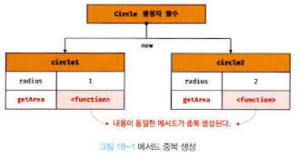
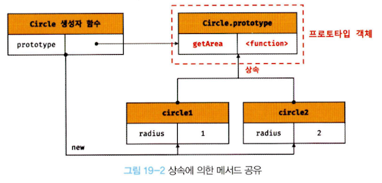
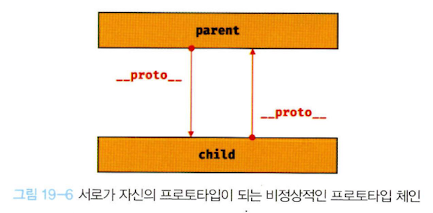
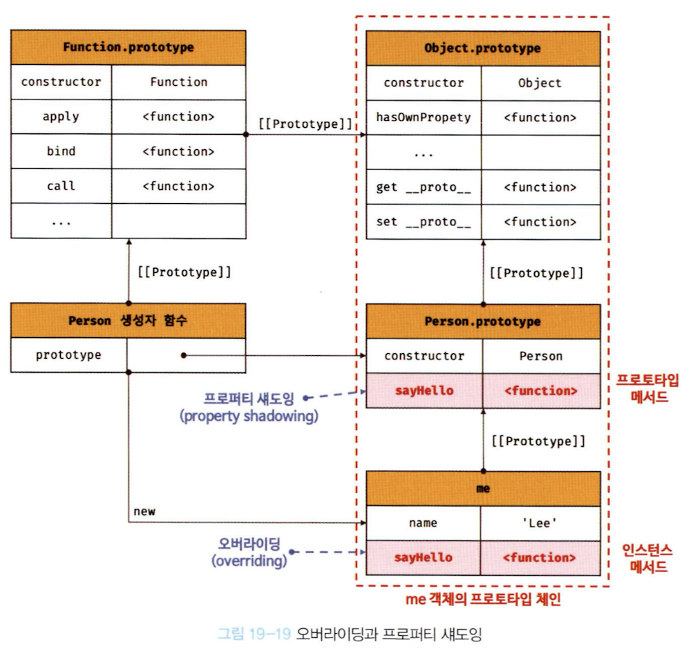
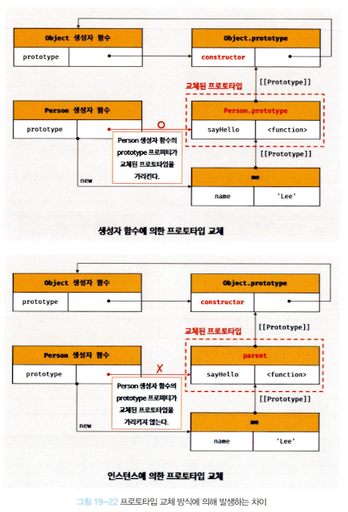
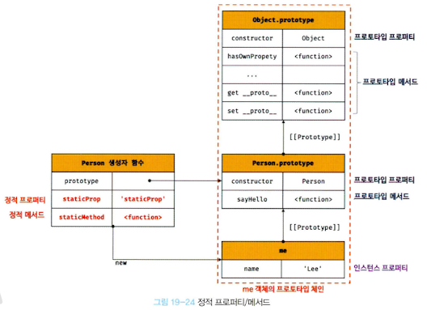

# **핵심 내용 정리**

자바스크립트는 객체 기반의 프로그래밍 언어이며 **자바스크립트를 이루고 있는 거의 ‘모든 것’이 객체**이다.

## **19.1 객체지향 프로그래밍**

- `객체 지향 프로그래밍` : 여러 개의 독립적 단위, 즉 객체의 집합으로 프로그램을 표현하는 것
- `추상화` : 다양한 속성 중에서 프로그램에 필요한 속성만 간추려 내어 표현하는 것
- `객체` : 속성을 통해 여러 개의 값을 하나의 단위로 구성한 복잡한 자료구조, 상태 데이터와 동작을 하나의 논리적인 단위로 묶은 복합적인 자료구조
- `프로퍼티` : 객체의 상태 데이터
- `메서드` : 객체의 동작

## 19.2 상속과 프로토타입

- `상속` : 어떤 객체의 프로퍼티 또는 메서드를 다른 객체가 상속받아 그대로 사용할 수 있는 것
- 자바스크립트는 프로토타입을 기반으로 상속을 구현하여 불필요한 중복을 제거한다.

**생성자 함수의 중복 생성**

- 동일한 프로퍼티(메서드 포함) 구조를 갖는 객체를 여러 개 생성할 때 유용하다
- 모든 인스턴스가 동일한 내용의 메서드를 사용하므로 단 하나만 생성하여 모든 인스턴스가 공유해서 사용하는 것이 바람직하다.
- 그러나 생성자 함수를 통해 인스턴스를 생성할 경우, 해당 메서드를 중복 생성하고 모든 인스턴스가 중복 소유한다.
- 동일한 생성자 함수에 의해 생성된 모든 인스턴스가 동일한 메서드를 중복 소유하는 것은 메모리를 불필요하게 낭비한다.

```jsx
// 생성자 함수
func Circle(radius) {
	this.radius = radius;
	this.getArea = func () {
		return Math.PI * this.radius ** 2;
	};
}

// 인스턴스 생성
const circle1 = new Circle(1);
const circle2 = new Circle(2);

console.log(circle1.getArea === circle2.getArea); // false
```



**상속을 통한 중복 제거**

- 자바스크립트는 프로토타입을 기반으로 상속을 구현한다.
- 자신의 상태를 나타내는 프로퍼티만 개별적으로 소유하고 내용이 동일한 메서드는 상속을 통해 공유하여 사용한다.
- 이는 코드의 재사용이란 관점에서 매우 유용하다.

```jsx
// 생성자 함수
func Circle(radius) {
	this.radius = radius;
}

// 공유할 메서드
Circle.prototype.getArea = func () {
	return Math.PI * this.radius ** 2;
};

// 인스턴스 생성
const circle1 = new Circle(1);
const circle2 = new Circle(2);

console.log(circle1.getArea === circle2.getArea); // true
```



## 19.3 프로토타입 객체

- 객체 간 상속을 구현하기 위해 사용된다.
- 모든 객체는 하나의 프로토타입을 갖는다. 그리고 모든 프로토타입은 생성자 함수와 연결되어 있다. 즉, 객체와 프로토타입과 생성자 함수는 서로 연결되어 있다.
- [[Prototype]] 내부 슬롯에는 직접 접근할 수 없지만, **proto** 접근자 프로퍼티를 통해 자신의 프로토타입에 간접적으로 접근할 수 있다.
- 프로토타입은 자신의 constructor 프로퍼티를 통해 생성자 함수에 접근할 수 있고, 생성자 함수는 자신의 prototype 프로퍼티를 통해 프로퍼티에 접근할 수 있다.


**proto 접근자 프로퍼티**

- 모든 객체는 **proto** 접근자 프로퍼티를 통해 자신의 프로토타입, 즉 [[Prototype]] 내부 슬롯에 간접적으로 접근할 수 있다.
- Object.prototype의 접근자 프로퍼티인 **proto**는 getter/setter 함수라 부르는 접근자 함수([[Get]], [[Set]] 프로퍼티 어트리뷰트에 할당된 함수)를 통해 [[Prototype]] 내부 슬롯의 값, 즉 프로토타입을 취득하거나 할당한다.
- **proto** 접근자 프로퍼티는 상속을 통해 사용된다.
- 프로토타입에 접근하기 위해 해당 프로퍼티를 사용하는 이유는 상호 참조에 의해 프로토타입 체인이 생성되는 것을 방지하기 위해서다. (아무런 체크 없이 무조건적인 프로토타입 교체 방지)
- 프로토타입 체인은 단방향 링크드 리스트로 구현되어야 한다. 순환 참조하는 프로토타입 체인(⇒비정상적)이 만들어지면 프로퍼티 검색 시 무한 루프에 빠지게 되기 때문이다.



- 코드 내에서 직접 사용하는 것은 권장하지 않는다. 지원하지 않는 객체가 있기 때문이다.
- 때문에 이를 대신해 Object.getPrototypeOf, Object.setPrototypeOf 메서드를 사용할 것을 권장한다.

**함수 객체의 prototype 프로퍼티**

- 생성자 함수가 생성할 인스턴스의 프로토타입을 가리킨다.

**proto 접근자 프로퍼티와 함수 객체의 prototype 프로퍼티**


**프로토타입의 constructor 프로퍼티와 생성자 함수**

- 모든 프로토타입은 constructor 프로퍼티를 갖는다.
- constructor 프로퍼티는 prototype 프로퍼티로 자신을 참조하고 있는 생성자 함수를 가리킨다.

## 19.4 리터럴 표기법에 의해 생성된 객체의 생성자 함수와 프로토타입

- Object 생성자 함수에 인자를 전달하지 않거나 undefined 또는 null을 인수로 전달하면서 호출하면 내부적으로는 추상 연산 OrdinaryObjectCreate를 호출하여 Object.prototype을 프로토타입으로 갖는 빈 객체를 생성한다.
- 이처럼 Object 생성자 함수 호출과 객체 리터럴의 평가는 추상 연산 OrdinaryobjectCreate를 호출하여 빈 객체를 생성하는 점에서 동일하나 new.target의 확인이나 프로퍼티를 추가하는 처리 등 세부내용은 다르다. 따라서 객체 래터럴에 의해 생성된 객체는 Object 생성자 함수가 생성한 객체가 아니다.
- 리터럴 표기법에 의해 생성된 객체도 가상적인 생성자 함수를 갖는다.
- **다시 말해, 프로토타입과 생성자 함수는 단독으로 존재할 수 없고 언제나 쌍으로 존재한다.**
- 리터럴 표기법(객체리터럴, 함수리터럴, 배열리터럴, 정규표현식 리터럴 등)에 의해 생성된 객체는 생성자 함수에 의해 생성된 객체는 아니다. 하지만 큰 틀에서 생각해보면 리터럴 표기법으로 생성한 객체도 생성자 함수 로 생성한 객체와 본질적인 면에서 큰 차이는 없다.

## 19.5 프로토타입의 생성 시점

- 프로토타입은 생성자 함수가 생성되는 시점에 더불어 생성된다.

**사용자 정의 생성자 함수와 프로토타입 생성 시점**

- 생성자 함수로서 호출할 수 있는 함수, 즉 constructor는 함수 정의가 평가되어 함수 객체를 생성하는 시점에 프로토타입도 더불어 생성된다.
- 생성된 프로토타입의 프로토타입은 언제나 Obejct.prototype이다.

**빌트인 생성자 함수와 프로토타입 생성 시점**

- 빌트인 생성자 함수가 생성되는 시점에 프로토타입이 생성된다.
- 모든 빌트인 생성자 함수는 전역 객체가 생성되는 시점에 생성된다.

**전역 객체**

- 코드가 실행되기 이전 단계에 자바스크립트 엔진에 의해 생성되는 트굿한 객체
- 클라이언트 사이드 환경(브라우저)에서는 window, 서버 사이드 환경(Node.js)에서는 global 객체를 의미한다.
- 표준 빌트인 객체들과 환경에 따른 호스트 객체(클라이언트, Web API 또는 Node.js의 호스트 API), 그리고 var 키워드로 선언한 전역 변수와 전역 함수를 프로퍼티로 갖는다.
- Math. Reflect, JSON을 제외한 표준 빌트인 객체는 모두 생성자 함수다.

생성자 함수 또는 리터럴 표기법으로 객체를 생성하면 프로토타입은 생성된 객체의 [[prototype]] 내부 슬롯에 할당된다.

## 19.6 객체 생성 방식과 프로토타입의 결정

다양한 방법으로 생성한 객체(객체 리터럴, Object 생성자 함수, 생성자 함수, Object.create 메서드, 클래스)는 추상 연산 OrdinaryObjectCreate에 의해 생성된다는 공통점이 있다.

**OrdinaryObjectCreate**

- 필수적으로 자신이 생성할 객체의 프로토타입을 인수로 전달받는다
- 자신이 생성할 객체에 추가할 프로퍼티 목록을 옵션으로 전달할 수 있다
- 빈 객체를 생성한 후, 객체에 추가할 프로퍼티 목록이 인수로 전달된 경우 프로퍼티를 객체에 추가한다.
- 그리고 인수로 전달받은 프로토타입을 자신이 생성한 객체의 [[Prototype]] 내부 슬롯에 할당한 다음, 생성한 객체를 반환한다.
- 즉, 프로토타입은 추상 연산 OrdinaryObjectCreate에 전달되는 인수에 의해 결정된다. 이 인수는 객체가 생성되는 시점에 객체 생성 방식에 의해 결정된다.

**객체 리터럴과 Object 생성자 함수에 의해 생성된 객체의 프로토타입**

- 생성되는 객체의 프로토타입은 Obejct.prototype이다.
- 그러나 두 방식의 차이는 **프로퍼티를 추가하는 방식**이다.
- 객체 리터럴 방식 : 객체 리터럴 내부에 프로퍼티를 추가
- Object 생성자 함수 : 일단 빈 객체를 생성한 이후 프로퍼티를 추가

**생성자 함수에 의해 생성된 객체의 프로퍼티**

- new 연산자와 함께 생성자 함수를 호출
- 생성자 함수에 의해 생성되는 객체의 프로토타입은 생성자 함수의 Prototype 프로퍼티에 바인딩되어 있는 객체
- 표준 빌트인 객체인 Object 생성자 함수와 더불어 생성된 프로토타입 Object.prototype은 다양한 빌트인 메서드(hasOwnProperty, propertyIsEnumerable 등)을 갖고 있다.
- 하지만 사용자 정의 생성자 함수 Person과 더불어 생성된 프로토타입 Person.prototype의 프로퍼티는 constructor 뿐이다.
  

## 19.7 프로토타입 체인

- 자바스크립트는 객체의 프로퍼티(메서드 포함)에 접근하려고 할 때 해당 객체에 접근하려는 프로퍼티가 없다면 [[prototype]] 내부 슬롯의 참조를 따라 자신의 부모 역할을 하는 프로토타입의 프로퍼티를 순차적으로 검색한다.
- 프로토타입 체인은 자바스크립트가 객체지향 프로그래밍의 상속을 구현하는 매커니즘이다.
- 프로토타입 체인의 최상위에 위치하는 객체는 언제나 Object.prototype이다.
- 따라서 모든 객체는 Object.prototype을 상속받는다.
- **Object.prototype을 프로토타입 체인의 종점이라고 한다.**
- Object.prototype에서도 프로퍼티를 검색할 수 없는 경우 Undefined를 반환한다. 이때 에러가 발생하지 않는 것에 주의하자.

**프로토타입 체인과 스코프 체인**

- 프로토타입 체인은 프로퍼티 검색을 위한 메커니즘이다.
- 스코프 체인은 식별자 검색을 위한 메커니즘이다.
- 스코프 체인과 프로토타입 체인은 서로 연관없이 별도로 동작하는 것이 아니라 서로 협력하여 식별자와 프로퍼티를 검색하는 데 사용된다.

## 19.8 오버라이딩과 프로퍼티 섀도잉

- `프로토타입 프로퍼티` : 프로토타입이 소유한 프로퍼티(메서드 포함)
- `인스턴스 프로퍼티` : 인스턴스가 소유한 프로퍼티
- 프로토타입 프로퍼티와 같은 이름의 프로퍼티를 인스턴스에 추가하면 프로토타입 체인을 따라 프로토타입 프로퍼티를 검색하여 프로토타입 프로퍼티를 덮어쓰는 것이 아니라 인스턴스 프로퍼티로 추가한다.
- 이때 인스턴스 메서드 sayHello는 프로토타입 메서드 sayHello를 오버라이딩했고 프로토타입 메서드 sayHello는 가려진다.
- 이처럼 상속 관계에 의해 프로퍼티가 가려지는 현상을 `프로퍼티 섀도잉`이라 한다.



**오버라이딩과 오버로딩**

- `오버라이딩` : 상위 클래스가 가지고 있는 메서드를 하위 클래스가 재정의하여 사용하는 방식
- `오버로딩` : 함수의 이름은 동일하지만 매개변수의 타입 또는 개수가 다른 메서드를 구현하고 매개변수에 의해 메서드를 구별하여 호출하는 방식
- 자바스크립트는 오버로딩을 지원하지 않지만 arguments 객체를 사용하여 구현할 수 있다.

**프로퍼티 삭제 시**

- 프로퍼티를 삭제하는 경우, 프로토타입 메서드가 아닌 인스턴스 메서드가 삭제된다. 다시 프로토타입 체인을 삭제하려고 해도, 삭제되지 않는다.

```jsx
me.sayHello(); // Hey! My name is Lee

// 인스턴스 메서드를 삭제한다.
delete me.sayHello;
// 인스턴스에는 sayHello 메서드가 없으므로 프로토타입 메서드가 호출된다.
me.sayHello(); // Hi! My name is Lee

// 프로토타입 체인을 통해 프로토타입 메서드가 삭제되지 않는다.
delete me.sayHello;
// 프로토타입 메서드가 호출된다.
me.sayHello(); // Hi! My name is Lee
```

- 이와 같이 하위 객체를 통해 프로토타입의 프로퍼티를 변경 또는 삭제하는 것은 불가능하다. 다시 말해 하위 객체를 통해 프로토타입에 get 액세스는 허용되나 set 액세스는 허용되지 않는다.
- 프로토타입 프로퍼티를 변경 또는 삭제하려면 하위 객체를 프로토타입 체인으로 접근하는 것이 아니라 프로토타입에 직접 접근해야 한다.

```jsx
// 프로토타입 메서드 변경
Person.prototype.sayHello = func () {
	console.log(`Hey! My name is ${this.name}`);
};
me.sayHello(); // Hey! My name is Lee

// 프로토타입 메서드 삭제
delete Person.prototype.sayHello;
me.sayHello(); // TypeError: me.sayHelo is not a fucntion
```

## 19.9 프로토타입의 교체

- 프로토타입은 임의의 다른 객체로 변경할 수 있다.
    
    이것은 부모 객체인 프로토타입을 동적으로 변경할 수 있다는 것을 의미한다.
    
    이러한 특징을 활용하여 객체 간의 상속 관계를 **동적**으로 변경할 수 있다.
    
- 프로토타입은 생성자 함수 또는 인스턴스에 의해 교체할 수 있다.

**생성자 함수에 의한 프로토타입의 교체**

- 프로토타입으로 교체한 객체 리터럴에는 constructor 프로퍼티가 없다.
- constructor 프로퍼티는 자바스크립트 엔진이 프로토타입을 생성할 때 암묵적으로 추가한 프로퍼티다.
- 프로토타입을 교체하면 constructor 프로퍼티와 생성자 함수 간의 연결이 파괴된다.
- 따라서 me 객체의 생성자 함수를 검색하면 Person이 아닌 Object가 나온다.

```jsx
const Person = (function () {
  function Person(name) {
    this.name = name;
  }

  // 1. 생성자 함수의 prototype 프로퍼티를 통해 프로토타입을 교체
  Person.prototype = {
    sayHello() {
      console.log(`Hi! My name is ${this.name}`);
    },
  };

  return Person;
})();

const me = new Person("Lee");

// 프로토타입을 교체하면 constructor 프로퍼티와 생성자 함수 간의 연결이 파괴된다.
console.log(me.constructor === Person); // false
// 프로토타입 체인을 따라 Object.prototype의 constructor 프로퍼티가 검색된다.
console.log(me.constructor === Object); // true
```

- 프로토타입으로 교체한 객체 리터럴에 constructor 프로퍼티를 추가해 연결을 되살릴 수 있다.

```jsx
const Person = (function () {
  function Person(name) {
    this.name = name;
  }

  // 생성자 함수의 prototype 프로퍼티를 통해 프로토타입을 교체
  Person.prototype = {
    // constructor 프로퍼티와 생성자 함수 간의 연결을 설정
    constructor: Person,
    sayHello() {
      console.log(`Hi! My name is ${this.name}`);
    },
  };

  return Person;
})();

const me = new Person("Lee");

// constructor 프로퍼티가 생성자 함수를 가리킨다.
console.log(me.constructor === Person); // true
console.log(me.constructor === Object); // false
```

**인스턴스에 의한 프로토타입의 교체**

- 프로토타입은 생성자 함수의 prototype 프로퍼티뿐만 아니라 인스턴스의 __proto__ 접근자 프로퍼티를 통해 접근할 수 있다.
- 따라서 인스턴스의 __proto__ 접근자 프로퍼티를 통해 프로토타입을 교체할 수 있다.
- 생성자 함수의 prototype 프로퍼티에 다른 임의의 객체를 바인딩하는 것은 미래에 생성할 인스턴스의 프로토타입을 교체하는 것이다.
- __proto__ 접근자 프로퍼티를 통해 프로토타입을 교체하는 것은 이미 생성된 객체의 프로토타입을 교체하는 것이다.

```jsx
function Person(name) {
  this.name = name;
}

const me = new Person("Lee");

// 프로토타입으로 교체할 객체
const parent = {
  sayHello() {
    console.log(`Hi! My name is ${this.name}`);
  },
};

// 1. me 객체의 프로토타입을 parent 객체로 교체한다.
Object.setPrototypeOf(me, parent);
// me.__proto__ = parent; 와 동일하다

me.sayHello(); // Hi! My name is Lee
```

- 생성자 함수에 의한 프로토타입 교체와 마찬가지로 프로토타입으로 교체한 객체에는 constructor 프로퍼티가 없으므로 constructor 프로퍼티와 생성자 함수 간의 연결이 파괴된다.
- 따라서 프로토타입의 constructor 프로퍼티로 me 객체의 생성자 함수를 검색하면 Person이 아닌 Object가 나온다.

```jsx
// 프로토타입을 교체하면 constructor 프로퍼티와 생성자 함수 간의 연결이 파괴된다.
console.log(me.constructor === Person); // false
// 프로토타입 체인을 따라 Object.prototype의 constructor 프로퍼티가 검색된다.
console.log(me.constructor === Object); // true
```

**생성자 함수에 의한 프로토타입 교체와 인스턴스에 의한 프로토타입 교체**



**프로토타입의 직접 교체는 권장하지 않는다**

- 객체 간의 상속 관계를 동적으로 변경하는 것이 꽤나 번거롭기 때문
- 상속 관계를 인위적으로 설정하려면 ‘직접 상속’이 더 편리하고 안전하다.
- 또는 ES6에서 도입된 클래스를 사용하라.

## 19.10 instanceof 연산자

- `객체 instanceof 생성자 함수`
- 우변의 생성자 함수의 prototype에 바인딩된 객체가 좌변의 객체의 프로토타입 체인 상에 존재하면 true로 평가되고, 그렇지 않은 경우에는 false로 평가된다
- instanceof 연산자는 프로토타입의 constructor 프로퍼티가 가리키는 생성자 함수를 찾는 것이 아니라 생성자 함수의 prototype에 바인딩된 객체가 프로토타입 체인 상에 존재하는지 확인한다.
    
    
    
- instanceof 연산자를 함수로 표현하면 다음과 같다.

```jsx
func inInstanceof(instance, constructor) {
	// 프로토타입 취득
	const prototype = Object.getPrototypeOf(instance);
	
	// 재귀 탈출 조건
	// prototype이 null이면 프로토타입 체인의 종점에 다다른 것이다.
	if (prototype === null) return false;
	
	// 프로토타입이 생성자 함수의 prototype 프로퍼티에 바인딩된 객체라면 true를 반환한다.
	// 그렇지 않다면 재귀 호출로 프로토타입 체인 상의 상위 프로토타입으로 이동하여 확인한다.
	return prototype === constructor.prototype || isInstanceof(prototype, constructor);
}

console.log(inInstanceof(me, Person)); // true
console.log(inInstanceof(me, Object)); // true
console.log(inInstanceof(me, Array)); // false
```

## 19.11 직접 상속

**Object.create에 의한 직접 상속**

- 명시적으로 프로토타입을 지정하여 새로운 객체를 생성한다.
- 첫 번째 매개변수에는 생성할 객체의 프로토타입으로 지정할 객체를 전달한다.
    
    두 번째 매개변수에는 생성할 객체의 프로퍼티 키와 프로퍼티 디스크립터 객체로 이뤄진 객체를 전달한다. 
    
- 두 번째 인수는 옵션이므로 생략 가능하다.
- Object.create 메서드는 첫 번째 매개변수에 전달한 객체의 프로토타입 체인에 속하는 객체를 생성한다.
    
    즉, 객체를 생성하면서 직접적으로 상속을 구현하는 것이다.
    
- 장점
    - new 연산자 없이도 객체를 생성할 수 있다.
    - 프로토타입을 지정하면서 객체를 생성할 수 있다.
    - 객체 리터럴에 의해 생성된 객체도 상속받을 수 있다.
- ESLint에서는 Object.prototype의 빌트인 메서드를 객체가 직접 호출하는 것을 권장하지 않는다.
    
    그 이유는 Object.create 메서드를 통해 프로토타입 체인의 종점에 위치하는 객체를 생성할 수 있기 때문이다. 
    
    프로토타입 체인의 종점에 위치하는 객체는 Object.prototype의 빌트인 메서드를 사용할 수 없다.
    

```jsx
// 프로토타입이 null인 객체, 즉 프로토타입 체인의 종점에 위치하는 객체를 생성한다.
const obj = Object.create(null);
obj.a = 1;

console.log(Object.getPrototypeOf(obj) === null); //true

// obj는 Object.prototype의 빌트인 메서드를 사용할 수 없다.
console.log(obj.hasOwnProperty("a")); // TypeError
```

- 따라서 이 같은 에러를 발생시킬 위험을 없애기 위해 Object.prototype의 빌트인 메서드는 다음과 같이 간접적으로 호출하는 것이 좋다.

```jsx
// 프로토타입이 null인 객체를 생성한다.
const obj = Object.create(null);
obj.a = 1;

// console.log(obj.hasOwnProperty('a'));
// TypeError: obj.hasOwnProperty is not a function

// Object.prototype의 빌트인 메서드는 객체로 직접 호출하지 않는다.
console.log(Object.prototype.hasOwnProperty.call(obj, "a")); // true
```

**객체 리터럴 내부에서 __proto__에 의한 직접 상속**

- Object.create 메서드에 의한 직접 상속은 앞에서 다룬 것과 같이 여러 장점이 있다. 하지만 두 번째 인자로 프로퍼티를 정의하는 것은 번거롭다. 일단 객체를 생성한 이후 프로퍼티를 추가하는 방법도 있으나 이 또한 깔끔한 방법은 아니다.
- ES6에서는 객체 리터럴 내부에서 __proto__ 접근자 프로퍼티를 사용하여 직접 상속을 구현할 수 있다.

```jsx
const myProto = { x: 10 };

// 객체 리터럴에 의해 객체를 생성하면서 프로토타입을 지정하여 직접 상속받을 수 있다.
const obj = {
  y: 20,
  // 객체를 직접 상속받는다.
  // obj -> myProto -> Object.prototype -> null
  __proto__: Myproto,
};
/* 위 코드는 아래와 동일
const obj = Object.create(myProto,{
	y: { value: 20, writable: true, enumerable: true, configurable: true }
});
*/
console.log(obj.x, obj.y); // 10 20
console.log(Object.getPrototypeOf(obj) === myProto); // true
```

## 19.12 정적 프로퍼티/메서드

- 생성자 함수로 인스턴스를 생성하지 않아도 참조/호출할 수 있는 프로퍼티/메서드

```jsx
// 생성자 함수
function Perosn(name) {
  this.name = name;
}

// 프로토타입 메서드
Person.prototype.sayHello = function () {
  console.log(`Hi! My name is ${this.name}`);
};

// 정적 프로퍼티
Person.staticProp = "static prop";

// 정적 메서드
Person.staticMethod = function () {
  console.log("staticMethod");
};

const me = new Person("Lee");

// 생성자 함수에 추가한 정적 프로퍼티/메서드는 생성자 함수로 참조/호출한다.
Person.staticMethod(); // staticMethod

// 정적 프로퍼티/메서드는 생성자 함수가 생성한 인스턴스로 참조/호출할 수 없다.
// 인스턴스로 참조/호출할 수 있는 프로퍼티/메서드는 프로토타입 체인 상에 존재해야 한다.
me.staticMethod(); // TypeError
```



- 생성자 함수가 생성한 인스턴스는 자신의 프로토타입 체인에 속한 객체의 프로퍼티/메서드에 접근할 수 있다.
    
    하지만 정적 프로퍼티/메서드는 인스턴스의 프로토타입 체인에 속한 객체의 프로퍼티/메서드가 아니므로 인스턴스로 접근할 수 없다.
    
- 앞에서 살펴본 Object.create 메서드는 Object 생성자 함수의 정적 메서드이고 Object.prototype.hasOwnProperty 메서드는 Object.prototype의 메서드다.
- 따라서 Object.create 메서드는 인스턴스, 즉 Object 생성자 함수가 생성한 객체로 호출할 수 없다.
- 하지만 Object.prototype의 메서드이므로 모든 객체가 호출할 수 있다.

```jsx
// Object.create는 정적 메서드다.
const obj = Object.create({ name: "Lee" });

// Object.prototype.hasOwnProperty는 프로토타입 메서드다.
obj.hasOwnProperty("name"); // false
```

- 만약 인스턴스/프로토타입 메서드 내에서 this를 사용하지 않는다면 그 메서드는 정적 메서드로 변경할 수 있다.

## 19.13 프로퍼티 존재 확인

**in 연산자**

- 객체 내에 특정 프로퍼티가 존재하는지 여부를 확인한다
- `key in object` (key: 프로퍼티 키를 나타내는 문자열, object: 객체로 평가되는 표현식)
- in 연산자는 확인 대상 객체의 프로퍼티뿐만 아니라 확인 대상 객체가 상속받은 모든 프로토타입의 프로퍼티를 확인하므로 주의가 필요하다.

**Object.prototype.hasOwnProperty 메서드**

- 특정 객체에 특정 프로퍼티가 존재하는지 확인할 수 있다.

```jsx
console.log(person.hasOwnProperty("name")); // true
console.log(person.hasOwnProperty("age")); // false
```

- 인수로 전달받은 프로퍼티 키가 객체 고유의 프로퍼티 키인 경우에만 true를 반환하고 상속받은 프로토타입의 프로퍼티 키인 경우 false를 반환한다.

```jsx
console.log(person.hasOwnProperty("toString")); // false
```

## 19.14 프로퍼티 열거

**for … in 문**

- 객체의 모든 프로퍼티를 순회하며 열거한다.
- `for (변수선언문 in 객체) { … }`
- for…in 문은 in 연산자처럼 순회 대상 객체의 프로퍼티뿐만 아니라 상속받은 프로토타입의 프로퍼티까지 열거한다.
- for…in 문은 객체의 프로토타입 체인 상에 존재하는 모든 프로토타입의 프로퍼티 중에서 프로퍼티 어트리뷰트 [[Enumerable]]의 값이 true인 프로퍼티를 순회하며 열거한다.
- for…in 문은 프로퍼티 키가 심벌인 프로퍼티는 열거하지 않는다.

```jsx
const sym = Symbol();
const obj = {
  a: 1,
  [sym]: 10,
};

for (const key in obj) {
  console.log(key + ": " + obj[key]);
}

// a:1
```

- 상속 받은 프로퍼티는 제외하고 객체 자신의 프로퍼티만 열거하려면 Object.prototype.hasOwnProperty 메서드를 사용하여 객체 자신의 프로퍼티인지 확인해야 한다.

```jsx
const person = {
	name: 'Lee',
	address : 'Seoul',
	__proto__ : { age:20 }
};

for (const key in person) {
	// 객체 자신의 프로퍼티인지 확인한다.
  if (!person.hasOwnProperty(key)) continue;
  console.log(key + ": " + person[key]);
}

// name: Lee
// address: Seoul
```

- for…in 문은 프로퍼티를 열거할 때 순서를 보장하지 않으므로 주의해야한다. 하지만 대부분의 모던 브라우저는 순서를 보장하고 숫자인 프로퍼티 키에 대해서는 정렬을 실시한다.
- 배열에는 for…in 문을 사용하지 말고 일반적인 for 문이나 for…of 문 또는 Array.prototype.forEach 메서드를 사용하기를 권장한다.

**Object.keys/values/entries 메서드**

- 객체 자신의 고유 프로퍼티만 열거하기 위해서는 for…in 문을 사용하는 것보다 Object.keys/values/entries 메서드를 사용하는 것을 권장한다.
- Object.keys 메서드는 객체 자신의 열거 가능한 프로퍼티 키를 배열로 반환한다.

```jsx
const person = {
  name: "Lee",
  address: "Seoul",
  __proto__: { age: 20 },
};
console.log(Object.keys(person)); // ["name","address"]
```

- ES8에서 도입된 Object.values 메서드는 객체 자신의 열거 가능한 프로퍼티 값을 배열로 반환한다.

```jsx
console.log(Object.values(person)); // ["Lee","Seoul"]
```

- ES8에서 도입된 Object.entries 메서드는 객체 자신의 열거 가능한 프로퍼티 키와 값의 쌍의 배열을 배열에 담아 반환한다.

```jsx
console.log(Object.entreis(person)); // \[["name, "Lee"], ["address", 'Seoul"]]
Object.entries(person).forEach(([key, value]) => console.log(key, value));

/*
name Lee
address Seoul
*/
```

---

# 면접 예상 질문

## 💥 ~~ 이란?

~~ 이다.

---

# 이야기하고 싶은 것

### p.n

> 페이지를 읽다가 인상 깊어 공유하고 싶거나, 어려운 부분을 함께 이야기하고 싶은 부분의 구절을 작성하고

코멘트를 답니다.

### p. 38 (예시)

> 좋은 이름, 즉 변수에 저장된 값의 의미를 파악할 수 있는 변수 이름은 가독성을 높이는 부수적인 효과도 있다.
>
> 코드는 컴퓨터에게 내리는 명령이지만 개발자를 위한 문서이기도 하다. 개발자의 의도를 나타내는 명확한 네이밍은 코드를 이해하기 쉽게 만들며, 이는 협업과 품질 향상에 도움을 준다. 변수 이름은 첫아이 이름을 짓듯이 심사숙고해서 지어야 한다.

이 부분이 인상깊어 공유하고 싶었습니다.
