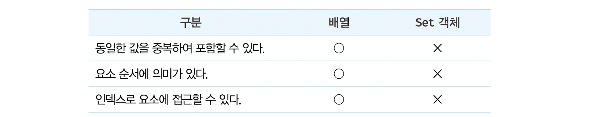
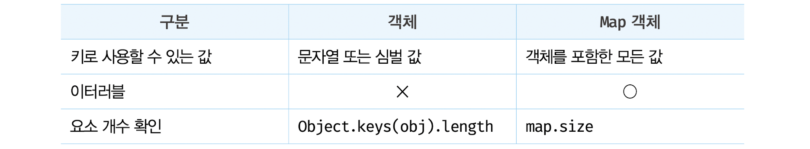
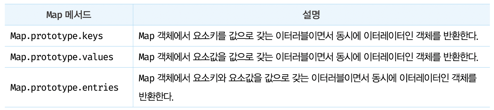

# Set과 Map

## 37.1 Set

- Set 객체는 중복되지 않는 유일한 값들의 집합 (배열과 유사 / 수학적 집합의 특성과 일치)
  

  - Set을 통해 교집합, 합집합, 차집합, 여집합 등을 구현 가능

- Set 객체의 생성: Set 생성자 함수로 생성 `const set = new Set();`

  - Set 생성자 함수는 이터러블을 인수로 전달받아 Set 객체를 생성
  - 이때 이터러블의 중복된 값은 Set 객체에 요소로 저장되지 않음
  - 중복을 허용하지 않는 Set 객체의 특성을 활용하여 배열에서 중복된 요소를 제거 가능

    ```js
    // 배열의 중복 요소 제거
    const uniq = (array) => array.filter((v, i, self) => self.indexOf(v) === i);
    console.log(uniq[(2, 1, 2, 3, 4, 3, 4)]); // [2, 1, 3, 4]

    // Set을 사용한 배열의 중복 요소 제거
    const uniq = (array) => [...new Set(array)];
    console.log(uniq[(2, 1, 2, 3, 4, 3, 4)]); // [2, 1, 3, 4]
    ```

* 요소 개수 확인 : `Set.prototype.size`
  ```js
  const { size } = new Set([2, 1, 3, 3]);
  console.log(size);
  ```
  - getter 함수만 존재하는 접근자 프로퍼티 => size 프로퍼티에 숫자를 할당하여 Set 객체의 요소 개수를 변경 불가능
* 요소 추가 : `Set.prototype.add`

  ```js
  const set = new Set();

  set.add(1).add(2);
  console.log(set); // Set(2) { 1, 2 }
  ```

  - add 메서드를 호출한 후 연속적으로 호출 가능
  - Set 객체는 NaN과 NaN을 같다고 평가하여 중복 추가를 허용하지 않음
  - Set 객체는 객체나 배열과 같이 자바스크립트의 모든 값을 요소로 저장 가능

* 요소 존재 여부 확인 : `Set.prototype.has`

  ```js
  const set = new Set([1, 2, 3]);

  console.log(set.has(2)); // true
  console.log(set.has(4)); // false
  ```

* 요소 삭제 : `Set.prototype.delete`

  - 삭제 성공 여부를 나타내는 불리언 값을 반환
  - 인덱스가 아니라 삭제하려는 요소값을 인수로 전달해야 함
  - 연속적으로 호출 불가능

  ```js
  const set = new Set([1, 2, 3]);

  // 요소 2 삭제
  set.delete(2);
  console.log(set); // Set(2) { 1, 3 }
  ```

* 요소 일괄 삭제 : `Set.prototype.clear`
  - 언제나 undefined를 반환
* 요소 순회 : `Set.prototype.forEach`

  - 콜백함수와 forEach 메서드의 콜백함수 내부에서 this로 사용될 객체 전달
    - 첫 번째 인수: 현재 순회 중인 요소값
    - 두 번째 인수: 현재 순회 중인 요소값
    - 세 번째 인수: 현재 순회 중인 Set 객체 자체
  - Set 객체는 이터러블 ( for...of , 스프레드 문법, 배열 디스트럭처링 가능)
  - Set 객체는 요소의 순서에 의미를 갖지 않지만 Set 객체를 순회하는 순서는 요소가 추가된 순서를 따름

- 집합 연산 : set 객체를 통해 교집합, 합집합, 차집합 등 구현가능

  - 교집합 : 집합 A와 집합 B의 공통 요소로 구성

    ```js
    // 방법 1
    Set.prototype.intersection = function (set) {
      const result = new Set();

      for (const value of set) {
        // 2개의 set의 요소가 공통되는 요소이면 교집합의 대상이다.
        if (this.has(value)) {
          result.add(value);
        }
      }

      return result;
    };

    const setA = new Set([1, 2, 3, 4]);
    const setB = new Set([2, 4]);

    //setA와 setB의 교집합
    console.log(setA.intersection(setB)); // Set(2) { 2, 4 }
    //setB와 setA의 교집합
    console.log(setB.intersection(setA)); // Set(2) { 2, 4 }

    // =====================================
    // 방법2
    Set.prototype.intersection = function (set) {
      return new Set([...this].filter((v) => set.has(v)));
    };

    const setA = new Set([1, 2, 3, 4]);
    const setB = new Set([2, 4]);

    //setA와 setB의 교집합
    console.log(setA.intersection(setB)); // Set(2) { 2, 4 }
    //setB와 setA의 교집합
    console.log(setB.intersection(setA)); // Set(2) { 2, 4 }
    ```

  - 합집합 : 집합 A와 집합 B의 중복 없는 모든 요소로 구성

    ```js
    // 방법 1
    Set.prototype.union = function (set) {
      // this(Set 객체 복사)
      const result = new Set(this);

      for (const value of set) {
        // 합집합은 2개의 Set 객체의 모든 요소로 구성된 집합니다. 중복된 요소는 포함되지 않는다.
        result.add(value);
      }

      return result;
    };

    const setA = new Set([1, 2, 3, 4]);
    const setB = new Set([2, 4]);

    //setA와 setB의 합집합
    console.log(setA.union(setB)); // Set(4) { 1, 2, 3, 4 }
    //setB와 setA의 합집합
    console.log(setB.union(setA)); // Set(4) { 2, 4, 1, 3 }
    // =====================================
    // 방법2
    Set.prototype.union = function (set) {
      return new Set([...this, ...set]);
    };

    const setA = new Set([1, 2, 3, 4]);
    const setB = new Set([2, 4]);

    //setA와 setB의 합집합
    console.log(setA.union(setB)); // Set(4) { 1, 2, 3, 4 }
    //setB와 setA의 합집합
    console.log(setB.union(setA)); // Set(4) { 2, 4, 1, 3 }
    ```

  - 차집합 : 집합 A에는 존재하지만 집합 B에는 존재하지 않는 요소로 구성

    ```js
    // 방법 1
    // this(Set 객체)를 복사
    Set.prototype.difference = function (set) {
      const result = new Set(this);

      for (const value of set) {
        // 차집합은 어느 한쪽 집합에는 존재하지만 다른 한쪽 집합에는 존재하지 않는 요소로 구성한 집합이다.
        result.delete(value);
      }

      return result;
    };

    const setA = new Set([1, 2, 3, 4]);
    const setB = new Set([2, 4]);

    //setA에 대한 setB의 차집합
    console.log(setA.difference(setB)); // Set(2) {1, 3}
    //setB에 대한 setA의 차집합
    console.log(setB.difference(setA)); // Set(0) {}
    // =====================================
    // 방법2
    Set.prototype.difference = function (set) {
      return new Set([...this].filter((v) => !set.has(v)));
    };

    const setA = new Set([1, 2, 3, 4]);
    const setB = new Set([2, 4]);

    //setA에 대한 setB의 차집합
    console.log(setA.difference(setB)); // Set(2) {1, 3}
    //setB에 대한 setA의 차집합
    console.log(setB.difference(setA)); // Set(0) {}
    ```

  - 부분 집합과 상위 집합 : 집합 A가 집합 B에 포함되는 경우 집합 A는 집합 B의 부분 집합이며,집합 B는 집합 A의 상위 집합

    ```js
    // 방법 1
    // this가 subset의 상위 집합인지 확인한다.
    Set.prototype.isSuperset = function (subset) {
      for (const value of subset) {
        // superset의 모든 요소가 subset의 모든 요소를 포함하는지 확인
        if (!this.has(value)) {
          return false;
        }
      }
      return true;
    };

    const setA = new Set([1, 2, 3, 4]);
    const setB = new Set([2, 4]);

    // setA가 setB의 상위 집합인지 확인한다.
    console.log(setA.isSuperset(setB)); // true
    // setB가 setA의 상위 집합인지 확인한다.
    console.log(setB.isSuperset(setA)); // false
    // =====================================
    // 방법2
    // this가 subset의 상위 집합인지 확인한다.
    Set.prototype.isSuperset = function (subset) {
      const supersetArr = [...this];
      return [...subset].every((v) => supersetArr.includes(v));
    };

    const setA = new Set([1, 2, 3, 4]);
    const setB = new Set([2, 4]);

    // setA가 setB의 상위 집합인지 확인한다.
    console.log(setA.isSuperset(setB)); // true
    // setB가 setA의 상위 집합인지 확인한다.
    console.log(setB.isSuperset(setA)); // false
    ```

## 37.2 Map

- Map 객체 : 키와 값의 쌍으로 이루어진 컬렉션 / 객체와 유사
  
- Map 객체의 생성 : `const map = new Map();`
  - Map 생성자 함수는 이터러블을 인수로 전달받아 Map 객체를 생성 (인수로 전달되는 이터러블은 키와 값의 쌍으로 이루어진 요소로 구성)
  - Map 생성자 함수의 인수로 전달한 이터러블에 중복된 키를 갖는 요소가 존재하면 값이 덮여씌여짐 => 중복된 키를 갖는 요소 존재 X
- 요소 개수 확인 : `Map.prototype.size`

  ```js
  const map = new Map();
  console.log(map); // Map(0) {}

  map.set("key1", "value1");

  console.log(map); // Map(1) { 'key1' => 'value1' }

  //  set 메서드를 호출한 후 연속적으로 호출 가능
  const map = new Map();

  map
    .set('key1', 'value1');
    .set('key2', 'value2');

  console.log(map); // Map(2) { 'key1' => 'value1', 'key2' => 'value2' }
  ```

  - 객체는 문자열 또는 심벌 값만 키로 사용 가능
  - Map 객체는 키 타입에 제한이 없음 > 객체를 포함한 모든 값을 키로 사용가능

    ```js
    const map = new Map();

    const lee = { name: "Lee" };
    const kim = { name: "Kim" };

    // 객체도 키로 사용할 수 있다.
    map.set(lee, "developer").set(kim, "designer");

    console.log(map);
    // Map(2) { { name: 'Lee' } => 'developer', { name: 'Kim' } => 'designer'}
    ```

  - 요소취득 : `Map.prototype.get`

    - get 메서드의 인수로 키를 전달하면 Map 객체에서 인수로 전달한 키를 갖는 값을 반환
    - Map 객체에서 인수로 전달한 키를 갖는 요소가 존재하지 않으면 undefined를 반환

      ```js
      const map = new Map();

      const lee = { name: "Lee" };
      const kim = { name: "Kim" };

      map.set(lee, "developer").set(kim, "designer");

      console.log(map.get(lee)); // developer
      console.log(map.get("key")); // undefined
      ```

  - 요소 존재 여부 확인 : `Map.prototype.has`

    ```js
    const lee = { name: "Lee" };
    const kim = { name: "Kim" };

    const map = new Map([
      [lee, "developer"],
      [kim, "designer"],
    ]);
    // 특정 요소의 존재 여부를 나타내는 불리언 값을 반환
    console.log(map.has(lee)); // true
    console.log(map.has("key")); // false
    ```

  - 요소 삭제 : `Map.prototype.delete`

    - 삭제 성공 여부를 나타내는 불리언 값을 반환
    - 연속호출 X

    ```js
    const lee = { name: "Lee" };
    const kim = { name: "Kim" };

    const map = new Map([
      [lee, "developer"],
      [kim, "designer"],
    ]);

    map.delete(kim);
    console.log(map); // Map(1) { { name: 'Lee' } => 'designer' }
    ```

  - 요소 일괄 삭제 : `Map.prototype.clear`

    ```js
    const lee = { name: "Lee" };
    const kim = { name: "Kim" };

    const map = new Map([
      [lee, "developer"],
      [kim, "designer"],
    ]);
    //언제나 undefined 를 반환
    map.clear();
    console.log(map); // Map(0) {}
    ```

  - 요소 순회 : `Map.prototype.forEach`

    - Array.prototype.forEach 메서드와 유사하게 콜백 함수와 forEach메서드의 콜백 함수 내부에서 this로 사용될 객체(옵션)를 인수로 전달
    - 콜백 함수는 3개의 인수를 전달 받음

      - 첫 번째 인수: 현재 순회 중인 요소값
      - 두 번째 인수: 현재 순회 중인 요소값
      - 세 번째 인수: 현재 순회 중인 Map 객체 자체

        ```js
        const lee = { name: "Lee" };
        const kim = { name: "Kim" };

        const map = new Map([
          [lee, "developer"],
          [kim, "designer"],
        ]);

        map.forEach((v, k, map) => console.log(v, k, map));
        /*
              developer { name: 'Lee' } Map(2) {
                { name: 'Lee' } => 'developer',
                { name: 'Kim' } => 'designer'
              }
              designer { name: 'Kim' } Map(2) {
                { name: 'Lee' } => 'developer',
                { name: 'Kim' } => 'designer'
              }
          */
        ```

    - Map 객체는 이터러블이다. 따라서 for...of 문으로 순회할 수 있으며, 스프레드 문법과 배열 디스트럭처링의 대상임

      ```js
      // for...of 문

      for (const entry of map) {
        console.log(entry); // [{name: 'Lee'}, 'developer'] [{name: 'Kim'}, 'designer']
      }

      // 스프레드 문법
      console.log([...map]);
      // [[{name: 'Lee'}, 'developer'], [{name: 'Kim'}, 'designer']]

      // 배열 디스트럭처링
      const [a, b] = map;
      console.log(a, b);
      // [{name: 'Lee' , 'developer'] [{name: 'Kim'}, 'designer']
      ```

    - Map 객체는 이터러블이면서 동시에 이터레이터인 객체를 반환하는 메서드를 제공
      

      ```js
      const lee = { name: "Lee" };
      const kim = { name: "Kim" };

      const map = new Map([
        [lee, "developer"],
        [kim, "designer"],
      ]);

      // Map.prototype.keys 메서드
      for (const key of map.keys()) {
        console.log(key); // { name: 'Lee' } { name: 'Kim' }
      }

      // Map.prototype.values 메서드
      for (const value of map.values()) {
        console.log(value); // developer designer
      }

      // Map.prototype.entries 메서드
      for (const entry of map.entries()) {
        console.log(entry);
        // [{name: 'Lee'}, 'developer'] [{ name: 'Kim'}, 'designer']
      }
      ```

    - Map 객체는 요소의 순서에 의미를 갖지 않지만 Map 객체를 순회하는 순서는 요소가 추가된 순서를 따른

---

# 면접 예상 질문

## 💥 MAP 객체와 일반 객체의 차이점은?

Map 객체는 키로 사용할수 있는 값이 객체를 포함한 모든값이며 이터러블입니다.
