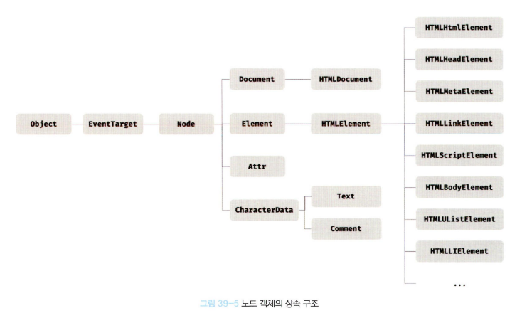
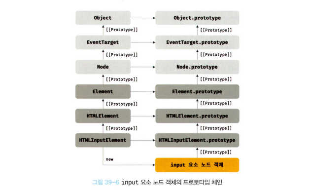
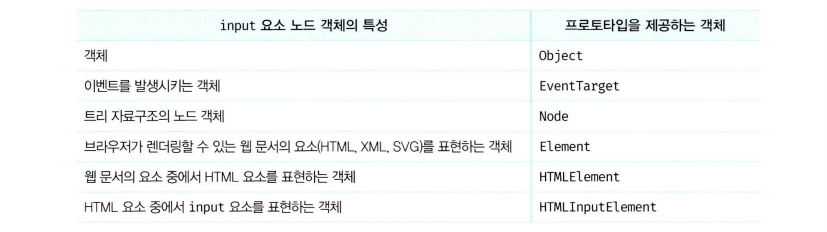
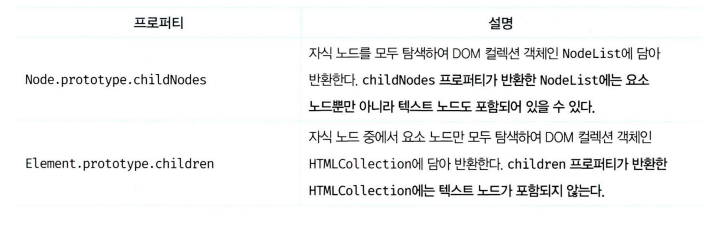
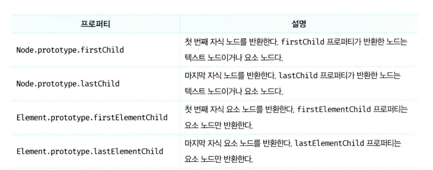
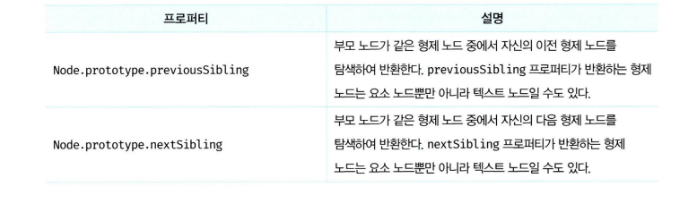
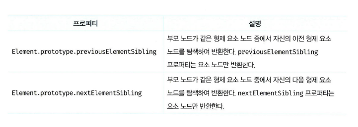

# 39.DOM

- 브라우저의 렌더링 엔진은 HTML문서를 파싱하여 브라우저가 이해할 수 있는 자료구조인 DOM을 생성한다. <b>DOM은 HTML 문서의 계층적 구조와 정보를 표현하며 이를 제어할 수 있는 API, 즉 프로퍼티와 메서드를 제공하는 트리 자료구조다.</b>

### 39.1 노드

#### 39.1.1 HTML 요소와 노드 객체

- HTML 요소는 HTML 문서를 구성하는 개별적인 요소를 의미한다. HTML 요소는 렌더링 엔진에 의해 파싱되어 DOM을 구성하는 요소 노드 객체로 변환된다. 이때 HTML요소의 어트리뷰트는 어트리뷰트 노드로, HTML 요소의 텍스트 콘텐츠는 텍스트 노드로 변환된다.


- HTML 문서는 HTML 요소들의 집합으로 이루어지며, HTML 요소는 중첩 관계를 가진다. 즉, HTML 요소의 콘텐츠 영역에는 텍스트뿐만 아니라 다른 HTML 요소도 포함할 수 있다.

이때 HTML 요소 간에는 중첩 관계에 의해 계층적인 부자관계가 형성된다. 이러한 HTML 요소 간의 부자 관계를 반영하여 HTML 문서의 구성 요소인 HTML 요소를 객체화한 모든 노드 객체들을 트리 자료구조로 구성한다.

#### 트리 자료구조

- 트리자료구조는 노드들의 계층 구조로 이루어진다. 즉, 트리 자료구조는 부모 노드와 자식노드로 구성되어 노드 간의 계층적 구조를 표현하는 비선형 자료구조를 말한다. 트리 자료구조는 하나의 최상위 노드에서 시작한다. 최상위 노드는 부모 노드가 없으며, 루트 노드라 한다. 루트 노드는 0개 이상의 자식 노드를 가진다. 자식 노드가 없는 노드를 리프 노드라 한다.

- 비선형 자료구조: 하나의 자료 뒤에 여러 개의 자료가 존재할 수 있다. (ex. 트리, 그래프)

- 선형 자료구조: 하나의 자료 뒤에 하나의 자료만 존재하는 자료구조 (ex. 배열, 스택, 큐, 연결 리스트, 해시 테이블 )

- <b>노드 객체들로 구성된 트리 자료구조를 DOM이라 한다.</b> 노드 객체의 트리로 구조화되어 있기 때문에 DOM을 <b>DOM 트리</b>라고 부르기도 한다.

#### 39.1.2 노드 객체의 타입

- #### 공백 텍스트 노드

- - HTML 요소 사이의 개행이나 공백은 텍스트 노드가 된다.

- 노드 객체는 종류가 있고 상속 구조를 가진다. 노드 객체는 총 12개의 종류가 있다. 이 중에서 중요한 노드 타입은 다음과 같이 4가지다.

- - #### 문서 노드
- - 문서 노드는 DOM 트리의 최상위에 존재하는 <b>루트 노드</b>로서 document 객체를 가리킨다. document 객체는 브라우저가 렌더링한 HTML 문서 전체를 가리키는 객체로서 전역 객체 window의 document 프로퍼티에 바인딩 되어 있다.

- - 브라우저 환경의 모든 자바스크립트 코드는 script 태그에 의해 분리되어 있어도 하나의 전역 객체 window를 공유한다. 따라서 모든 자바스크립트 코드는 전역 객체 window의 document 프로퍼티에 바인딩 되어 있는 하나의 document 객체를 바라본다. 즉, HTML 문서당 document 객체는 유일하다. DOM 트리의 루트 노드이므로 DOM 트리의 노드들에 접근하기 위한 진입점 역할을 담당한다.

- - #### 요소 노드
- - 요소 노드는 HTML 요소를 가리키는 객체다. 요소 노드는 HTML 요소 간의 중첩에 의해 부자 관계를 가지며, 이 부자 관계를 통해 정보를 구조화 한다. 따라서 요소 노드는 문서의 구조를 표현한다고 할 수 있다.

- - #### 어트리뷰트 노드
- - HTML 요소의 어트리뷰트를 가리키는 객체다. 어트리뷰트 노드는 어트리뷰트가 지정된 HTML 요소의 요소 노드와 연결되어 있다. 단, 요소 노드는 부모 노드와 연결되어 있지만 어트리뷰트 노드는 부모 노드와 연결되어 있지 않고 요소 노드에만 연결되어 있다. 즉, 어트리뷰트 노드는 부모노드가 없으므로 요소 노드의 형제 노드는 아니다.

- - #### 텍스트 노드
- - HTML 요소의 텍스트를 가리키는 객체다. 요소 노드가 문서의 구조를 표현한다면 텍스트 노드는 문서의 정보를 표현한다고 할 수 있다. 텍스트 노드는 요소 노드의 자식 노드이며, 자식 노드를 가질 수 없는 리프 노드다. 즉, 텍스트 노드는 DOM 트리의 최종단이다.

- 위 4가지 노드 타입 외에도 주석을 위한 Comment 노드, DOCTYPE을 위한 DocumentType 노드, 복수의 노드를 생성하여 추가할 때 사용하는 DocumentFragment 노드 등 총 12개의 노드 타입이 있다.

#### 39.1.3 노드 객체의 상속 구조

- DOM은 HTML 문서의 계층적 구조와 정보를 표현하며, 이를 제어할 수 있는 API, 즉 프로퍼티와 메서드를 제공하는 트리 자료구조라고 했다. 즉, DOM을 구성하는 노드 객체는 자신의 구조와 정보를 제어할 수 있는 DOM API를 사용할 수 있다. 이를 통해 노드 객체는 자신의 부모, 형제, 자식을 탐색할 수 있으며, 자신의 어트리뷰트와 텍스트를 조작할 수도 있다.

- DOM을 구성하는 노드 객체는 ECMAScript 사양에 정의된 표준 빌트인 객체가 아니라 브라우저 환경에서 추가적으로 제공하는 호스트 객체다. 하지만 노드 객체도 자바스크립트 객체이므로 프로토타입에 의한 상속 구조를 가진다.



- 위 그림과 같이 모든 노드 객체는 Object, EventTarget, Node 인터페이스를 상속받는다. 추가적으로 문서 노드는 Document, HTMLDocument 인터페이스를 상속받고 어트리뷰트 노드는 Attr, 텍스트 노드는 CharacterData 인터페이스를 각각 상속받는다.

- 요소 노드는 Element 인터페이스를 상속받는다. 또한 요소 노드는 추가적으로 HTMLElement와 태그의 종류별로 세분화된 HTMLhtmlElement, HTMLHeadElement, HTMLBodyElement, HTMLUListElement 등의 인터페이스를 상속받는다.

- 이를 프로토타입 체인의 관점에서 살펴보자, 예를 들어 input 요소 노드 객체는 HTMLInputElement, HTMLElement, Element, Node, EventTarget, Object의 prototype에 바인딩 되어 있는 프로토타입 객체를 상속받는다. 즉, input 요소 노드 객체는 프로토타입 체인에 있는 모든 프로토타입의 프로퍼티나 메서드를 상속받아 사용할 수 있다.



- 배열이 객체인 동시에 배열인 것처럼 input 요소 노드 객체도 다음과 같이 다양한 특성을 가지는 객체이며, 이러한 특성을 나타내는 기능들을 상속을 통해 제공받는다.



- 모든 노드 객체가 공통으로 가지는 기능도 있고, 노드 타입에 따라 고유한 기능도 있다. 예를 들어 모든 노드 객체는 공통적으로 이벤트를 발생시킬 수 있다. 이벤트에 관련된 기능은 EventTarget 인터페이스가 제공한다. 또한 모든 노드 객체는 트리 자료구조의 노드로서 공통적으로 트리 탐색 기능이나 노드 정보 제공 기능이 필요하다. 이 같은 노드 관련 기능은 Node 인터페이스가 제공한다.

- HTML요소가 가지는 공통적인 기능은 style프로퍼티가 있다. 이처럼 HTML 요소가 가지는 공통적인 기능은 HTMLElement 인터페이스가 제공한다.

- 하지만 요소 노드 객체는 HTML 요소의 종류에 따라 고유한 기능도 있다. 예를 들어 input 요소 노드 객체는 value 프로퍼티가 필요하지만 div 요소 노드 객체는 value 프로퍼티가 필요하지 않다. 따라서 필요한 기능을 제공하는 인터페이스(HTMLInputElement, HTMLDivElement 등)가 HTML 요소의 종류에 따라 각각 다르다.

- <b>DOM은 HTML 문서의 계층적 구조와 정보를 표현하는 것은 물론 노드 객체의 종류, 즉 노드 타입에 따라 필요한 기능을 프로퍼티와 메서드의 집합인 DOM API로 제공한다. 이 DOM API를 통해 HTML의 구조나 내용 또는 스타일 등을 동적으로 조작할 수 있다.</b>

### 39.2 요소 노드 취득

#### 39.2.1 id를 이용한 요소 노드 취득

- Document.prototype.getElementById
- 인수1 - id어트리뷰트값
- id값이 중복되어도 첫 번째 탐색 결과만 가져옴
- 해당 id를 가진 요소가 없으면 null 반환
- HTML 요소에 id어트리뷰트를 부여하면 id값과 동일한 이름의 전역 변수가 암묵적으로 선언되고 해당 노드 객체가 할당되는 부수 효과가 있다. (단, id값과 동일한 이름의 전역 변수가 이미 선언되어 있으면 이 전역 변수에 노드 객체가 재할당되지 않는다.)

#### 39.2.2 태그 이름을 이용한 요소 노드 취득

- Document.prototype./Element.prototype.getElementsByTagName
- 반환값이 DOM 컬렉션 객체인 HTMLCollection 객체는 유사배열 객체이면서 이터러블이다.
- 모든 요소 노드를 취득하려면 인수로 '\*'를 전달한다.

#### 39.2.3 class를 이용한 요소 노드 취득

- Document.prototype./Element.prototype.getElementsByClassName
- 반환값이 DOM 컬렉션 객체인 HTMLCollection 객체는 유사배열 객체이면서 이터러블이다.
- 인수로 전달된 class 값을 가진 요소가 없는 경우 빈 HTMLCollection 객체를 반환한다.

#### 39.2.4 CSS 선택자를 이용한 요소 노드 취득

- Document.prototype./Element.prototype.querySelector

  - 인수로 전달한 CSS 선택자를 만족시키는 요소 노드가 여러 개인 경우 첫 번째 요소 노드만 반환한다.
  - 인수로 전달한 CSS 선택자를 만족시키는 요소 노드가 없는 경우 null을 반환한다.
  - 인수로 전달한 CSS 선택자가 문법에 맞지 않는 경우 DOMException 에러가 발생한다.

- Document.prototype./Element.prototype.querySelectorAll
  - 인수로 전달한 CSS 선택자를 만족시키는 모든 요소 노드를 반환
  - 여러 개의 요소 노드 객체를 가지는 DOMCollection 객체인 NodeList 객체를 반환한다. NodeList 객체는 유사 배열 객체이면서 이터러블이다.
  - 인수로 전달한 CSS 선택자를 만족시키는 요소 노드가 없는 경우 빈NodeList 객체를 반환한다.
  - 인수로 전달한 CSS 선택자가 문법에 맞지 않는 경우 DOMException 에러가 발생한다.
  - 모든 요소 노드를 취득하려면 인수로 '\*'를 전달한다.

#### 39.2.5 특정 요소 노드를 취득할 수 있는지 확인

- Element.prototype.matches
- 인수로 전달한 CSS 선택자를 통해 특정 요소 노드를 취득할 수 있는지 확인한다.

#### 39.2.6 HTMLCollection과 NodeList

- DOM API가 여러 개의 결과값을 반환하기 위한 DOM 컬렉션 객체다. 둘 다 유사 배열 객체이면서 이터러블이다. 따라서 for...of 문으로 순회할 수 있으며 스프레드 문법을 사용하여 간단히 배열로 변환할 수 있다.

- 이 둘의 중요한 특징은 노드 객체의 상태 변화를 실시간으로 반영하는 <b>살아 있는 객체</b>라는 것이다. HTMLCollection은 언제나 live 객체로 동작한다. 단, NodeList는 대부분의 경우 노드 객체의 상태 변화를 실시간으로 반영하지 않고 과거의 정적 상태를 유지하는 non-live 객체로 동작하지만 경우에 따라 live 객체로 동작할 때가 있다.

- NodeList 객체는 NodeList.prototype.forEach 메서드를 상속받아 사용할 수 있다. NodeList.prototype은 forEach 외에도 item, entries, keys, values 메서드를 제공한다.

- NodeList는 대부분의 경우 노드 객체의 상태 변화를 실시간으로 반영하지 않고 과거의 정적 상태를 유지하는 non-live 객체로 동작한다. 하지만 <b>childNodes 프로퍼티가 반환하는 NodeList 객체는 HTMLCollection 객체와 같이 실시간으로 노드 객체의 상태 변경을 반영하는 live 객체로 동작하므로 주의가 필요하다.</b>

- 이처럼 HTMLCollection이나 NodeList 객체는 예상과 다르게 동작할 때가 있어 다루기 까다롭고 실수하기 쉽다. 따라서 <b>노드 객체의 상태 변경과 상관없이 안전하게 DOM 컬렉션을 사용하려면 HTMLCollection이나 NodeList객체를 배열로 변환하여 사용하는 것을 권장한다.</b>

### 39.3 노드 탐색

- 요소 노드를 취득한 다음, 취득한 요소 노드를 기점으로 DOM트리의 노드를 옮겨 다니며 부모, 형제, 자식 노드 등을 탐색해야 할 때가 있다.
- DOM 트리 상의 노드를 탐색할 수 있도록 Node, Element인터페이스는 트리 탐색 프로퍼티를 제공한다.

  - parentNode
  - previousSibling
  - firstChild
  - childNodes
  - Node.prototype이 제공하는 프로퍼티
  - 프로퍼티키에 Element가 포함된 previousElementSibling, nextElementSibling과 children 프로퍼티는 Element.prototype이 제공한다.

- 노드 탐색 프로퍼티는 모두 접근자 프로퍼티다. 단, 노드 탐색 프로퍼티는 setter없이 getter만 존재하여 참조만 가능한 읽기 전용 접근자 프로퍼티다. 읽기 전용 접근자 프로퍼티에 값을 할당하면 아무런 에러 없이 무시된다.

#### 39.3.1 공백 텍스트 노드

- HTML 요소 사이의 스페이스, 탭 , 줄바꿈 등의 공백 문자는 텍스트 노드를 생성한다. 이를 공백 텍스트 노드라 한다.

#### 39.3.2 자식 노드 탐색




#### 39.3.3 자식 노드 존재 확인

- Node.prototype.hasChildNodes
- childNodes 프로퍼티와 마찬가지로 텍스트 노드를 포함하여 자식 노드의 존재를 확인한다.
- 텍스트 노드를 제외하고 확인하려면 children.length 혹은 Element 인터페이스의 childElementCount 프로퍼티를 사용한다.

#### 39.3.4 요소 노드의 텍스트 노드 검색

- 텍스트 노드는 요소 노드의 자식노드이므로 firstChild 프로퍼티를 사용하여 탐색한다.

#### 39.3.5 부모 노드 탐색

- Node.prototype.parentNode

#### 39.3.6 형제 노드 탐색




### 39.4 노드 정보 취득

- 노드 객체에 대한 정보를 취득하려면 다음과 같은 노드 정보 프로퍼티를 사용한다.


### 39.5 요소 노드의 텍스트 조작

#### 39.5.1 nodeValue

- Node.prototype.nodeValue
- 참조와 할당 모두 가능
- 참조시 노드 객체의 값 반환 (텍스트 노드의 텍스트)
- 문서 노드나 요소 노드의 nodeValue를 참조하면 null을 반환
- 텍스트 노드의 nodeValue 프로퍼티에 값을 할당하면 텍스트 노드의 값, 즉 텍스트를 변경할 수 있다. 따라서 요소 노드의 텍스트를 변경하려면 다음과 같은 순서의 처리가 필요하다.
  - 1. 텍스트를 변경할 요소 노드를 취득한 다음, 취득한 요소의 텍스트 노드를 탐색한다. 텍스트 노드는 요소 노드의 자식노드이므로 firstChild 프로퍼티를 사용하여 탐색한다.
  - 2. 탐색한 텍스트 노드의 nodeValue 프로퍼티를 사용하여 값을 변경한다.

#### 39.5.2 textContent

- Node.prototype.textContent
- setter, getter 모두 존재
- 요소 노드의 텍스트와 모든 자손 노드의 텍스트를 모두 취득하거나 변경
- 참조시 요소 노드의 콘텐츠 영역 내의 텍스트를 모두 반환한다.
- 문자열을 할당하면 요소 노드의 모든 자식 노드가 제거되고 할당한 문자열이 텍스트로 추가된다. 이때 할당한 문자열에 HTML 마크업이 포함되어 있더라도 문자열 그대로 인식되어 텍스트로 취급된다.
- 유사한 동작을 하는 innerText 프로퍼티가 있다.
  - CSS에 순종적이다. 예를 들어 CSS에 의해 비표시로 지정된 요소 노드의 텍스트를 반환하지 않는다.
  - CSS를 고려해야 하므로 textContent 프로퍼티보다 느리다.

### 39.6 DOM 조작

#### 39.6.1 innerHTML

- Element.prototype.innerHTML
- setter,getter 모두 존재
- 참조시 요소 노드의 콘텐츠 영역내에 포함된 모든 마크업을 문자열로 반환
- XSS에 취약하므로 위험

```html
<!DOCTYPE html>
<html lang="en">
  <body>
    <div id="foo">Hello</div>
  </body>
  <script>
    document.getElementById("foo").innerHTML =
      "";
  </script>
</html>
```

#### HTML 새니티제이션

- 사용자로부터 입력받은 데이터에 의해 발생할 수 있는 크로스 사이트 스크립팅 공격을 예방하기 위해 잠재적 위험을 제거하는 기능을 말한다. 새니티제이션 함수를 직접 구현할 수도 있겠지만 DOMPurify 라이브러리를 사용하는 것을 권장한다.

#### 39.6.2 inserAdjacentHTML 메서드

- Element.prototype.inserAdjacentHTML(position, DOMString)
- 기존 요소를 제거하지 않으면서 위치를 지정해 새로운 요소를 삽입
- 인수1 - position (htmlText 파싱되어 들어가길 바라는 위치)

  - 1. "beforebegin" - 요소 이전에 위치합니다. 오직 요소가 DOM 트리에 있고 부모 요소를 가지고 있을 때만 유효합니다
  - 2. "afterbegin" - 요소 바로 안에서 처음 자식 이전에 위치합니다.
  - 3. "beforeend" - 요소 바로 안에서 마지막 자식 이후에 위치합니다.
  - 4. "afterend" - 요소 이후에 위치합니다. 오직 요소가 DOM 트리에 있고 부모 요소를 가지고 있을 때만 유효합니다.

- 인수2 - htmlText (text형식으로 날라온 html 양식)

#### 39.6.3 노드 생성과 추가

- Document.prototype.createElement(tagName)
- Document.prototype.createTextNode(text)
- Document.prototype.appendChild(childNode)

#### 39.6.4 복수의 노드 생성과 추가

- DOM을 변경하는 것은 높은 비용이 드는 처리이므로 가급적 횟수를 줄이는 편이 성능에 유리하다.
- 컨테이너 요소 사용 기법

  - 1. 컨테이너 요소를 미리 생성
  - 2. DOM에 추가해야 할 3개의 요소 노드를 컨테이너 요소에 자식으로 추가
  - 3. 컨테이너 요소를 삽입하면 DOM은 한 번만 변경된다.

- 불필요한 컨테이너 요소가 DOM에 추가되는 부작용이 있음
- DocumentFragment 노드를 통해 해결 가능

- DocumentFragment 노드는 기존 DOM과는 별도로 존재하므로 DocumentFragment 노드에 자식 노드를 추가 하여도 기존 DOM에는 어떠한 변경도 발생하지 않는다. 또한 DocumentFragment 노드를 DOM에 추가하면 자신은 제거되고 자신의 자식 노드만 DOM에 추가된다.

- Document.prototype.createDocumentFragment 메서드는 비어있는 DocumentFragment 노드를 생성하여 반환한다.

#### 39.6.5 노드 삽입

- Node.prototype.insertBefore(newNode,childNode)
- 인수1은 무조건 insertBefore메서드를 호출한 노드의 자식노드여야함
- 인수2가 null이라면 appendChild 처럼 동작

#### 39.6.6 노드 이동

- DOM에 이미 존재하는 노드를 appendChild 또는 insertBefore메서드를 이용하여 DOM에 다시 추가하면 현재 위치에서 노드를 제거하고 새로운 위치에 노드를 추가한다.

#### 39.6.7 노드 복사

- Node.prototype.cloneNode([deep: true | false])

#### 39.6.8 노드 교체

- Node.prototype.replaceChild(newChild, oldChild)

#### 39.6.9 노드 삭제

- Node.prototype.removeChild(Child)
- 인수는 무조건 removeChild 호출한 노드의 자식노드여야함

### 39.7 어트리뷰트

- 요소 노드의 모든 어트리뷰트 노드는 Element.prototype.attributes 프로퍼티로 취득할 수 있다. getter만 존재하는 읽기 전용이다. NamedNodeMap 객체를 반환한다.

- Element.prototype.getAttribute/setAttribute를 통해 참조와 조작을 할 수 있다.

- 존재여부의 확인은 Element.prototype.hasAttribute
- 삭제는 Element.prototype.removeAttribute

#### 39.7.3 HTML 어트리뷰트 vs DOM 프로퍼티

- HTML 어트리뷰트는 DOM에서 중복 관리되고 있지 않다. <b>HTML 어트리뷰트의 역할은 HTML 요소의 초기 상태를 지정하는 것이다. 즉, HTML 어트리뷰트 값은 HTML 요소의 초기 상태를 의미하며 이는 변하지 않는다.</b>

- 첫 렌더링까지는 동일 사용자의 입력을 받는다면 <b>요소 노드의 최신 상태를 관리하고 있는 DOM 프로퍼티가 변경된다.</b>

#### 39.7.4 data 어트리뷰트와 dataset 프로퍼티

- data 어트리뷰트와 dataset 프로퍼티를 사용하면 HTML 요소에 정의한 사용자 정의 어트리뷰트와 자바스크립트 간에 데이터를 교환할 수 있다. data 어트리뷰트는 data-user-id , data-role과 같이 data- 접두사 다음에 임의의 이름을 붙여 사용한다.

- data 어트리뷰트의 값은 HTMLElement.dataset 프로퍼티로 취득할 수 있다. dataset 프로퍼티는 HTML 요소의 모든 data 어트리뷰트의 정보를 제공하는 DOMStringMap 객체를 반환한다.

### 39.8 스타일

- HTMLElement.prototype.style 프로퍼티는 setter, getter 모두 존재하고 요소 노드의 <b>인라인 스타일</b>을 취득하거나 추가 또는 변경한다.

- 참조하면 CSSStyleDeclaration 타입의 객체를 반환한다.
- Element.prototype.className/classList를 통해 클래스 조작가능
- DOMTokenList 객체 / 유사배열객체/ 이터러블
- add, remove, item(index),contains(className),replace(old,new),toggle(className[ , force ])

### 39.9 DOM 표준

- WHATWG(구글, 애플, 마이크로소프트, 모질라로 구성된 단체)가 단일 표준을 내놓기로 합의되었다.

# 면접 예상 질문

## 💥 --;

# 이야기하고 싶은 것

--
