# 40. 이벤트

### 40.1 이벤트 드리븐 프로그래밍

- 브라우저는 처리해야 할 특정 사건이 발생하면 이를 감지하여 이벤트를 발생시킨다. 만약 애플리케이션이 특정 타입의 이벤트에 대해 반응하여 어떤 일을 하고 싶다면 해당하는 타입의 이벤트가 발생했을 때 호출될 함수를 브라우저에게 알려 호출을 위임한다. 이때 이벤트가 발생했을 때 호출될 함수를 <b>이벤트 핸들러</b>라 하고, 이벤트가 발생했을 때 브라우저에게 이벤트 핸들러의 호출을 위임하는 것을 <b>이벤트 핸들러 등록</b>이라한다.

- 함수를 언제 호출할지 알 수 없으므로 개발자가 명시적으로 함수를 호출하는 것이 아니라 브라우저에게 함수 호출을 위임하는 것이다.

- 프로그램의 흐름을 이벤트 중심으로 제어하는 프로그래밍 방식을 <b>이벤트 드리븐 프로그래밍</b>이라 한다.

### 40.2 이벤트 타입

- 이벤트 타입은 이벤트의 종류를 나타내는 문자열이다. 이벤트 타입에 대한 상세 목록은 MDN의 Event reference에서 확인할 수 있다.

#### 40.2.1 마우스 이벤트

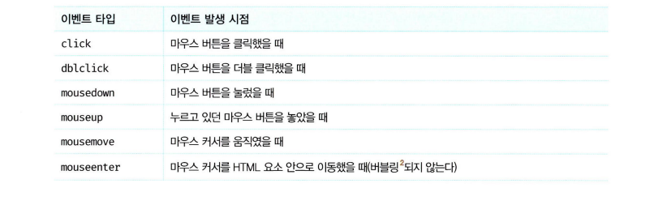
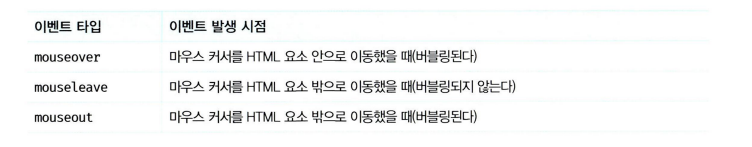

#### 40.2.2 키보드 이벤트


#### 40.2.3 포커스 이벤트


#### 40.2.4 폼 이벤트

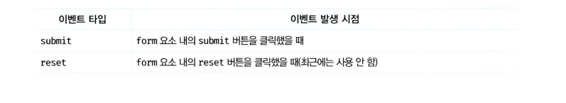

#### 40.2.5 값 변경 이벤트

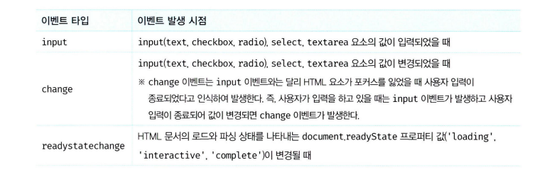

#### 40.2.6 DOM 뮤테이션 이벤트

 <table>
      <tr>
        <td>이벤트 타입</td>
        <td>이벤트 발생 시점</td>
      </tr>
      <tr>
        <td>DOMContentLoaded</td> 
        <td>HTML 문서의 로드와 파싱이 완료되어 DOM 생성이 완료되었을때</td>
      </tr>
  </table>

#### 40.2.7 뷰 이벤트

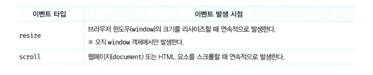

#### 40.2.8 리소스 이벤트

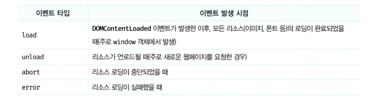

### 이벤트 핸들러 등록

- 이벤트 핸들러는 이벤트가 발생했을 때 브라우저에 호출을 위임한 함수다. 다시 말해, 이벤트가 발생하면 브라우저에 의해 호출될 함수가 이벤트 핸들러다.
- 이벤트 핸들러를 등록하는 방법은 3가지이다.

#### 40.3.1 이벤트 핸들러 어트리뷰트 방식

- HTML 요소의 어트리뷰트 중에는 이벤트에 대응하는 이벤트 핸들러 어트리뷰트가 있다. 이벤트 핸들러 어트리뷰트 이름은 onclick과 같이 on 접두사와 이벤트의 종류를 나타내는 이벤트타입으로 이루어져 있다. 이벤트 핸들러 어트리뷰트 값으로 함수 호출문 등의 문(statement)을 할당하면 이벤트 핸들러가 등록된다.

```html
<!DOCTYPE html>
<html>
  <body>
    <button onclick="sayHi('yang')">클릭</button>
  </body>
  <script>
    function sayHi(name) {
      console.log(`Hi ${name}.`);
    }
  </script>
</html>
```

- 주의할 점은 이벤트 핸들러 어트리뷰트 값으로 함수 참조가 아닌 함수 호출문 등의 문을 할당한다는 것이다. 이벤트 핸들러 프로퍼티 방식에서는 DOM 노드의 이벤트 핸들러 프로퍼티에 함수 참조를 할당한다.

- 이벤트 핸들러 등록이란 함수 호출을 브라우저에게 위임하는 것이라 했다. 따라서 이벤트 핸들러를 등록할때 콜백 함수와 마찬가지로 함수 참조를 등록해야 브라우저가 이벤트 핸들러를 호출할 수 있다. 만약 함수 참조가 아니라 함수 호출문을 등록하면 함수 호출문의 평가 결과가 이벤트 핸들러로 등록된다. 함수를 반환하는 고차 함수 호출문을 이벤트 핸들러로 등록한다면 문제가 없겠지만 함수가 아닌 값을 반환하는 함수 호출문을 이벤트 핸들러로 등록하면 브라우저가 이벤트 핸들러를 호출할 수 없다.

- 하지만 위 예제에서는 이벤트 핸들러 어트리뷰트 값으로 함수 호출문을 할당했다. 이때 <b>이벤트 핸들러 어트리뷰트 값은 사실 암묵적으로 생성될 이벤트 핸들러의 함수 몸체를 의미한다.</b> 즉, onclick="sayHi('Lee')" 어트리뷰트는 파싱되어 다음과 같은 함수를 암묵적으로 생성하고, 이벤트 핸들러 어트리뷰트 이름과 동일한 키 onclick 이벤트 핸들러 프로퍼티에 할당한다.

```jsx
function onclick() {
  sayHi("yang");
}
```

- 이처럼 동작하는 이유는 이벤트 핸들러에 인수를 전달하기 위해서다. 만약 이벤트 핸들러 어트리뷰트 값으로 함수 참조를 할당해야 한다면 이벤트 핸들러에 인수를 전달하기 곤란하다.

- 결국 이벤트 핸들러 어트리뷰트 값으로 할당한 문자열은 암묵적으로 생성되는 이벤트 핸들러의 함수 몸체다. 따라서 이벤트 핸들러 어트리뷰트 값으로 다음과 같이 여러 개의 문을 할당할 수 있다.

```jsx
<button onclick="console.log('Hi!'); console.log('yang');">클릭</button>
```

- 이벤트 핸들러 어트리뷰트 방식은 오래된 코드에서 간혹 이 방식을 사용한 것이 있기 때문에 알아둘 필요는 있지만 더는 사용하지 않는 것이 좋다. HTML과 자바스크립트는 관심사가 다르므로 혼재하는 것보다 분리하는 것이 좋다.

- 하지만 모던 자바스크립트에서는 이벤트 핸들러 어트리뷰트 방식을 사용하는 경우가 있다. CBD(Component Based Development)
  방식의 SPA 프레임워크/라이브러리에서는 이벤트 핸들러 어트리뷰트 방식으로 이벤트를 처리한다. CBD에서는 HTML,CSS, 자바스크립트를 관심사가 다른 개별적인 요소가 아닌, 뷰를 구성하기 위한 요소로 보기 때문에 관심사가 다르다고 생각하지 않는다.

#### 40.3.2 이벤트 핸들러 프로퍼티 방식

- window 객체와 Document, HTMLElement 타입의 DOM 노드 객체는 이벤트에 대응하는 이벤트 핸들러 프로퍼티를 가지고 있다. 이벤트 핸들러 프로퍼티의 키는 이벤트 핸들러 어트리뷰트와 마찬가지로 onclick과 같이 on 접두사와 이벤트의 종류를 나타내는 이벤트 타입으로 이루어져 있다. 이벤트 핸들러 프로퍼티에 함수를 바인딩하면 이벤트 핸들러가 등록된다.

```html
<!DOCTYPE html>
<html>
  <body>
    <button>클릭</button>
  </body>
  <script>
    const $button = document.querySelector("button");

    $button.onclick = function () {
      console.log("button click");
    };
  </script>
</html>
```

- 이벤트 핸들러는 대부분 이벤트를 발생시킬 이벤트 타깃에 바인딩한다. 하지만 반드시 이벤트 타깃에 이벤트 핸들러를 바인딩해야 하는 것은 아니다. 이벤트 핸들러는 이벤트 타깃 또는 전파된 이벤트를 개치할 DOM 노드 객체에 바인딩한다.

- 앞서 살펴본 이벤트 핸들러 어트리뷰트 방식도 결국 DOM 노드 객체의 이벤트 핸들러 프로퍼티로 변환되므로 결과적으로 이벤트 핸들러 프로퍼티 방식과 동일하다고 할 수 있다.

- 이벤트 핸들러 프로퍼티 방식은 HTML과 자바스크립트가 혼재되는 문제를 해결할 수 있다. 하지만 이벤트 핸들러 프로퍼티에 하나의 이벤트 핸들러만 바인딩할 수 있다는 단점이 있다.

#### 40.3.3 addEventListener 메서드 방식

- EventTarget.prototype.addEventListener
- 1번째 매개변수에는 이벤트의 종류를 나타내는 문자열인 이벤트 타입을 전달한다.
- 2번째 매개변수에는 이벤트 핸들러를 전달한다.
- 3번째 매개변수에는 이벤트를 개치할 이벤트 전파 단계(캡처링 또는 버블링)를 지정한다. 생략하거나 false를 지정하면 버블링 단계에서 이벤트를 캐치하고, true를 지정하면 캡처링 단계에서 이벤트를 캐치한다.

- addEventListener 메서드 방식은 이벤트 핸들러 프로퍼티에 바인딩된 이벤트 핸들러에 아무런 영향을 주지 않는다. 따라서 버튼 요소에서 클릭 이벤트가 발생하면 2개의 이벤트 핸들러가 모두 호출된다.

- 동일한 HTML 요소에서 발생한 동일한 이벤트에 대해 이벤트 핸들러 프로퍼티 방식은 하나 이상의 이벤트 핸들러를 등록할 수 없지만 addEventListener 메서드는 하나 이상의 이벤트 핸들러를 등록할 수 있다. 이때 이벤트 핸들러는 등록된 순서대로 호출된다.

- 단, addEventListener 메서드를 통해 참조가 동일한 이벤트 핸들러를 중복 등록하면 하나의 이벤트 핸들러만 등록된다.

### 40.4 이벤트 핸들러 제거

- addEventListener 메서드로 등록한 이벤트 핸들러를 제거하려면 EventTarget.prototype.removeEventListener 메서드를 사용한다. removeEventListener 메서드에 전달할 인수는 addEventListener 메서드와 동일하다. 단, addEventListener 메서드에 전달한 인수와 removeEventListener 메서드에 전달한 인수가 일치하지 않으면 이벤트 핸들러가 제거되지 않는다.

- removeEventListener 메서드에 인수로 전달한 이벤트 핸들러는 addEventListener 메서드에 인수로 전달한 등록 이벤트 핸들러와 동일한 함수이어야 한다. 따라서 다음과 같이 무명 함수를 이벤트 핸들러로 등록한 경우 제거할 수 없다. 이벤트 핸들러를 제거하려면 이벤트 핸들러의 참조를 변수나 자료구조에 저장하고 있어야 한다.

- 단, 기명 이벤트 핸들러 내부에서 removeEventListener 메서드를 호출하여 이벤트 핸들러를 제거하는 것은 가능하다. 이때 이벤트 핸들러는 단 한 번만 호출된다.

```jsx
$button.addEventListener("click", function foo() {
  console.log("clicked");

  $button.removeEventListener("click", foo);
});
```

- 기명 함수를 이벤트 핸들러로 등록할 수 없다면 호출된 함수, 즉 함수 자신을 가리키는 arguments.callee 를 사용할 수도 있다.

```jsx
$button.addEventListener("click", function () {
  console.log("clicked");

  $button.removeEventListener("click", arguments.callee);
});
```

- arguments.callee는 코드 최적화를 방해하므로 strict mode에서 사용이 금지된다. 따라서 가급적 이벤트 핸들러의 참조를 변수나 자료구조에 저장하여 제거하는 편이 좋다.

- 이벤트 핸들러 프로퍼티 방식으로 등록한 이벤트 핸들러는 removeEventListener 메서드로 제거할 수 없다. 이벤트 핸들러 프로퍼티 방식으로 등록한 이벤트 핸들러를 제거하려면 이벤트 핸들러 프로퍼티에 null을 할당한다.

### 40.5 이벤트 객체

- 이벤트가 발생하면 이벤트에 관련한 다양한 정보를 담고 있는 이벤트 객체가 동적으로 생성된다. <b>생성된 이벤트 객체는 이벤트 핸들러의 첫 번째 인수로 전달된다.</b>

- 브라우저가 이벤트 핸들러를 호출할 때 이벤트 객체를 인수로 전달하기 때문이다. 따라서 이벤트 객체를 전달받으려면 이벤트 핸들러를 정의할 때 이벤트 객체를 전달받을 매개변수를 명시적으로 선언해야 한다.

- 이벤트 핸들러 어트리뷰트 방식으로 이벤트 핸들러를 등록했다면 다음과 같이 event를 통해 이벤트 객체를 전달받을 수 있다.

```jsx
/** event가 아닌 다른 이름으로는 이벤트 객체를 전달받지 못한다.*/
<button onclick="showCoords(event)"></button>;

const $msg = document.querySelector(".message");

function showCoords(e) {
  $msg.textContent = `clientX: ${e.clientX}, clientY: ${e.clientY}`;
}
```

- 다음과 같이 변환된다.

```jsx
function onclick(event) {
  showCoords(event);
}
```

- 이때 암묵적으로 생성된 onclick 이벤트 핸들러의 첫 번째 매개변수의 이름이 event로 명명되기 때문에 event가 아닌 다른 이름으로는 이벤트 객체를 전달받지 못한다.

#### 40.5.1 이벤트 객체의 상속 구조

- 이벤트가 발생하면 이벤트 타입에 따라 다양한 타입의 이벤트 객체가 생성된다. 이벤트 객체는 다음과 같은 상속 구조를 가진다.

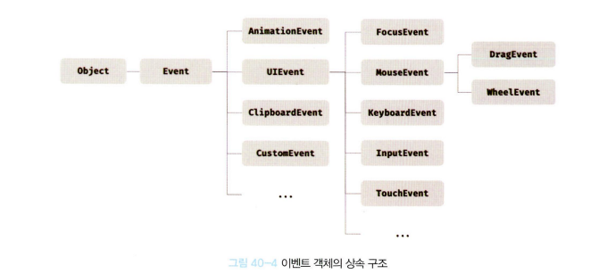

- 위 그림의 Event, UIEvent, MouseEvent 등 모두는 생성자 함수다. 따라서 다음과 같이 생성자 함수를 호출하여 이벤트 객체를 생성할 수 있다.

- 이벤트가 발생하면 암묵적으로 생성되는 이벤트 객체도 생성자 함수에 의해 생성된다. 그리고 생성된 이벤트 객체는 생성자 함수와 더불어 생성되는 프로토타입으로 구성된 프로토타입 체인의 일원이 된다. 예를 들어 click 이벤트가 발생하면 암묵적으로 생성되는 MouseEvent 타입의 이벤트 객체는 다음과 같은 프로토타입 체인의 일원이 된다.

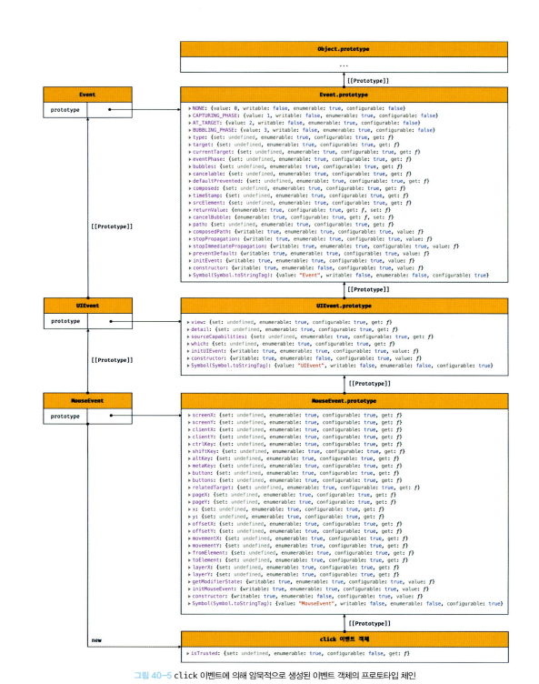

- 이벤트 객체 중 일부는 사용자 행위에 의해 생성된 것이고 일부는 자바스크립트 코드에 의해 인위적으로 생성된 것이다. 예를 들어 MouseEvent 타입의 이벤트 객체는 사용자가 마우스를 클릭하거나 이동했을 때 생성되는 이벤트 객체이며, CustomEvent 타입의 이벤트 객체는 자바스크립트 코드에 의해 인위적으로 생성한 이벤트 객체다.

- Event 인터페이스는 DOM 내에서 발생한 이벤트에 의해 생성되는 이벤트 객체를 나타낸다. Event 인터페이스에는 모든 이벤트 객체의 공통 프로퍼티가 정의되어 있고 FocusEvent, MouseEvent, KeyboardEvent, WheelEvent 같은 하위 인터페이스에는 이벤트 타입에 따라 고유한 프로퍼티가 정의되어 있다.

#### 40.5.2 이벤트 객체의 공통 프로퍼티

- Event 인터페이스, 즉 Event.prototype에 정의되어 있는 이벤트 관련 프로퍼티는 모든 파생 이벤트 객체에 상속된다. 즉, Event 인터페이스의 이벤트 관련 프로퍼티는 모든 이벤트 객체가 상속받는 공통 프로퍼티이다.

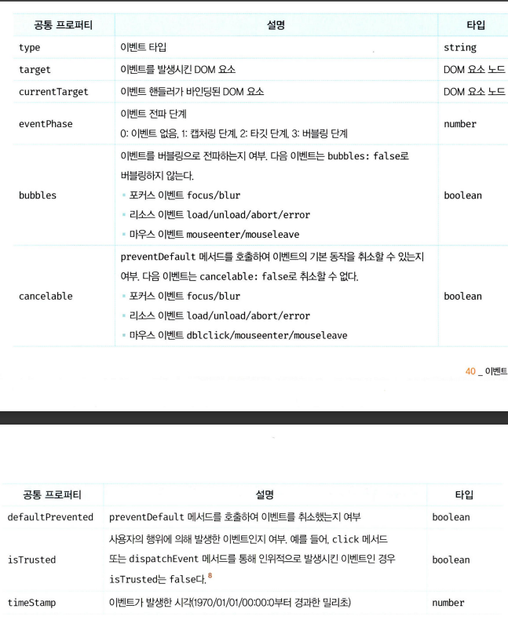

- target 프로퍼티는 이벤트를 발생시킨 객체를 나타낸다.
- currentTarget 프로퍼티는 이벤트 핸들러가 바인딩된 DOM 요소를 가리킨다.

- 이벤트 객체의 target 프로퍼티와 currentTarget 프로퍼티는 동일한 DOM 요소를 가리키지만 서로 다른 DOM 요소를 가리킬 수 있다.

#### 40.5.3 마우스 정보 취득

- 마우스 이벤트가 발생하면 생성되는 MouseEvent 타입의 이벤트 객체는 다음과 같은 고유의 프로퍼티를 가진다.

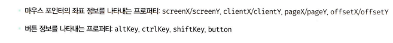

#### 40.5.4 키보드 정보 취득

- 키보드 이벤트가 발생하면 생성되는 KeyboardEvent 타입의 이벤트 객체는 altKey, ctrlKey, shiftKey, metaKey, key, keyCode 같은 고유의 프로퍼티를 가진다.

### 40.6 이벤트 전파

- DOM 트리 상에 존재하는 DOM 요소 노드에서 발생한 이벤트는 DOM 트리를 통해 전파된다. 이를 이벤트 전파라고 한다.
- <b>생성된 이벤트 객체는 이벤트를 발생시킨 DOM 요소인 이벤트 타깃을 중심으로 DOM 트리를 통해 전파된다.</b>

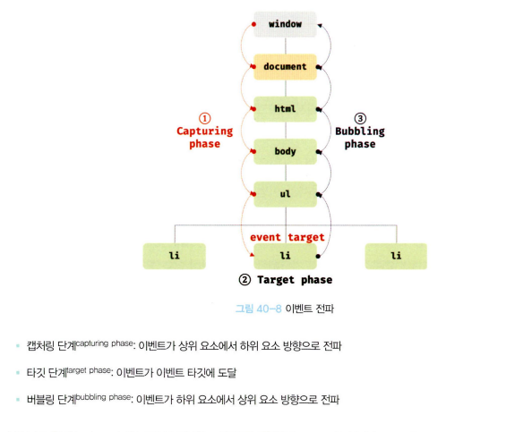

- 특정 요소에서 이벤트가 발생하면 이벤트 객체가 생성되고 window에서부터 시작하여 이벤트 타깃 방향으로 전파된다. 이것이 캡처링 단계다. 이후 이벤트 객체는 이벤트를 발생시킨 이벤트 타깃에 도달한다. 이것이 타깃 단계다. 이후 이벤트 객체는 이벤트 타깃에서 시작하여 window 방향으로 전파된다. 이것이 버블링 단계다.

- 이벤트 핸들러 어트리뷰트/프로퍼티 방식으로 등록한 이벤트 핸들러는 타깃 단계와 버블링 단계의 이벤트만 캐치할 수 있다. 하지만 addEventListener 메서드 방식으로 등록한 이벤트 핸들러는 타깃 단계와 버블링 단계뿐만 아니라 캡처링 단계의 이벤트도 선별적으로 캐치할 수 있다. 캡처링 단계의 이벤트를 캐치하려면 addEventListener 메서드의 3번째 인수로 true를 전달해야한다. 3번째 인수를 생략하거나 false를 전달하면 타깃 단계와 버블링 단계의 이벤트만 캐치할 수 있다.

- <b>이벤트는 이벤트를 발생시킨 이벤트 타깃은 물론 상위 DOM 요소에서도 캐치할 수 있다.</b> 즉, DOM 트리를 통해 전파되는 이벤트는 이벤트 패스(이벤트가 통과하는 DOM 트리 상의 경로, Event.prototype.composedPath 메서드로 확인할 수 있다.)에 위치한 모든 DOM 요소에서 캐치할 수 있다.

- 대부분의 이벤트는 캡처링과 버블링을 통해 전파된다. 하지만 다음 이벤트는 버블링을 통해 전파되지 않는다. 이 이벤트들은 버블링을 통해 이벤트를 전파하는지 여부를 나타내는 이벤트 객체의 공통 프로퍼티 event.bubbles의 값이 모두 false다.

  - 포커스 이벤트: focus/blur
  - 리소스 이벤트: load/unload/abort/error
  - 마우스 이벤트: mouseenter/mouseleave

- 위 이벤트는 버블링되지 않으므로 이벤트 타깃의 상위 요소에서 위 이벤트를 캐치하려면 캡처링 단계의 이벤트를 캐치해야 한다. 하지만 위 이벤트를 상위 요소에서 캐치해야 할 경우 대체할 수 있는 이벤트가 존재한다. 예를 들어, focus/blur 이벤트는 focusin/fucusout으로, mouseenter/mouseleave는 mouseover/mouseout으로 대체할 수 있다. focusin/focusout, mouseover/mouseout은 버블링을 통해 전파된다.

### 40.7 이벤트 위임

-...

### 40.8 DOM 요소의 기본 동작 조작

#### 40.8.1 DOM요소의 기본 동작 중단

- e.preventDefault 메서드

#### 40.8.2 이벤트 전파 방지

- e.stopPropagation 메서드
- 자신이 발생시킨 이벤트가 전파되는 것을 중단하여 자신에게 바인딩된 이벤트 핸들러만 실행되도록 한다.

### 40.9 이벤트 핸들러 내부의 this

#### 40.9.1 이벤트 핸들러 어트리뷰트 방식

- this는 전역 객체 window를 가리킨다.
- 바인딩된 문자열이 암묵적으로 생성되는 이벤트 핸들러 함수의 몸체이기 때문..

- 단, 이벤트 핸들러를 호출할 때 인수로 전달한 this는 이벤트를 바인딩한 DOM 요소를 가리킨다.

```jsx
<button onclick="handleClick(this)">클릭</button>;

function handleClick(button) {
  console.log(button); // 이벤트를 바인딩한 버튼 요소
  console.log(this); // window;
}
```

- 위 예제에서 handleClick 함수에 전달한 this는 암묵적으로 생성된 이벤트 핸들러 내부의 this다. 즉, 이벤트 핸들러 어트리뷰트 방식에 의해 암묵적으로 생성된 이벤트 핸들러 내부의 this는 이벤트를 바인딩한 DOM 요소를 가리킨다. 이는 이벤트 핸들러 프로퍼티 방식과 동일하다.

#### 40.9.2 이벤트 핸들러 프로퍼티 방식과 addEventListener 메서드 방식

- 두 가지 방식 모두 이벤트 핸들러 내부의 this는 이벤트를 바인딩한 DOM 요소를 가리킨다. 즉, 이벤트 핸들러 내부의 this는 이벤트 객체의 currentTarget 프로퍼티와 같다. (단, 함수선언문으로 핸들러를 작성한 경우에만)

### 40.10 이벤트 핸들러에 인수 전달

- 이벤트 핸들러 어트리뷰트 방식은 함수 호출문을 사용할 수 있기 때문에 인수를 전달할 수 있지만 이벤트 핸들러 프로퍼티 방식과 addEventListener 메서드 방식의 경우 이벤트 핸들러를 브라우저가 호출하기 때문에 함수 호출문이 아닌 함수 자체를 등록해야 한다. 따라서 인수를 전달할 수 없다. 그러나 인수를 전달할 방법이 전혀 없는 것은 아니다.

- 핸들러 내부에서 함수를 호출하면서 인수를 전달한다. (실제로 사용할 핸들러 밖으로 함수를 한번 더 감싸는 형태)

### 40.11 커스텀 이벤트

#### 40.11.1 커스텀 이벤트 생성

- 이벤트 생성자 함수를 호출하여 명시적으로 생성한 이벤트 객체는 임의의 이벤트 타입을 지정할 수 있다. 이처럼 개발자의 의도로 생성된 이벤트를 커스텀 이벤트라 한다.

- 1번째 인수로 이벤트 타입을 나타내는 문자열을 전달받는다. 이때 이벤트 타입을 나타내는 문자열은 기존 이벤트 타입을 사용할 수도 있고, 기존 이벤트 타입이 아닌 임의의 문자열을 사용하여 새로운 이벤트 타입을 지정할 수도 있다. 이 경우에는 일반적으로 CustomEvent 이벤트 생성자 함수를 사용한다.

```jsx
const customEvent = new CustomEvent("foo");
console.log(customEvent.type); // foo
```

- 생성된 커스텀 이벤트 객체는 버블링되지 않으며 preventDefault 메서드로 취소할 수도 없다. 즉, 커스텀 이벤트 객체는 bubbles와 cancelable 프로퍼티의 값이 false로 기본 설정된다.

- bubbles와 cancelable 프로퍼티의 값을 true로 설정하려면 이벤트 생성자 함수의 두 번째 인수로 bubbles 또는 cancelable 프로퍼티를 가지는 객체를 전달한다.

```jsx
const customEvent = new CustomEvent("foo", {
  bubbles: true,
  cancelable: true,
});
console.log(customEvent.bubbles); // true
console.log(customEvent.cancelable); // true
```

- 커스텀 이벤트 객체에는 bubbles 또는 cancelable 프로퍼티뿐만 아니라 이벤트 타입에 따라 가지는 이벤트 고유의 프로퍼티 값을 지정할 수 있다. 이 또한 마찬가지로 두번째 인수로 전달하는 객체의 프로퍼티로 바인딩 하여 전달한다.

- 이벤트 생성자 함수로 생성한 커스텀 이벤트는 isTrusted 프로퍼티의 값이 언제나 false다. 커스텀 이벤트가 아닌 사용자의 행위에 의해 발생한 이벤트에 의해 생성된 이벤트 객체의 isTrusted 프로퍼티 값은 언제나 true 다.

#### 40.11.2 커스텀 이벤트 디스패치

- 생성된 커스텀 이벤트는 dispatchEvent메서드로 디스패치(이벤트를 발생시키는 행위)할 수 있다.

- 일반적으로 이벤트 핸들러는 비동기처리 방식으로 동작하지만 dispatchEvent메서드는 이벤트 핸들러를 동기처리 방식으로 호출한다. 다시말해, 커스텀이벤트에 바인딩된 이벤트 핸들러를 직접 호출하는 것과 같다.

# 면접 예상 질문

## 💥 이벤트 전파와 위임 ..

# 이야기하고 싶은 것

addEventListener 의 세번째 인수옵션 : {once: true}

- 한번 동작한 이후로는 이벤트가 발생해도 동작하지 않음
