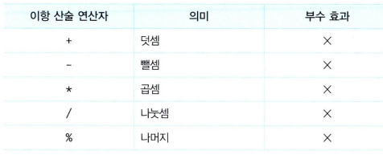
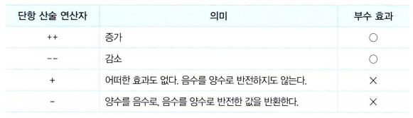
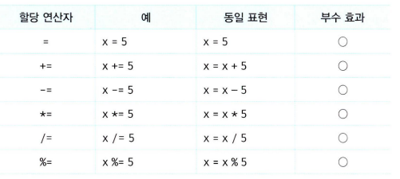
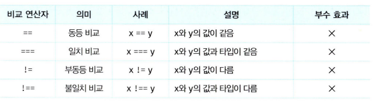

# 핵심 내용 정리

- 연산자 : 하나 이상의 표현식을 대상으로 연산을 등을 수행하여 하나의 값을 만듦
- 피연산자 : 연산의 대상, 값으로 평가될 수 있는 표현식임
  - 5 \* 4 // 5와 4가 피연산자
- 연산자 표현식 : 역시 표현식임

## 7.1 산술 연산자

- 수학적 계산, 산술 연산 불가능 시 NaN 반환
- 이항 산술 연산자 : 2개의 피연산자
  
  - 피연산자의 값을 변경하는 부수효과 X, 즉 언제나 새로운 값 반환
- 단항 산술 연산자 : 1개의 피연산자
  
  - ++, --은 피연산자의 값을 변경하는 부수효과 O
    - `var x = 1; x++; console.log(x) // 2`,
      2가 나오는 이유는 압묵적 할당이 이루어진것
    - ++, --의 위치에 따라 `선 할당 후 연산` 혹은 `선 연산 후 할당` 진행
  - +:아무런 효과 없음, 타입을 숫자로 바꾸고 싶을때 주로 사용
  - -: 양수,음수로 반전된 값 반환
    - `-(-10) // 10`
    - `-true // -1` 불리언 값을 숫자로 변환
- 문자열 연결 연산자 : 피연산자 중 하나 이상이 문자열이면 문자열 연결 연산자로 아니면 산술 연산자로 동작 => 압묵적 타입변환 or 타입강제변환
  - `'1'+2 = '12'` 문자열 연결 연산자 동작
  - `1 + false // 1` 산수 연산자 동작
  - `1 + true // 2` 산수 연산자 동작
  - `'1' + true // '1true'` 문자열 연결 연산자 동작

## 7.2 할당 연산자

- 우항 피연산자의 평과 결과를 좌항의 변수에 할당
- 모두 부수효과 O

* 할당문은 표현식 : 할당된 값으로 평가되며 연쇄 할당도 가능하다
  - `a = b = c = 0 // 0,0,0`

## 7.3 비교 연산자

- 좌항,우항 피연산자 비교하여 불리언 값 반환
- if, for 제어문 조건식에서 주로 사용
- 동등/일치 비교 연산자
  
      - == : 압묵적 타입 변환을 통해 타입을 일치 시키고 비교 ⇒ 예측이 어렵다
      - === : 타입도 같고 값도 같을때만 true 반환 ⇒ 예측이 쉽다
          - 주의 : `NaN === NaN // false` 따라서 `isNaN(NaN)` 이나 `Object.is(NaN,NaN) // true` 권장
          - 주의 : `0 === -0 // true` 따라서 `Object.is(+0,-0) // false` 권장
- 대소관계비교연산자
  

## 7.4 삼항 연산자

## 7.5 논리 연산자

## 7.6 쉼표 연산자

## 7.7 그룹 연산자

## 7.8 typeof 연산자

## 7.9 지수 연산자

## 7.10 그 외의 연산자

## 7.11 연산자의 부수 효과

## 7.12 연산자 우선순위

## 7.13 연산자 결합 순서

---

# 면접 예상 질문

## 💥 ~~ 이란?

---

# 이야기하고 싶은 것

### p.74

> 값으로 평가될 수 있는 표현식임
>
> 평가 의미 : 값을 헤아려 매김 즉, 값을 헤아려 매길수 있는 것이 표현식이다.

### p. 38 (예시)

> 좋은 이름, 즉 변수에 저장된 값의 의미를 파악할 수 있는 변수 이름은 가독성을 높이는 부수적인 효과도 있다.
>
> 코드는 컴퓨터에게 내리는 명령이지만 개발자를 위한 문서이기도 하다. 개발자의 의도를 나타내는 명확한 네이밍은 코드를 이해하기 쉽게 만들며, 이는 협업과 품질 향상에 도움을 준다. 변수 이름은 첫아이 이름을 짓듯이 심사숙고해서 지어야 한다.

이 부분이 인상깊어 공유하고 싶었습니다.
