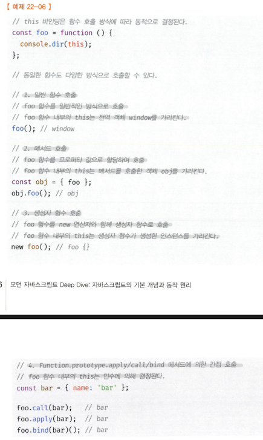
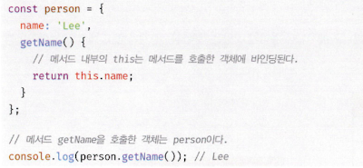
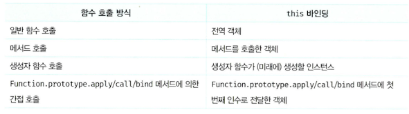

# 핵심 내용 정리

## **22.1 this 키워드**

- 객체는 상태를 나타내는 프로퍼티와 동작을 나타내는 메서드를 하나의 논리적인 단위로 묶은 복합적인 단위 자료구조다.
- 동작을 나타내는 메서드는 자신이 속한 객체의 상태, 즉 프로퍼티를 참조하고 변경할 수 있어야 한다.
- **자신이 속한 객체를 가리키는 식별자를 참조할 수 있어야 한다**
- 자기 자신이 속한 객체를 재귀적으로 참조하는 방식은 일반적이지 않으며 바람직하지도 않다.
- 생성자 함수를 정의하는 시점에는 아직 인스턴스를 생성하기 이전이므로 생성자 함수가 생성할 인스턴스를 가리키는 식별자를 알 수 없다. 따라서 자신이 속한 객체 또는 자신이 생성할 인스턴스를 가리키는 특수한 식별자가 필요하다. 이를 위해 자바스크립트는 this라는 특수한 식별자를 제공한다.
- **this는 자신이 속한 객체 또는 자신이 생성할 인스턴스를 가리키는 자기참조변수다. this를 통해 자신이 속한 객체 또는 자신이 생성할 인스턴스의 프로퍼티나 메서드를 참조할 수 있다.**
- this는 자바스크립트 엔진에 의해 암묵적으로 생성되며, 코드 어디서든 참조할 수 있다. 함수를 호출하면 arguments 객체와 this가 암묵적으로 함수 내부에 전달된다.
- **this가 가리키는 값, 즉 this 바인딩은 함수 호출 방식에 의해 동적으로 결정된다.**
- 바인딩이란 식별자와 값을 연결하는 과정을 의미한다. this 바인딩은 this(키워드로 분류되지만 식별자 역할을 한다)와 this가 가리킬 객체를 바인딩하는 것이다.
- **자바스크립트의 this는 함수가 호출되는 방식에 따라 this에 바인딩될 값, 즉 this 바인딩이 동적으로 결정된다.**
- strict mode(엄격모드) 역시 this 바인딩에 영향을 준다.
- this는 코드 어디에서든 참조 가능하다.

- strict mode가 적용된 일반 함수 내부의 this에는 undefined가 바인딩된다. 일반 함수 내부에서 this를 사용할 필요가 없기 때문이다.

## 22.2 함수 호출 방식과 this 바인딩

- **this 바인딩(this에 바인딩될 값)은 함수 호출 방식, 즉 함수가 어떻게 호출되었는지에 따라 동적으로 결정된다**
- **렉시컬 스코프와 this 바인딩은 결정 시기가 다르다**. 함수의 상위 스코프를 결정하는 방식인 렉시컬 스코프는 함수 정의가 평가되어 함수 객체가 생성되는 시점에 상위 스코프를 결정한다. 하지만 this 바인딩은 함수 호출 시점에 결정된다.
- 함수를 호출하는 방식은 다음과 같다.
    - 일반 함수 호출
    - 메서드 호출
    - 생성자 함수 호출
    - Function.prototype.apply/call/bind 메서드에 의한 간접 호출

### 1. 일반 함수 호출

- **기본적으로 this에는 전역 객체가 바인딩된다.**
- 전역 함수는 물론이고 중첩 함수를 **일반 함수로 호출하면 함수 내부의 this에는 전역 객체가 바인딩된다.**
- 다만 this는 객체의 프로퍼티나 메서드를 참조하기 위한 자기 참조 변수이므로 객체를 생성하지 않는 일반 함수에서 this는 의미가 없다.
- strict mode가 적용된 일반 함수 내부의 this에는 undefined가 바인딩된다.
- 콜백 함수가 일반 함수로 호출된다면 콜백 함수 내부의 this에도 전역 객체가 바인딩된다.
- **일반 함수로 호출된 모든 함수(중첩 함수, 콜백 함수 포함) 내부에 this에는 전역 객체가 바인딩된다.**
- 메서드 내에서 정의한 중첩 함수 또는 메서드에게 전달한 콜백 함수(보조 함수)가 일반 함수로 호출될 때 메서드 내의 중첩 함수 또는 콜백 함수의 this가 전역 객체를 바인딩하는 것은 문제가 있다. 중첩 함수 또는 콜백 함수는 외부 함수를 돕는 헬퍼 함수의 역할을 하므로 외부 함수의 일부 로직을 대신하는 경우가 대부분이다. 하지만 외부 함수인 메서드와 중첩 함수 또는 콜백 함수의 this가 일치하지 않는다는 것은 중첩 함수 또는 콜백 함수를 헬퍼 함수로 동작하기 어렵게 만든다.
- 메서드 내부의 중첩 함수나 콜백 함수의 this 바인딩을 메서드의 this 바인딩과 일치시키기 위한 방법은 다음과 같다.
    - this 바인딩을 변수에 할당하고, 콜백 함수 내에서 this 대신 해당 변수를 참조한다.
        
        
        
    - this를 명시적으로 바인딩할 수 있는 Function.prototype.apply/call/bind 메서드를 제공한다.
        
        
        
    - 화살표 함수를 사용해 this 바인딩을 일치시킬 수 있다.
        
        
        

### 2. 메서드 호출

- 메서드 내부의 this에는 메서드를 호출한 객체, 즉 메서드를 호출할 때 메서드 이름 앞의 마침표(.) 연산자 앞에 기술한 객체가 바인딩된다.
- 주의할 것은 메서드 내부의 this는 메서드를 소유한 객체가 아닌 메서드를 호출한 객체에 바인딩된다는 것이다.

- 위 예제의 getName 메서드는 person 객체의 메서드로 정의되었다. 메서드는 프로퍼티에 바인딩된 함수다. 즉, person 객체의 getName 프로퍼티가 가리키는 함수 객체는 person 객체에 포함된 것이 아니라 독립적으로 존재하는 별도의 객체다. getName 프로퍼티가 함수 객체를 가리키고 있을 뿐이다. 따라서 getName 프로퍼티가 가리키는 함수 객체, 즉 getName 메서드는 다른 객체의 프로퍼티에 할당하는 것으로 다른 객체의 메서드가 될 수도 있고 일반 변수에 할당하여 일반 함수로 호출될 수도 있다.
- 따라서 메서드 내부의 this는 프로퍼티로 메서드를 가리키고 있는 객체와는 관계가 없고 메서드를 호출한 객체에 바인딩된다.
- 프로토타입 메서드 내부에서 사용된 this도 일반 메서드와 마찬가지로 해당 메서드를 호출한 객체에 바인딩된다.

### 생성자 함수 호출

- 생성자 함수 내부의 this에는 생성자 함수가 (미래에) 생성할 인스턴스가 바인딩된다.
- 생성자 함수는 이름 그대로 객체(인스턴스)를 생성하는 함수다.
- new 연산자와 함께 생성자 함수를 호출하지 않으면 생성자 함수가 아니라 일반 함수로 동작한다.

### Function.prototype.apply/call/bind 메서드에 의한 간접 호출

- Function.prototype.apply/call 메서드는 this로 사용할 객체와 인수 리스트를 인수로 전달받아 함수를 호출한다.
- **apply와 call 메서드의 본질적인 기능은 함수를 호출하는 것이다.** apply와 call 메서드는 함수를 호출하면서 첫 번째 인수로 전달한 특정 객체를 호출한 함수의 this에 바인딩한다. apply와 call 메서드는 호출할 함수에 인수를 전달하는 방식만 다를 뿐 동일하게 동작한다.
- apply 메서드는 호출할 함수의 인수를 배열로 묶어 전달한다.
- call 메서드는 호출할 함수의 인수를 쉼표로 구분한 리스트 형식으로 전달한다.
- apply와 call 메서드의 대표적인 용도는 arguments 객체와 같은 유사 배열 객체에 배열 메서드를 사용하는 경우다. arguments 객체는 배열이 아니기 때문에 Array.prototype.slice 같은 배열의 메서드를 사용할 수 없으나 apply와 call 메서드를 이용하면 가능하다.
- Function.prototype.bind 메서드는 apply와 call 메서드와 달리 함수를 호출하지 않고 this로 사용할 객체만 전달한다.
- bind 메서드는 메서드의 this와 메서드 내부의 중첩 함수 또는 콜백 함수의 this가 불일치하는 문제를 해결하기 위해 유용하게 사용된다.

즉, 함수 호출 방식에 따라 this 바인딩이 동적으로 결정되는 것에 대해 정리하면 다음과 같다.

---

# 면접 예상 질문

## **💥 this이란?**

- this는 자신이 속한 객체 또는 자신이 생성할 인스턴스를 가리키는 자기참조변수다. this를 통해 자신이 속한 객체 또는 자신이 생성할 인스턴스의 프로퍼티나 메서드를 참조할 수 있다.
- 자바스크립트의 this는 함수가 호출되는 방식에 따라 this에 바인딩될 값, 즉 this 바인딩이 동적으로 결정된다.

## **💥 this 바인딩이란?**

- 함수 호출 방식, 즉 함수가 어떻게 호출되었는지에 따라 동적으로 결정된다.

## **💥 렉시컬 스코프와 this 바인딩은?**

- 렉시컬 스코프와 this 바인딩은 결정 시기가 다르다.
- 함수의 상위 스코프를 결정하는 방식인 렉시컬 스코프는 함수 정의가 평가되어 함수 객체가 생성되는 시점에 상위 스코프를 결정한다.
- 하지만 this 바인딩은 함수 호출 시점에 결정된다.

---

# 이야기하고 싶은 것

