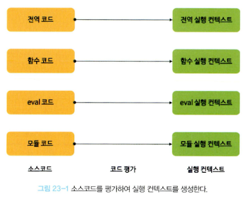
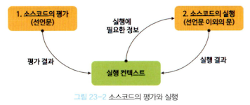
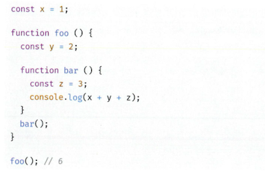
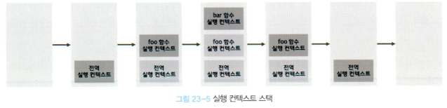

# 핵심 내용 정리

- 실행 컨텍스트를 바르게 이해하면 자바스크립트가 스코프를 기반으로 식별자와 식별자에 바인딩된 값(식별자 바인딩)을 관리하는 방식과 호이스팅이 발생하는 이유, 클로저의 동작 방식, 그리고 태스크 큐와 함께 동작하는 이벤트 핸들러와 비동기 처리의 동작 방식을 이해할 수 있다.

## **23.1 소스코드의 타입**

- 4가지 타입의 소스코드는 실행 컨텍스트를 생성한다.
    
    
    
- 소스코드의 타입에 따라 실행 컨텍스트를 생성하는 과정과 관리 내용이 다르다.
- 전역 코드
    - 전역 코드는 전역 변수를 관리하기 위해 최상위 스코프인 전역 스코프를 생성해야 한다.
    - var 키워드로 선언된 전역 변수와 함수 선언문으로 정의된 전역 함수를 전역 객체의 프로퍼티와 메서드로 바인딩하고 참조하기 위해 전역 객체와 연결되어야 한다.
    - 이를 위해 전역 코드가 평가되면 전역 실행 컨텍스트가 생성된다.
- 함수 코드
    - 함수 코드는 지역 스코프를 생성하고 지역 변수, 매개변수, arguments 객체를 관리해야 한다.
    - 그리고 생성한 지역 스코프를 전역 스코프에서 시작하는 스코프 체인의 일원으로 연결해야 한다.
    - 이를 위해 함수 코드가 평가되면 함수 실행 컨텍스트가 생성된다.
- eval 코드
    - eval 코드는 strict mode(엄격 모드)에서 자신만의 독자적인 스코프를 생성한다.
    - 이를 위해 eval 코드가 평가되면 eval 실행 컨텍스트가 생성된다.
- 모듈 코드
    - 모듈 코드는 모듈별로 독립적인 모듈 스코프를 생성한다.
    - 모듈 평가가 평가되면 모듈 실행 컨텍스트가 생성된다.

## 23.2 소스 코드의 평가와 실행

- 자바스크립트 엔진은 소스코드를 2개의 과정, 즉 소스코드의 평가와 소스코드의 실행 과정으로 나누어 처리한다.
- `소스코드 평가 과정`에서는 실행 컨텍스트를 생성하고 변수, 함수 등의 선언문만 먼저 실행하여 생성된 변수나 함수 식별자를 키로 실행 컨텍스트가 관리하는 스코프(렉시컬 환경의 환경 레코드)에 등록한다.
- 소스코드 평가 과정이 `끝나면` 비로소 선언문을 제외한 소스코드가 순차적으로 실행되기 시작한다. 즉, 런타임이 시작된다. 이때 소스코드 실행에 필요한 정보, 즉 변수나 함수의 참조를 실행 컨텍스트가 관리하는 스코프에서 검색해서 취득한다. 그리고 변수 값의 변경 등 소스코드의 실행 결과는 다시 실행 컨텍스트가 관리하는 스코프에 등록된다.

## 23.3 실행 컨텍스트의 역할

1. **전역 코드 평가**
    - 전역 코드를 실행하기 위한 준비를 한다.
    - 전역 코드의 변수 선언문과 함수 선언문이 먼저 실행되고, 그 결과 생성된 전역 변수와 전역 함수가 실행 컨텍스트가 관리하는 전역 스코프에 등록된다.
    - 이때 var 키워드로 선언된 전역 변수와 함수 선언문으로 정의된 전역 함수는 전역 객체의 프로퍼티와 메서드가 된다.
2. **전역 코드 실행**
    - 전역 코드 평가 과정이 끝나면 런타임이 시작되어 전역 코드가 순차적으로 실행되기 시작한다.
    - 이때 전역 변수에 값이 할당되고 함수가 호출된다.
    - 함수가 호출되면 순차적으로 실행되던 전역 코드의 실행을 일시 중단하고 코드 실행 순서를 변경하여 함수 내부로 진입한다.
3. **함수 코드 평가**
    - 함수 코드를 실행하기 위한 준비를 한다.
    - 매개변수와 지역 변수 선언문이 먼저 실행되고, 그 결과 생성된 매개변수와 지역 변수가 실행 컨텍스트가 관리하는 지역 스코프에 등록된다.
    - 또한 함수 내부에서 지역 변수처럼 사용할 수 있는 arguments 객체가 생성되어 지역 스코프에 등록되고 this 바인딩도 결정된다.
4. **함수 코드 실행**
    - 런타임이 시작되어 함수 코드가 순차적으로 실행되기 시작한다.
    - 이때 매개변수와 지역 변수에 값이 할당되고 console.log 메서드가 호출된다.
    - `console.log 메서드`를 호출하기 위해 먼저 `식별자 console`을 스코프 체인을 통해 검색한다. 이를 위해 함수 코드와 지역 스코프는 상위 스코프인 전역 스코프와 연결되어야 한다. 하지만 console 식별자는 스코프 체인에 등록되어 있지 않고 전역 객체에 프로퍼티로 존재한다. 이는 전역 객체의 프로퍼티가 마치 전역 변수처럼 전역 스코프를 통해 검색 가능해야 한다는 것을 의미한다.
    - 다음은 `log 프로퍼티`를 console 객체의 프로토타입 체인을 통해 검색한다. 그 후 console.log 메서드에 인수로 전달된 표현식 a + x + y가 평가된다. a, x, y 식별자는 스코프 체인을 통해 검색한다. console.log 메서드의 실행이 종료되면 함수 코드 실행 과정이 종료되고 함수 호출 이전으로 되돌아가 전역 코드 실행을 계속한다.
    - 이처럼 코드가 실행되려면 스코프를 구분하여 식별자와 바인딩된 값이 관리되어야 한다.
    - 그리고 중첩 관계에 의해 스코프 체인을 형성하여 식별자를 검색할 수 있어야 하고, 전역 객체의 프로퍼티도 전역 변수처럼 검색할 수 있어야 한다.
    - 또한 함수 호출이 종료되면 함수 호출 이전으로 되돌아가기 위해 현재 실행 중인 코드와 이전에 실행하던 코드를 구분하여 관리해야한다.
    - **이처럼 코드가 실행되려면 다음과 같이 스코프, 식별자, 코드 실행 순서 등의 관리가 필요하다.**
        1. 선언에 의해 생성된 모든 식별자(변수, 함수, 클래스 등)를 스코프를 구분하여 등록하고 상태 변화(식별자에 바인딩된 값의 변화)를 지속적으로 관리할 수 있어야 한다.
        2. 스코프는 중첩 관계에 의해 스코프 체인을 형성해야 한다. 즉, 스코프 체인을 통해 상위 스코프로 이동하며 식별자를 검색할 수 있어야 한다.
        3. 현재 실행 중인 코드의 실행 순서를 변경(예를 들어, 함수 호출에 의한 실행 순서 변경)할 수 있어야 하며 다시 되돌아갈 수도 있어야 한다.
    - 이 모든 것을 관리하는 것이 바로 실행 컨텍스트이다.
    - **실행 컨텍스트는 소스 코드를 실행하는 데 필요한 환경을 제공하고 코드의 실행 결과를 실제로 관리하는 영역이다.**
    - **실행 컨텍스트는 식별자(변수, 함수, 클래스 등의 이름)를 등록하고 관리하는 스코프와 코드 실행 순서 관리를 구현한 내부 메커니즘으로, 모든 코드는 실행 컨텍스트를 통해 실행되고 관리된다.**
    - 식별자와 스코프는 실행 컨텍스트의 **렉시컬 환경**으로 관리하고 코드 실행 순서는 **실행 컨텍스트 스택**으로 관리한다.

## 23.4 실행 컨텍스트 스택

- 소스코드의 타입으로 분류할 때 전역 코드와 함수 코드로 이루어져 있다.
- 자바스크립트 엔진은 먼저 전역 코드를 평가하여 전역 실행 컨텍스트를 생성한다.
- 그리고 함수가 호출되면 함수 코드를 평가하여 함수 실행 컨텍스트를 생성한다.
- 이때 생성된 실행 컨텍스트는 스택 자료구조로 관리된다. 이를 **실행 컨텍스트 스택**이라고 부른다.
- 코드가 실행되는 시간의 흐름에 따라 실행 컨텍스트 스택에는 다음과 같이 실행 컨텍스트가 추가되고 제거된다.
    
    
    
1. **전역 코드의 평가와 실행**
    - 자바스크립트 엔진은 먼저 전역 코드를 평가하여 전역 실행 컨텍스트를 생성하고 실행 컨텍스트 스택에 푸시한다.
    - 이때 전역 변수와 전역 함수는 전역 실행 컨텍스트에 등록된다.
    - 이후 전역 코드가 실행되기 시작하여 전역 변수에 값이 할당되고 전역 함수가 호출된다.
2. **foo 함수 코드의 평가와 실행**
    - 전역 함수 foo가 호출되면 전역 코드의 실행은 일시 중단되고 코드의 제어권이 foo 함수 내부로 이동한다.
    - 자바스크립트 엔진은 foo 함수 내부의 함수 코드를 평가하여 foo 함수 실행 컨텍스트를 생성하고 실행 컨텍스트 스택에 푸시한다.
    - 이때 foo 함수의 지역 변수 y와 중첩 함수 bar가 foo 함수 실행 컨텍스트에 등록된다.
    - 이후 foo 함수 코드가 실행되기 시작하여 지역 변수 y에 값이 할당되고 중첩 함수 bar가 호출된다.
3. **bar 함수 코드의 평가와 실행**
    - 중첩 함수 bar가 호출되면 foo 함수 코드의 시행은 일시 중단되고 코드의 제어권이 bar 함수 내부로 이동한다.
    - 자바스크립트 엔진은 bar 함수 내부의 함수 코드를 평가하여 bar 함수 실행 컨텍스트를 생성하고 실행 컨텍스트 스택에 푸시한다.
    - 이때 bar 함수의 지역 변수 z가 bar 함수 실행 컨텍스트에 등록된다.
    - 이후, bar 함수 코드가 실행되기 시작하여 지역 변수 z에 값이 할당되고 console.log 메서드를 호출한 이후, bar 함수는 종료된다.
4. **foo 함수 코드로 복귀**
    - bar 함수가 종료되면 코드의 제어권은 다시 foo 함수로 이동한다.
    - 이때 자바스크립트 엔진은 bar 함수 실행 컨텍스트를 실행 컨텍스트를 실행 컨텍스트 스택에서 팝하여 제거한다.
    - 그리고 foo 함수는 더 이상 실행할 코드가 없으므로 종료된다.
5. **전역 코드로 복귀**
    - foo 함수가 종료되면 코드의 제어권은 다시 전역 코드로 이동한다.
    - 이때 자바스크립트 엔진은 foo 함수 실행 컨텍스트를 실행 컨텍스트 스택에서 팝하여 제거한다.
    - 그리고 더 이상 실행할 전역 코드가 남아 있지 않으므로 전역 컨텍스트도 실행 컨텍스트 스택에서 팝되어 실행 컨텍스트 스택에는 아무것도 남아있지 않게 된다.
- **실행 컨텍스트 스택은 코드의 실행 순서를 관리한다.**
- 소스 코드가 평가되면 실행 컨텍스트가 생성되고 실행 컨텍스트 스택의 최상위에 쌓인다. **실행 컨텍스트 스택의 최상위에 존재하는 실행 컨텍스트는 언제나 현재 실행중인 코드의 실행 컨텍스트다.**
- 실행 컨텍스트 스택의 최상위에 존재하는 실행 컨텍스트를 **실행 중인 실행 컨텍스트**라 부른다.

## 렉시컬 환경

- 식별자와 식별자에 바인딩된 값, 그리고 상위 스코프에 대한 참조를 기록하는 자료구조로 실행 컨텍스트를 구성하는 컴포넌트다.
- 실행 컨텍스트 스택이 코드의 실행 순서를 관리한다면 렉시컬 환경은 스코프와 식별자를 관리한다.
- 렉시컬 환경은 키와 값을 갖는 객체 형태의 스코프(전역, 함수, 블록 스코프)를 생성하여 식별자를 키로 등록하고  식별자에 바인딩된 값을 관리한다. 즉, 렉시컬 환경은 스코프를 구분하여 식별자를 등록하고 관리하는 저장소 역할을 하는 렉시컬 스코프의 실체다.
- 렉시컬 환경은 다음과 같이 두 개의 컴포넌트로 구성된다.
    - 환경 스코프 : 스코프에 포함된 식별자를 등록하고 등록된 식별자에 바인딩된 값을 관리하는 저장소다.
    - 외부 렉시컬 환경에 대한 참조 : 외부 렉시컬 환경에 대한 참조는 상위 스코프를 가리킨다. 이때 상위 스코프란 외부 렉시컬 환경, 즉 해당 실행 컨텍스트를 생성한 소스코드를 포함하는 상위 코드의 렉시컬 환경을 말한다. 외부 렉시컬 환경에 대한 참조를 통해 단방향 링크드 리스트인 스코프 체인을 구현한다.

## 23.6 실행 컨텍스트의 생성과 식별자 검색 과정

### 1. 전역 객체 생성

- 전역 코드가 평가되기 이전에 생성된다.
- 전역 객체에는 빌트인 전역 프로퍼티와 빌트인 전역 함수, 그리고 표준 빌트인 객체가 추가되며 동작 환경에 따라 클라이언트 사이드 Web API 또는 특정 환경을 위한 호스트 객체를 포함한다.
- 전역 객체도 Object.prototype을 상속받는다. 즉, 전역 객체도 프로토타입 체인의 일원이다.

### 2. 전역 코드 평가

1. 전역 실행 컨텍스트 생성 : 먼저 비어있는 전역 실행 컨텍스트를 생성하여 실행 컨텍스트 스택에 푸시한다.
2. 전역 렉시컬 환경 생성 : 전역 렉시컬 환경을 생성하고 전역 실행 컨텍스트에 바인딩한다.
    1. 전역 환경 레코드 생성
        - 전역 환경 레코드 : 전역 변수를 관리하는 전역 스코프, 전역 객체의 빌트인 전역 프로퍼티와 빌트인 전역 함수, 표준 빌트인 객체를 제공한다.
        - ‘전역 객체와 let’에서 살펴보았듯이 let, const 키워드로 선언한 전역 변수는 전역 객체의 프로퍼티가 되지 않고 개념적인 블록 내에 존재하게 된다.
        - var 키워드로 선언한 전역 변수와 let, const 키워드로 선언한 전역 변수를 구분하여 관리하기 위해 전역 스코프 역할을 하는 **전역 환경 레코드는 객체 환경 레코드와 선언적 환경 레코드로 구성되어 있다.**
        - `객체 환경 레코드`는 var 키워드로 선언한 전역 변수와 함수 선언문으로 정의한 전역 함수, 빌트인 전역 프로퍼티와 빌트인 전역 함수, 표준 빌트인 객체를 관리하고, `선언적 환경 레코드`는 let, const 키워드로 선언한 전역 변수를 관리한다.
        - 즉, 전역 환경 레코드의 객체 환경 레코드와 선언적 환경 레코드는 서로 협력하여 전역 스코프와 전역 객체(전역 변수의 전역 객체 프로퍼티화)를 관리한다.
        1. 객체 환경 레코드 생성
            - BindingObject라고 부르는 전역 객체와 연결된다.
            - **전역 코드 평가 과정에서 var 키워드로 선언한 전역 변수와 함수 선언문으로 정의된 전역 함수는 전역 환경 레코드의 객체 환경 레코드에 연결된 BindingObject를 통해 전역 객체의 프로퍼티와 메서드가 된다.**
            - 그리고 이때 등록된 식별자를 전역 환경 레코드의 객체 환경 레코드에서 검색하면 전역 객체의 프로퍼티를 검색하여 반환한다.
            - 이것이 var 키워드로 선언한 전역 변수와 함수 선언문으로 정의된 전역 함수가 전역 객체의 프로퍼티와 메서드가 되고 전역 객체를 가리키는 식별자(window) 없이 전역 객체의 프로퍼티를 참조할 수 있는 메커니즘이다.
            - var 키워드로 선언한 변수는 ‘선언 단계’와 ‘초기화 단계’가 동시에 진행된다.
            - 다시 말해, 전역 코드 평가 시점에 객체 환경 레코드에 바인딩된 BindingObject를 통해 전역 객체에 변수 식별자로 키를 등록한 다음, 암묵적으로 undefined를 바인딩한다.
            - var 키워드로 선언한 변수는 코드 실행 단계(현 시점은 코드 실행 단계가 아니라 코드 평가 단계다)에서 변수 선언문 이전에도 참조할 수 있다.
            - 단, 변수 선언문 이전에 참조한 변수의 값은 언제나 undefined다.
            - var 키워드로 선언한 변수에 할당한 함수 표현식도 이와 동일하게 동작한다.
            - 함수 선언문으로 정의한 함수가 평가되면 함수 이름과 동일한 이름의 식별자를 객체 환경 레코드에 바인딩된 BindingObject를 통해 전역 객체에 키로 등록하고 생성된 함수 객체를 즉시 할당한다.
        2. 선언적 환경 레코드 생성
            - let, const 키워드로 선언한 전역 변수는 선언적 환경 레코드에 등록되고 관리된다.
            - 해당 키워드로 선언한 변수는 ‘선언 단계’와 ‘초기화 단계’가 분리되어 진행한다.
            - 따라서 초기화 단계, 즉 런타임에 실행 흐름이 변수 선언문에 도달하기 전까지 **일시적 사각지대(Temporal Dead Zone: TDZ)**에 빠지게 된다.
    2. this 바인딩
    3. 외부 렉시컬 환경에 대한 참조 결정
        - 외부 렉시컬 환경에 대한 참조는 현재 평가 중인 소스코드를 포함하는 외부 소스코드의 렉시컬 환경, 즉 상위 스코프를 가리킨다.
        - 이를 통해 단방향 링크드 리스트인 스코프 체인을 구현한다.
        - 전역 렉시컬 환경의 외부 렉시컬 환경에 대한 참조에 null이 할당되는 것은, 전역 렉시컬 환경이 스코프 체인의 종점에 존재함을 의미한다.

### 3. 전역 코드 실행

- 변수 할당문 또는 함수 호출문을 실행하려면 먼저 변수 또는 함수 이름이 선언된 식별자인지 확인해야 한다. 선언되지 않는 식별자는 차모할 수 없으므로 할당이나 호출도 할 수 없기 때문이다.
- 동일한 이름의 식별자가 다른 스코프에 여러 개 존재할 수도 있다.
- 따라서 어느 스코프의 식별자를 참조하면 되는지 결정할 필요가 있다. 이를 **식별자 결정**이라 한다.
- **식별자 결정을 위해 식별자를 검색할 때는 실행 중인 실행 컨텍스트에서 식별자를 검색하기 시작한다.**
- 선언된 식별자는 실행 컨텍스트의 렉시컬 환경의 환경 레코드에 등록되어 있다.
- 만약 실행 중인 실행 컨텍스트의 렉시컬 환경에서 식별자를 검색할 수 없으면 외부 렉시컬 환경에 대한 참조가 가리키는 렉시컬 환경, 즉 상위 스코프로 이동하여 식별자를 검색한다.
- 이것이 바로 스코프 체인의 동작 원리다.
- 하지만 전역 렉시컬 환경은 스코프 체인의 종점이므로 전역 렉시컬 환경에서 검색할 수 없는 식별자는 참조 에러를 발생시킨다. 식별자 결정에 실패했기 때문이다.

### 4. foo 함수 코드 평가

1. 함수 실행 컨텍스트 생성
2. 함수 렉시컬 환경 생성
    1. 함수 환경 레코드 생성 : 매개변수, arguments 객체, 함수 내부에서 선언한 지역 변수와 중첩 함수를 등록하고 관리한다.
    2. this 바인딩
    3. 외부 렉시컬 환경에 대한 참조 결정
        - 자바스크립트는 **함수를 어디서 호출했는지가 아니라 어디에 정의했는지에 따라 상위 스코프를 결정한다**
        - 함수 렉시컬 환경의 외부 렉시컬 환경에 대한 참조에 할당되는 것은 바로 함수의 상위 스코프를 가리키는 함수 객체의 내부 슬롯 [[Environment]]에 저장된 렉시컬 환경의 참조다.
        - 즉, 함수 객체의 내부 슬롯 [[Environment]]가 바로 렉시컬 스코프를 구현하는 메커니즘이다.

### 5. foo 함수 코드의 실행

- 식별자 결정을 위해 실행 중인 실행 컨텍스트의 렉시컬 환경에서 식별자를 검색하기 시작한다.

### 6. bar 함수 코드 평가

### 7. bar 함수 코드 실행

### 8. bar 함수 코드 실행 종료

- 실행 컨텍스트 스택에서 bar 함수 실행 컨텍스트가 제거되었다고 해서 bar 함수 렉시컬 환경까지 즉시 소멸하는 것은 아니다.
- 렉시컬 환경은 실행 컨텍스트에 의해 참조되기는 하지만 독립적인 객체다.
- 객체를 포함한 모든 값은 누군가에 의해 참조되지 않았을 때 비로소 가비지 컬렉터에 의해 메모리 공간의 확보가 해제되어 소멸한다.
- bar 함수 실행 컨텍스트가 소멸되었다 하더라도 만약 bar 함수 렉시컬 환경을 누군가 참조하고 있다면 bar 함수 렉시컬 환경은 소멸하지 않는다.

### 9. foo 함수 코드 실행 종료

### 10. 전역 코드 실행 종료

---

# 면접 예상 질문

## **💥** 실행 컨텍스트**란?**

- 실행 컨텍스트는 식별자(변수, 함수, 클래스 등의 이름)를 등록하고 관리하는 스코프와 코드 실행 순서 관리를 구현한 내부 메커니즘으로, 모든 코드는 실행 컨텍스트를 통해 실행되고 관리된다.

## **💥 렉시컬 환경**이**란?**

- 식별자와 식별자에 바인딩된 값, 그리고 상위 스코프에 대한 참조를 기록하는 자료구조로 실행 컨텍스트를 구성하는 컴포넌트다.

## **💥 전역 코드 평가 과정에서 var 키워드로 선언한 전역 변수와 함수 선언문으로 정의된 전역 함수가 전역 객체의 프로퍼티와 메서드가 되고 전역 객체를 가리키는 식별자(window) 없이 전역 객체의 프로퍼티를 참조할 수 있는 메커니즘이 되는 이유는?**

- **전역 코드 평가 과정에서 var 키워드로 선언한 전역 변수와 함수 선언문으로 정의된 전역 함수는 전역 환경 레코드의 객체 환경 레코드에 연결된 BindingObject를 통해 전역 객체의 프로퍼티와 메서드가 된다.**
- 그리고 이때 등록된 식별자를 전역 환경 레코드의 객체 환경 레코드에서 검색하면 전역 객체의 프로퍼티를 검색하여 반환한다.

## **💥 변수 호이스팅이 발생하는 원인은?**

- var 키워드로 선언한 변수는 ‘선언 단계’와 ‘초기화 단계’가 동시에 진행된다.
- 다시 말해, 전역 코드 평가 시점에 객체 환경 레코드에 바인딩된 BindingObject를 통해 전역 객체에 변수 식별자로 키를 등록한 다음, 암묵적으로 undefined를 바인딩한다.
- var 키워드로 선언한 변수는 코드 실행 단계(현 시점은 코드 실행 단계가 아니라 코드 평가 단계다)에서 변수 선언문 이전에도 참조할 수 있다.
- 단, 변수 선언문 이전에 참조한 변수의 값은 언제나 undefined다.
- var 키워드로 선언한 변수에 할당한 함수 표현식도 이와 동일하게 동작한다.

## **💥 변수 호이스팅과 함수 호이스팅의 차이**

- var 키워드로 선언한 변수는 전역 코드 평가 시점에 객체 환경 레코드에 바인딩된 BindingObject를 통해 전역 객체에 변수 식별자로 키를 등록한 다음, 암묵적으로 undefined를 바인딩한다.
- 함수 선언문으로 정의한 함수가 평가되면 함수 이름과 동일한 이름의 식별자를 객체 환경 레코드에 바인딩된 BindingObject를 통해 전역 객체에 키로 등록하고 생성된 함수 객체를 즉시 할당한다.

---

# 이야기하고 싶은 것
