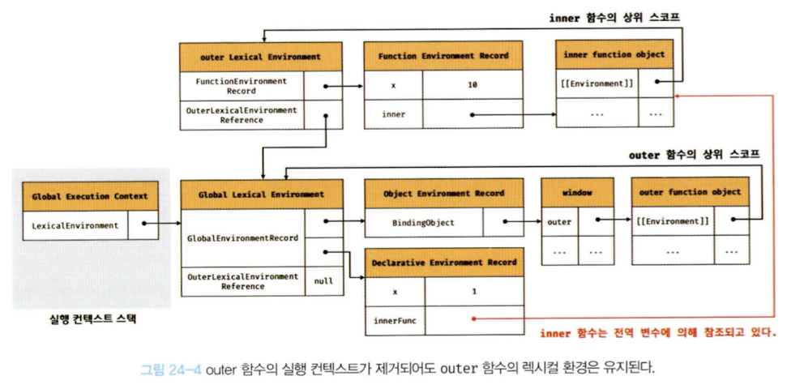

# 핵심 내용 정리

클로저는 함수와 그 함수가 선언된 렉시컬 환경과의 조합이다.

<br/>

### 함수가 선언된 렉시컬 환경?

만약 innerFunc 함수가 outerFunc 함수의 내부에서 정의된 중첩 함수가 아니라면 innerFunc 함수를 outerFunc 함수의 내부에서 호출한다 하더라도 outerFunc 함수의 변수에 접근할 수 없다.

```jsx
const x = 1;

function outerFunc() {
  const x = 10;
  innerFunc();
}

function innerFunc() {
  console.log(x); // 1
}

outerFunc();
```

이와 같은 현상이 발생하는 이유는 **자바스크립트가 렉시컬 스코프를 따르는 프로그래밍 언어**이기 때문이다.

<br/>

> 즉, ‘그 함수가 선언된 렉시컬 환경’이란 함수가 정의된 위치의 스코프, 즉 상위 스코프를 의미하는 실행 컨텍스트의 렉시컬 환경을 말한다.

<br/>

## **24.1 렉시컬 스코프**

**자바스크립트 엔진은 함수를 어디서 호출했는지가 아니라 함수를 어디에 정의했는지에 따라 상위 스코프를 결정한다. 이를 렉시컬 스코프(정적 스코프)라고 한다.**

```jsx
const x = 1;

function foo() {
  const x = 10;
  bar();
}

function bar() {
  console.log(x);
}

foo(); // 1
bar(); // 1
```

<br/>

함수를 어디서 호출하는지는 함수의 상위 스코프 결정에 어떠한 영향도 주지 못한다.

즉, 함수의 상위 스코프는 **함수를 정의한 위치**에 의해 정적으로 결정되고 변하지 않는다.

<br/>

스코프의 실체는 실행 컨텍스트의 렉시컬 환경이다.

이 렉시컬 환경은 자신의 ‘외부 렉시컬 환경에 대한 참조’를 통해 상위 렉시컬 환경과 연결된다. 이것이 바로 스코프 체인이다.

<br/>

따라서 ‘함수의 상위 스코프를 결정한다’는 것은 ‘렉시컬 환경의 외부 렉시컬 환경에 대한 참조에 저장할 참조값을 결정한다’는 것과 같다.

렉시컬 환경의 ‘외부 렉시컬 환경에 대한 참조’에 저장할 참조값이 바로 상위 렉시컬 환경에 대한 참조이며, 이것이 상위 스코프이기 때문이다.

<br/>

**렉시컬 환경의 ‘외부 렉시컬 환경에 대한 참조’에 저장할 참조값, 즉 상위 스코프에 대한 참조는 함수 정의가 평가되는 시점에 함수가 정의된 환경(위치)에 의해 결정된다. 이것이 바로 렉시컬 스코프다.**

<br/>

## 24.2 함수 객체의 내부 슬롯 [[Environment]]

렉시컬 스코프가 가능하려면 함수는 자신이 정의된 환경, 즉 상위 스코프(함수 정의가 위치하는 스코프가 바로 상위 스코프다)를 기억해야 한다.

이를 위해 **함수는 자신의 내부 슬롯 [[Environment]]에 자신이 정의된 환경, 즉 상위 스코프의 참조를 저장한다.**

다시 말해, 함수 정의가 평가되어 함수 객체를 생성할 때 자신이 정의된 환경(위치)에 의해 결정된 상위 스코프의 참조를 함수 객체 자신의 내부 슬롯 [[Environment]]에 저장한다.

<br/>

이때 자신의 내부 슬롯 [[Environment]]에 저장된 상위 스코프의 참조는 현재 실행 중인 실행 컨텍스트의 렉시컬 환경을 가리킨다.

왜냐하면 함수 정의가 평가되어 함수 객체를 생성하는 시점은 함수가 정의된 환경, 즉 상위 함수(또는 전역 코드)가 평가 또는 실행되고 있는 시점이며, 이때 현재 실행 중인 실행 컨텍스트는 상위 함수(또는 전역 코드)의 실행 컨텍스트이기 때문이다.

<br/>

**따라서 함수 객체의 내부 슬롯 [[Environment]]에 저장된 현재 실행 중인 실행 컨텍스트의 렉시컬 환경의 참조가 바로 상위 스코프다.**

**또한 자신이 호출되었을 때 생성될 함수 렉시컬 환경의 ‘외부 렉시컬 환경에 대한 참조’에 저장될 참조값이다.**

**함수 객체는 내부 슬롯 [[Environment]]에 저장한 렉시컬 환경의 참조, 즉 상위 스코프를 자신이 존재하는 한 기억한다.**

<br/>

함수가 호출되면 함수 내부로 코드의 제어권이 이동한다. 그리고 함수 코드를 평가하기 시작한다. 함수 코드 평가는 아래 순서로 진행된다.

1. 함수 실행 컨텍스트 생성
2. 함수 렉시컬 환경 생성
   1. 함수 환경 레코드 생성
   2. this 바인딩
   3. 외부 렉시컬 환경에 대한 참조 결정

이때 함수 렉시컬 환경의 구성 요소인 **외부 렉시컬 환경에 대한 참조에는 함수 객체의 내부 슬롯 [[Environment]]에 저장된 렉시컬 환경의 참조가 할당된다.**

즉, 함수 객체의 내부 슬롯 [[Environment]]에 저장된 렉시컬 환경의 참조는 바로 함수의 상위 스코프를 의미한다.

<br/>

## 24.3 클로저와 렉시컬 환경

외부 함수보다 중첩 함수가 더 오래 유지되는 경우 중첩 함수는 이미 생명 주기가 종료한 외부 함수의 변수를 참조할 수 있다. 이러한 중첩 함수를 클로저라고 부른다.

클로저는 함수와 그 함수가 선언된 렉시컬 환경의 조합이다.

‘그 함수가 선언된 렉시컬 환경’이란 함수가 정의된 위치의 스코프, 즉 상위 스코프를 의미하는 실행 컨텍스트의 렉시컬 환경을 말한다.

함수를 어디서 호출하든 상관없이 함수는 언제나 자신이 기억하는 상위 스코프의 식별자를 참조할 수 있으며 식별자에 바인딩된 값을 변경할 수도 있다.

<br/>

```jsx
const x = 1;

// (1)
function outer() {
  const x = 10;
  const inner = function () {
    console.log(x); // (2)
  };
  return inner;
}

// outer 함수를 호출하면 중첩 함수 inner를 반환한다.
// 그리고 outer 함수의 실행 컨텍스트는 실행 컨텍스트 스택에서 팝되어 제거된다.
const innerFunc = outer(); //(3)
innerFunc(); // (4) 10
```

위 코드에서 outer 함수의 실행이 종료하면 inner 함수를 반환하면서 outer 함수의 생명 주기가 종료된다(3).

즉, outer 함수의 실행 컨텍스트가 실행 컨텍스트 스택에서 제거된다.

이때 **outer 함수의 실행 컨텍스트는 실행 컨텍스트 스택에서 제거되지만 ㅐuter 함수의 렉시컬 환경까지 소멸하는 것은 아니다.**

outer 함수의 렉시컬 환경은 inner 함수의 [[Environment]] 내부 슬롯에 의해 참조되고 있고 inner 함수는 전역 변수 innerFunc에 의해 참조되고 있으므로 가비지 컬렉션의 대상이 되지 않기 때문이다.

가비지 컬렉터는 누군가가 참조하고 있는 메모리 공간을 함부로 해제하지 않는다.



<br/>

**클로저는 중첩 함수가 상위 스코프의 식별자를 참조하고 있고 중첩 함수는 외부 함수보다 더 오래 유지되는 경우에 한정하는 것이 일반적이다.**

<br/>

클로저에 의해 참조되는 상위 스코프의 변수를 **자유 변수**라고 부른다.

클로저란 ‘함수가 자유 변수에 대해 닫혀있다’ 라는 의미다.

이를 좀 더 알기 쉽게 의역하면 ‘자유 변수에 묶여 있는 함수’라고 할 수 있다.

<br/>

### 클로저의 메모리

**클로저는 상위 스코프를 기억해야 하므로 불필요한 메모리의 점유를 걱정할 수도 있겠다.**

하지만 모던 자바스크립트 엔진은 최적화가 잘 되어 있어서 클로저가 참조하지 않는 식별자는 기억하지 않는다.

즉, 상위 스코프의 식별자 중에서 기억해야 할 식별자만 기억한다.

기억해야 할 식별자를 기억하는 것을 불필요한 메모리 낭비라고 볼 수 없다.

**즉, 클로저의 메모리 점유는 필요한 것을 기억하기 위한 것이므로 이는 걱정할 대상이 아니다.**

<br/>

## 24.4 클로저의 활용

**클로저는 상태(state)를 안전하게 변경하고 유지하기 위해 사용한다.**

다시 말해, 상태가 의도치 않게 변경되지 않도록 **상태를 안전하게 은닉**하고, **특정 함수에게만 상태 변경을 허용**하기 위해 사용한다.

```jsx
// 카운트 상태 변수
let num = 0;

// 카운트 상태 변경 함수
const increase = function () {
  // 카운트 상태를 1만큼 증가시킨다.
  return ++num;
};

console.log(increase()); // 1
console.log(increase()); // 2
console.log(increase()); // 3
```

위 코드는 잘 동작하지만 오류를 발생시킬 가능성을 내포하고 있는 좋지 않은 코드다.

바르게 동작하려면 아래의 전제 조건이 지켜져야 하기 때문이다.

1. 카운트 상태(num 변수의 값)는 Increase 함수가 호출되기 전까지 변경되지 않고 유지되어야 한다.
2. 이를 위해 카운트 상태(num 변수의 값)는 increase 함수만이 변경할 수 있어야 한다.

<br/>

`하지만` 카운트 상태는 **전역 변수를 통해 관리**되고 있기 때문에 언제든지 누구나 접근할 수 있고 변경할 수 있다(암묵적 결합).

이는 **의도치 않게 상태가 변경**될 수 있다는 것을 의미한다.

따라서 카운트 상태를 안전하게 변경하고 유지하기 위해서는 increase 함수만이 num 변수를 참조하고 변경할 수 있게 하는 것이 바람직하다.

**이를 위해 전역 변수 num을 increase 함수의 지역 변수로 바꾸어 의도치 않은 상태 변경을 방지해보자.**

```jsx
// 카운트 상태 변경 함수
const increase = function () {
  // 카운트 상태 변수
  let num = 0;

  // 카운트 상태를 1만큼 증가시킨다.
  return ++num;
};

// 이전 상태를 유지하지 못한다.
console.log(increase()); // 1
console.log(increase()); // 1
console.log(increase()); // 1
```

<br/>

하지만 위 코드는 increase 함수가 호출될 때마다 지역 변수 num은 다시 선언되고 0으로 초기화되기 때문에 출력 결과는 언제나 1이다.

다시 말해, 상태가 변경되기 이전 상태를 유지하지 못한다.

**이전 상태를 유지할 수 있도록 클로저를 사용해보자.**

> 이 과정이 ‘함수형 프로그래밍’의 과정(전역변수의 의도치 않은 상태 변경 가능성 ⇒ 지역변수로 변환)과 동일하게 가고 있다.
>
> 지역 변수로 변환하면 이전 상태를 유지하지 못한다는 문제가 발생하고, 이를 해결하기 위해 ‘클로저’를 사용한다.
>
> 즉, 클로저를 활용하는 과정은 ‘함수형 프로그래밍’ 측면에서도 유용하다.

```jsx
// 카운트 상태 변경 함수
const increase = (function () {
  // 카운트 상태 변수
  let num = 0;

  // 클로저
  return function () {
    // 카운트 상태를 1만큼 증가시킨다.
    return ++num;
  };
})();

console.log(increase()); // 1
console.log(increase()); // 2
console.log(increase()); // 3
```

<br/>

위 코드가 실행되면 **즉시 실행 함수**가 호출되고 즉시 실행 함수가 반환한 함수가 increase 변수에 할당된다.

increase 변수에 할당된 함수는 자신이 정의된 위치에 의해 결정된 상위 스코프인 즉시 실행 함수의 렉시컬 환경을 기억하는 클로저다.

<br/>

즉시 실행 함수는 호출된 이후 소멸되지만 즉시 실행 함수가 반환한 클로저는 Increase 변수에 할당되어 호출된다.

이때 즉시 실행 함수가 반환한 클로저는 자신이 정의된 위치에 의해 결정된 상위 스코프인 즉시 실행 함수의 렉시컬 환경을 기억하고 있다.

따라서 즉시 실행 함수가 반환한 클로저는 카운트 상태를 유지하기 위한 자유 변수 num을 언제 어디서 호출하든지 참조하고 변경할 수 있다.

<br/>

즉시 실행 함수는 한 번만 실행되므로 increase가 호출될 때마다 num 변수가 재차 초기화될 일은 없을 것이다.

또한 num 변수는 외부에서 직접 접근할 수 없는 은닉된 private 변수이므로 전역 변수를 사용했을 때와 같이 의도되지 않은 변경을 걱정할 필요도 없기 때문에 더 안정적인 프로그래밍이 가능하다.

<br/>

**이처럼 클로저는 상태가 의도치 않게 변경되지 않도록 안전하게 은닉하고 특정 함수에게만 상태 변경을 허용하여 상태를 안전하게 변경하고 유지할 수 있게 사용한다.**

<br/>

좀 더 발전시켜보자.

<br/>

---

# 면접 예상 질문

## 💥 ~~ 이란?

~~ 이다.

---

# 이야기하고 싶은 것

### p.n

> 페이지를 읽다가 인상 깊어 공유하고 싶거나, 어려운 부분을 함께 이야기하고 싶은 부분의 구절을 작성하고

코멘트를 답니다.

### p. 38 (예시)

> 좋은 이름, 즉 변수에 저장된 값의 의미를 파악할 수 있는 변수 이름은 가독성을 높이는 부수적인 효과도 있다.
>
> 코드는 컴퓨터에게 내리는 명령이지만 개발자를 위한 문서이기도 하다. 개발자의 의도를 나타내는 명확한 네이밍은 코드를 이해하기 쉽게 만들며, 이는 협업과 품질 향상에 도움을 준다. 변수 이름은 첫아이 이름을 짓듯이 심사숙고해서 지어야 한다.

이 부분이 인상깊어 공유하고 싶었습니다.
