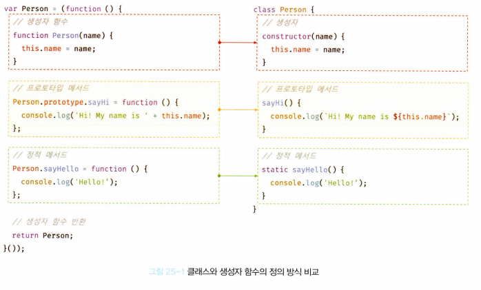

# **핵심 내용 정리**

## 25.1 클래스는 프로토타입의 문법적 설탕인가?

- 자바스크립트는 클래스가 필요없는 프로토타입 기반 객체지향 언어이다. (클래스 없이도 생성자 함수와 프로토타입을 통해 객체지향 언어의 상속을 구현할 수 있다.)
- 사실 클래스는 함수이며 기존 프로토타입 기반 패턴을 클래스 기반 패턴처럼 사용할 수 있도록 하는 문법적 설탕이라고 볼 수 있다.
- 단, 클래스와 생성자 함수는 모두 프로토타입 기반의 인스턴스를 생성하지만 정확히 동일하게 동작하지는 않는다. 클래스는 생성자 함수보다 엄격하며 생성자 함수에서는 제공하지 않는 기능도 제공한다.

- 클래스와 생성자 함수의 차이
  1. 클래스를 new 연산자 없이 호출하면 에러가 발생한다. 생성자 함수를 new 연산자 없이 호출하면 일반 함수로서 호출된다.
  2. 클래스는 상속을 지원하는 extends, super 키워드를 제공한다. 생성자 함수는 extends와 super 키워드를 지원하지 않는다.
  3. 클래스는 호이스팅이 발생하지 않는 것처럼 동작한다. 하지만 함수 선언문으로 정의된 생성자 함수는 함수 호이스팅이, 함수 표현식으로 정의한 생성자 함수는 변수 호이스팅이 발생한다.
  4. 클래스 내의 모든 코드에는 암묵적으로 strict mode가 지정되어 실행되며 해제할 수 없다. 하지만 생성자 함수는 암묵적으로 strict mode가 지정되지 않는다.
  5. 클래스의 constructor, 프로토타입 메서드, 정적 메서드는 모두 프로퍼티 어트리뷰트 [[Enumerable]]의 값이 false다. 다시 말해, 열거되지 않는다.
- 클래스와 생성자 함수는 프로토타입 기반의 객체지향을 구현했다는 점에서 매우 유사하다.
- 하지만 클래스의 객체 생성 방식이 더 견고하고 명료하다. 특히 클래스의 extends와 super 키워드는 상속 관계 구현을 더욱 간결하고 명료하게 한다.

- 따라서 클래스를 프로토타입 기반 객체 생성 패턴의 단순한 문법적 설탕이라고 보기보다는 **새로운 객체 생성 메커니즘**으로 보는 것이 좀 더 합당하다.

## 25.2 클래스 정의

- 클래스는 class 키워드를 사용하여 정의하고 파스칼 케이스를 사용하는 것이 일반적이다.
- 클래스를 표현식으로 정의할 수 있다는 것은 클래스가 값으로 사용할 수 있는 일급 객체라는 것을 의미한다.
- 즉, 클래스는 일급 객체로서 다음과 같은 특징을 갖는다.
  - 무명의 리터럴로 생성할 수 있다. 즉, 런타임에 생성이 가능하다.
  - 변수나 자료구조에 저장할 수 있다.
  - 함수의 매개변수에게 전달할 수 있다.
  - 함수의 반환값으로 사용할 수 있다.
- 클래스는 몸체에는 0개 이상의 메서드만 정의할 수 있다.
- 클래스 몸체에서 정의할 수 있는 메서드는 constructor(생성자), 프로토타입 메서드, 정적 메서드의 세 가지가 있다.

```jsx
// 클래스 선언문
class Person {
  // 생성자
  constructor(name) {
    // 인스턴스 생성 및 초기화
    this.name = name; // name 프로퍼티는 public하다.
  }

  // 프로토타입 메서드
  sayHi() {
    console.log(`Hi! My name is $[this.name}`);
  }

  // 정적 메서드
  static sayHello() {
    console.log("Hello!");
  }
}

// 인스턴스 생성

const me = new Person("Lee");

// 인스턴스의 프로퍼티 참조
console.log(me.name); // Lee
// 프로토타입 메서드 호출
me.sayHi(); // Hi! My name is Lee
// 정적 메서드 호출
Person.sayHello(); // Hello!
```

- 클래스와 생성자 함수의 정의 방식을 비교해 보면 다음과 같다.
  

## 25.3 클래스 호이스팅

- 클래스틑 함수로 평가된다.
- 클래스 선언문으로 정의한 클래스는 함수 선언문과 같이 소스코드 평가 과정, 즉 런타임 이전에 먼저 평가되어 함수 객체를 생성한다.
- 이때 클래스가 평가되어 생성된 함수 객체는 생성자 함수로서 호출할 수 있는 함수 즉, constructor다.
- 생성자 함수로서 호출할 수 있는 함수는 함수 정의가 평가되어 함수 객체를 생성하는 시점에 프로토타입도 더불어 생성된다.
- 프로토타입과 생성자 함수는 단독으로 존재할 수 없고 언제나 쌍으로 존재하기 때문이다.
- 단, 클래스는 클래스 정의 이전에 참조할 수 없다.

```jsx
console.log(Person);
// ReferenceError: Cannot access 'Person' before initialization

// 클래스 선언문
class Person {}
```

- 클래스 선언문은 마치 호이스팅이 발생하지 않는 것처럼 보이나 그렇지 않다.

```jsx
const Person = "";
{
  // 호이스팅이 발생하지 않는다면 ''이 출력되어야 한다.
  console.log(Person);
  // ReferenceError

  // 클래스 선언문
  class Person {}
}
```

- 클래스 선언문도 변수 선언, 함수 정의와 마찬가지로 호이스팅이 발생한다.
- 단, 클래스는 let, const 키워드로 선언한 변수처럼 호이스팅된다.
- 따라서 클래스 선언문 이전에 일시적 사각지대에 빠지기 때문에 호이스팅이 발생하지 않는 것처럼 동작한다.

## 25.4 인스턴스 생성

- 클래스는 생성자 함수이며 new 연산자와 함께 호출되어 인스턴스를 생성한다.
- 클래스는 함수와 달리 인스턴스를 생성하는 것이 유일한 존재 이유이므로 반드시 new 연산자와 함께 호출해야 한다.

```jsx
class Person {}

// 인스턴스 생성
// const me = Person(); TypeError
const me = new Person();
console.log(me); // Person {}
```

## 25.5 메서드

- 클래스 몸체에는 0개 이상의 메서드만 선언할 수 있다.
- 클래스 몸체에서 정의할 수 있는 메서드는 constructor(생성자), 프로토타입 메서드, 정적 메서드의 세 가지가 있다.

### 25.5.1 constructor

- constructor는 인스턴스를 생성하고 초기화하기 위한 특수한 메서드다.
- constructor는 이름을 변경할 수 없다.

```jsx
class Person {
  // 생성자
  constructor(name) {
    this.name = name;
  }
}
```

- 클래스는 평가되어 함수 객체가 되고 클래스도 함수 객체 고유의 프로퍼티를 모두 갖고있다.
- 모든 함수 객체가 가지고 있는 prototype 프로퍼티가 가리키는 프로토타입 객체의 constructor 프로퍼티는 클래스 자신을 가리키고 있다.
- 이는 클래스가 인스턴스를 생성하는 생성자 함수라는 것을 의미한다.
- 즉, new 연산자와 함께 클래스를 호출하면 클래스는 인스턴스를 생성한다.

```jsx
// 클래스
class Perosn {
  // 생성자
  constructor(name) {
    // 인스턴스 생성 및 초기화
    this.name = name;
  }
}

// 생성자 함수
function Person(name) {
  // 인스턴스 생성 및 초기화
  this.name = name;
}
```

- 위 코드에서 클래스가 평가되어 생성된 함수 객체나 클래스가 생성한 인스턴스 어디에도 constructor 메서드는 보이지 않는다.
- 이는 클래스 몸체에 정의한 constructor가 단순한 메서드가 아니라는 것을 의미한다.
- constructor는 메서드로 해석되는 것이 아니라 클래스가 평가되어 생성한 함수 객체 코드의 일부가 된다.
- 다시 말해, 클래스 정의가 평가되면 constructor의 기술된 동작을 하는 함수 객체가 생성된다.

- **constructor는 생성자 함수와 유사하지만 몇 가지 차이가 있다.**
  1. constructor는 클래스 내에 최대 한 개만 존재할 수 있다.
  2. constructor는 생략할 수 있다. (암묵적으로 빈 constructor가 생성되기 때문)
  3. 프로퍼티가 추가되어 초기화된 인스턴스를 생성하려면 constructor 내부에서 this에 인스턴스 프로퍼티를 추가한다.

     ```jsx
     class Person {
       constructor() {
         // 고정값으로 인스턴스 초기화
         this.name = "Lee";
         this.address = "Seoul";
       }
     }

     const me = new Person();
     console.log(me); // Person {name: 'Lee', address: 'Seoul'}
     ```

     인스턴스를 생성할 때 클래스 외부에서 인스턴스 프로퍼티의 초기값을 전달하려면 다음과 같이 constructor에 매개변수를 선언하고 인스턴스를 선언할 때 초기값을 전달한다.

     이때 초기값은 constructor의 매개변수에게 전달된다.

     ```jsx
     class Person {
       constructor(name, address) {
         // 인수로 인스턴스 초기화
         this.name = name;
         this.address = address;
       }
     }

     // 인수로 초기값을 전달한다. 초기값은 constructor에 전달한다.
     const me = new Person("Lee", "Seoul");
     console.log(me); // Person {name: 'Lee', address: 'Seoul'}
     ```

     따라서 인스턴스를 초기화하려면 constuctor를 생략해서는 안된다.

  4. constructor 내부에서 명시적으로 this가 아닌 다른 값을 반환하는 것은 클래스의 기본 동작을 훼손한다. 따라서 constructor 내부에서 return 문을 반드시 생략해야 한다.

### 25.5.2 프로토타입 메서드

- 클래스 몸체에서 정의한 메서드는 생성자 함수에 의한 객체 생성 방식과는 다르게 클래스의 prototype 프로퍼티에 메서드를 추가하지 않아도 기본적으로 프로토타입 메서드가 된다.

```jsx
class Person {
  constructor(name) {
    this.name = "Lee";
  }
  // 프로토타입 메서드
  sayHi() {
    console.log(`Hi! My name is ${this.name}`);
  }
}

const me = new Person("Lee");
me.sayHi(); // Hi! My name is Lee
```

- 생성자 함수와 마찬가지로 클래스가 생성한 인스턴스는 프로토타입 체인의 일원이 된다.

```jsx
// me 객체의 프로토타입은 Person.prototype 이다.
Object.getPrototypeOf(me) === Person.prototype; // true
me instanceof Person; // true

// Person.prototype의 프로토타입은 Object.prototype이다.
Object.getPrototypeOf(Person) === Object.prototype; // true
me instanceof Object; // true

// me 객체의 constructor는 Person 클래스다.
me.constructor === Person; // true
```

- 클래스는 생성자 함수와 마찬가지로 프로토타입 기반의 객체 생성 메커니즘이다.

### 25.5.3 정적 메서드

- 정적 메서드는 인스턴스를 생성하지 않아도 호출할 수 있는 메서드를 말한다.
- 생성자 함수의 경우 정적 메서드를 생성하기 위해서는 명시적으로 생성자 함수에 메서드를 추가해야한다.
- 클래스에서는 메서드에 의해 static 키워드를 붙이면 정적 메서드가 된다.

```jsx
// 생성자 함수
function Person(name) {
  this.name = name;
}

// 정적 메서드
Person.sayHi = function () {
  console.log("Hi!");
};

// 정적 메서드 호출
Person.sayHi(); // Hi!

// 클래스
class Person {
  constructor(name) {
    this.name = name;
  }

  // 정적 메서드
  static sayHi() {
    console.log("Hi!");
  }
}
```

- 정적 메서드는 클래스에 바인딩된 메서드가 된다.
- 정적 메서드는 클래스 정의 이후 인스턴스를 생성하지 않아도 호출할 수 있다.
- 정적 메서드는 프로토타입 메서드처럼 인스턴스로 호출하지 않고 클래스로 호출한다.

```jsx
// 정적 메서드는 클래스로 호출한다.
// 정적 메서드는 인스턴스로 호출할 수 없다.
Person.sayHi(); // Hi!
```

- 정적 메서드는 인스턴스로 호출할 수 없다.
- 정적 메서드가 바인딩된 클래스는 인스턴스의 프로토타입 체인 상에 존재하지 않기 때문이다.
- 다시 말해, 인스턴스의 프로토타입 체인 상에는 클래스가 존재하지 않기 때문에 인스턴스로 클래스의 메서드를 상속받을 수 없다.

```jsx
// 인스턴스 생성
const me = new Person("Lee");
me.sayHi(); // TypeError: me.sayHi is not a function
```

### 25.5.4 정적 메서드와 프로토타입 메서드의 차이

1. 정적 메서드와 프로토타입 메서드는 자신이 속해 있는 프로토타입 체인이 다르다.
2. 정적 메서드는 클래스로 호출하고 프로토타입 메서드는 인스턴스로 호출한다.
3. 정적 메서드는 인스턴스 프로퍼티를 참조할 수 없지만 프로토타입 메서드는 인스턴스 프로퍼티를 참조할 수 있다.

```jsx
class Square {
  // 정적 메서드
  static area(width, height) {
    return width * height;
  }
}

console.log(Square.area(10, 10)); // 100
```

- 인스턴스 프로퍼티를 참조해야 한다면 정적 메서드 대신 프로토타입 메서드를 사용해야 한다.

```
class Square {
  constructor(width, height) {
    this.width = width;
    this.height = height;
  }

  // 프로토타입 메ㅔ서드
  area() {
    return this.width * this.height;
  }
}

const square = new Square(10, 10);
console.log(square.area()); // 100

```

- 프로토타입 메서드는 인스턴스로 호출해야 하므로 프로토타입 메서드 내부의 this는 프로토타입 메서드를 호출한 인스턴스를 가리킨다.
- 위 예제의 경우 square 객체로 프로토타입 메서드 area를 호출했기 때문에 area 내부의 this는 square 객체를 가리킨다.
- 정적 메서드는 클래스를 호출해야 하므로 정적 메서드 내부의 this는 인스턴스가 아닌 클래스를 가리킨다.
- 즉, 프로토타입 메서드와 정적 메서드 내부의 this 바인딩이 다르다.
- 메서드 내부에서 인스턴스 프로퍼티를 참조할 필요가 있다면 this를 사용해야 하며 이러한 경우 프로토타입 메서드로 정의해야 한다.
- 하지만 메서드 내부에서 인스턴스 프로퍼티를 참조해야 할 필요가 없다면 this를 사용하지 않게된다.
- 물론 메서드 내부에서 this를 사용하지 않더라도 프로토타입 메서드로 정의할 수 있다.
- 하지만 반드시 인스턴스를 생성한 다음 인스턴스로 호출해야 하므로 this를 사용하지 않는 메서드는 정적 메서드로 정의하는 것이 좋다.

- 클래스 또는 생성자 함수를 하나의 네임스페이스로 사용하여 정적 메서드를 모아놓으면 이름 충돌 가능성을 줄여 주고 관련 함수들을 구조화할 수 있는 효과가 있다.
- 이 같은 이유로 정적 메서드는 애플리케이션 전역에서 사용할 유틸리티 함수를 전역 함수로 정의하지 않고 메서드로 구조화할 때 유용하다.

```jsx
// 표준 빌트인 객체의 정적 메서드
Math.max(1, 2, 3); // 3
Numbewr.isNaN(NaN); // true
JSON.stringify({ a: 1 }); // "{"a":1}"
```

### 25.5.5 클래스에서 정의한 메서드의 특징

1. function 키워드를 생략한 메서드 축약 표현을 사용한다.
2. 객체 리터럴과는 다르게 클래스에 메서드를 정의할 때는 콤마가 필요 없다.
3. 암묵적으로 strict mode로 실행된다.
4. for..in 문이나 Object.keys 메서드 등으로 열거할 수 없다. 즉, 프로퍼티의 열거 가틍 여부를 나타내며 불리언 값을 갖는 프로퍼티 어트리뷰트 [[Enumerable]]의 값이 false다.
5. 내부 메서드 [[Constructor]]를 갖지 않는 non-constructor다. 따라서 new 연산자와 함께 호출할 수 없다.

## 25.6 클래스의 인스턴스 생성 과정

1. 인스턴스 생성과 this 바인딩
   - new 연산자와 함께 클래스를 호출하면 constructor의 내부 코드가 실행되기에 앞서 암묵적으로 빈 객체가 생성된다.
   - 이 빈 객체가 바로 클래스가 생성하는 인스턴스다.
   - 이때 클래스가 생성한 인스턴스의 프로토타입으로 클래스의 prototype 프로퍼티가 가리키는 객체가 설정된다.
   - 그리고 암묵적으로 생성된 빈 객체, 즉 인스턴스는 this에 바인딩된다.
   - 따라서 constructor 내부의 this는 클래스가 생성한 인스턴스를 가리킨다.
2. 인스턴스 초기화
   - constructor 내부 코드가 실행되어 this에 바인딩되어 있는 인스턴스를 초기화한다.
   - 즉, this에 바인딩되어 있는 인스턴스에 프로퍼티를 추가하고 constructor가 인수로 전달받은 초기값으로 인스턴스의 프로퍼티 값을 초기화한다.
   - 만약 constructor가 생략되었다면 이 과정도 생략된다.
3. 인스턴스 반환

   - 클래스의 모든 처리가 끝나면 완성된 인스턴스가 바인딩된 this가 암묵적으로 반환된다.

   ```jsx
   class Person {
     // 생성자
     constructor(name) {
       // 1. 암묵적으로 인스턴스가 생성되고 this에 바인딩된다.
       console.log(this); // Person{}
       console.log(Object.getPrototypeOf(this) === Person.prototype); // true

       // 2. this에 바인딩되어 있는 인스턴스를 초기화한다.
       this.name = name;

       // 3. 완성된 인스턴스가 바인딩된 this가 암묵적으로 반환된다.
     }
   }
   ```

## 25.7 프로퍼티

### 25.7.1 인스턴스 프로퍼티

- 인스턴스 프로퍼티는 constructor 내부에서 정의해야 한다.
- constructor 내부 코드가 실행되기 이전에 내부의 this는 이미 클래스가 암묵적으로 생성한 인스턴스인 빈 객체가 바인딩되어 있다.
- constructor 내부에서 this에 인스턴스 프로퍼티를 추가한다.
- 이로써 클래스가 암묵적으로 생성한 빈 객체, 즉 인스턴스에 프로퍼티가 추가되어 인스턴스가 초기화된다.

```jsx
class Person {
  // 생성자
  constructor(name) {
    // 인스턴스 프로퍼티
    this.name = name; // name 프로퍼티는 public하다.
  }
}

const me = new Person("Lee");

// name은 public하다.
console.log(me.name); // Lee
```

- constructor 내부에서 this에 추가한 프로퍼티는 언제나 클래스가 생성한 인스턴스의 프로퍼티가 된다.
- ES6의 클래스는 다른 객체지향 언어처럼 private, public, protected 키워드와 같은 접근 제한자를 지원하지 않는다.
- 따라서 인스턴스 프로퍼티는 언제나 public하다.
- 다행히도 private한 프로퍼티를 정의할 수 있는 사양이 현재 제안 중에 있다.

### 25.7.2 접근자 프로퍼티

- 접근자 프로퍼티는 자체적으로는 값([[Value]] 내부 슬롯)을 갖지 않고 다른 데이터 프로퍼티의 값을 읽거나 저장할 때 사용하는 접근자 함수로 구성된 프로퍼티다.

```jsx
const person = {
  //데이터 프로퍼티
  firstName: "Ungmo",
  lastName: "Lee",

  // fullName은 접근자 함수로 구성된 접근자 프로퍼티다.
  // getter함수
  get fullName() {
    return `${this.firstName} ${this.lastName}`;
  },
  // setter 함수
  set fullName(name) {
    [this.firstName, this.lastName] = name.split(" ");
  },
};

// 데이터 프로퍼티를통한 프로퍼티 값의 참조
console.log(`${person.firstName} ${person.lastName}`); // Ungmo Lee

// 접근자 프로퍼티를 통한 프로퍼티 값의 저장
// 접근자 프로퍼티 fullName에 값을 저장하면 setter 함수가 호출된다.
person.fullName = "Heegun Lee";
console.log(person); // {fristName : "Heegun", lastName: "Lee"}

// 접근자 프로퍼티를 통한 프로퍼티 값의 참조
// 접근자 프로퍼티 fullName에 접근하면 getter 함수가 호출된다.
console.log(person.fullName); // Heegun Lee

// fullName은 접근자 프로퍼티로 get, set, enumarable, configurable 프로퍼티 어트리뷰트를 갖는다.
console.log(Object.getOwnPropertyDescriptor(person, "fullName"));
// {get: f, set: f, enumarable: true, configurable: true}
```

- 접근자 프로퍼티는 클래스에서도 사용할 수 있다.

```jsx
class Person{
	constructor(firstName, lastName){
		this.firstName = firstName;
		this.lastName = lastName;
	}

	// fullName은 접근자 함수로 구성된 접근자 프로퍼티다.
	// getter함수
	get fullName() {
		return `${this.firstName} ${this.lastName}`;
	},
	// setter 함수
	set fullName(name) {
		[this.firstName, this.lastName] = name.split(' ');
	}
}

const me = new Person('Ungmo', 'Lee');

// 데이터 프로퍼티를통한 프로퍼티 값의 참조
console.log(`${me.firstName} ${me.lastName}`); // Ungmo Lee

// 접근자 프로퍼티를 통한 프로퍼티 값의 저장
// 접근자 프로퍼티 fullName에 값을 저장하면 setter 함수가 호출된다.
me.fullName = 'Heegun Lee';
console.log(me); // {fristName : "Heegun", lastName: "Lee"}

// 접근자 프로퍼티를 통한 프로퍼티 값의 참조
// 접근자 프로퍼티 fullName에 접근하면 getter 함수가 호출된다.
console.log(me.fullName); // Heegun Lee

// fullName은 접근자 프로퍼티로 get, set, enumarable, configurable 프로퍼티 어트리뷰트를 갖는다.
console.log(Object.getOwnPropertyDescriptor(Person.prototype, 'fullName'));
// {get: f, set: f, enumarable: true, configurable: true} `

```

- 접근자 프로퍼티는 자체적으로 값을 갖지 않고 다른 데이터 프로퍼티의 값을 읽거나 저장할 때 사용하는 접근자 함수, 즉 getter 함수와 setter 함수로 구성되어 있다.
- getter는 인스턴스 프로퍼티에 접근할 때마다 프로퍼티 값을 조작하거나 별도의 행위가 필요할 때 사용한다.
- 접근자 프로퍼티를 할당 시 setter를, 참조 시 getter를 호출한다.
- 클래스의 메서드는 기본적으로 프로토타입 메서드가 되므로 클래스의 접근자 프로퍼티 또한 인스턴스프로퍼티가 아닌 프로토타입 프로퍼티가 된다.

### 25.7.3 클래스 필드 정의 제안

- **클래스 필드는 클래스 기반 객체지향 언어에서 클래스가 생성할 인스턴스의 프로퍼티를 가리키는 용어다**. 클래스 기반 객체지향 언어인 자바에서 클래스 필드는 마치 클래스 내부에서 변수처럼 사용된다.
- 자바의 클래스와 자바스크립트의 클래스
  1. 자바스크립트의 클래스에서 인스턴스 프로퍼티를 선언하고 초기화하려면 반드시 constructor 내부에서 this에 프로퍼티를 추가해야 한다. 하지만 자바의 클래스에서는 클래스 필드를 마치 변수처럼 클래스 몸체에 this 없이 선언한다.
  2. 자바스크립트의 클래스에서 인스턴스 프로퍼티를 참조하려면 반드시 this를 사용하여 참조해야 한다. 하지만 자바의 클래스에서는 this를 생략해도 클래스 필드를 참조할 수 있다.
  3. 클래스 기반 객체지향 언어의 this는 언제나 클래스가 생성할 인스턴스를 가리킨다. this는 주로 클래스 필드가 생성자 또는 메서드의 매개변수 이름과 동일할 때 클래스 필드임을 명확히 하기 위해 사용한다.
  4. 자바스크립트의 클래스 몸체에는 메서드만 선언할 수 있다. 따라서 클래스 몸체에 자바와 유사하게 클래스 필드를 선언하면 문법 에러가 발생한다.
- 하지만 (4)번의 경우, 최신 브라우저 또는 node.js(12이상)에서 실행하면 문법 에러가 발생하지 않고 정상 동작한다.
- 자바스크립트에서도 인스턴스 프로퍼티를 마치 클래스 기반 객체지향 언어의 클래스 필드처럼 정의할 수 있는 새로운 표준 사양인 “Class field declarations”가 제안되어 있다.
- 최신 브라우저와 node.js는 이 제안을 선제적으로 미리 구현해 놓았다.
- 따라서 **최신 브라우저와 Node.js에서는 다음 예제와 같이 클래스 필드를 클래스 몸체에 정의할 수 있다.**

```jsx
class Person {
  // 클래스 필드 정의
  name = "Lee";
}

const me = new Person();
console.log(me); // Person {name: "Lee"}
```

- 자바스크립트에서 클래스 필드 사용하기
  - 클래스 몸체에서 클래스 필드를 정의하는 경우 this에 클래스 필드를 바인딩해서는 안 된다. this는 클래스의 constructor와 메서드 내에서만 유효하다.
  - 클래스 필드를 참조하는경우 this를 반드시 사용해야 한다.
  - 클래스 필드에 초기값을 할당하지 않으면 undefined를 갖는다.
  - 인스턴스를 생성할 때 외부의 초기값으로 클래스 필드를 초기화해야 할 필요가 있다면 원래와 같이 constructor에서 클래스 필드를 초기화해야 한다.
    - 이처럼 인스턴스를 생성할 떄 클래스 필드를 초기화할 필요가 있다면 constructor 밖에서 클래스 필드를 정의할 필요가 없다.
    - 클래스 필드를 초기화할 필요가 있다면 어차피 constructor 내부에서 클래스 필드를 참조하여 초기값을 할당해야 한다.
    - 이때 this, 즉 생성한 인스턴스에 클래스 필드에 해당하는 프로퍼티가 없다면 자동 추가되기 때문이다.
  - 함수는 일급 객체이므로 함수를 클래스 필드에 할당할 수 있다.
    - 클래스 필드를 통해 메서드를 정의할수도 있으나 프로토타입 메서드가 아닌 인스턴스 메서드가 되므로 권장하지 않는다.
- 인스턴스를 생성할 때 외부 초기값으로 클래스 필드를 초기화할 필요가 있다면 constructor에서 인스턴스 프로퍼티를 정의하는 기존 방식을 사용하고, 인스턴스를 생성할 때 외부 초기값으로 클래스 필드를 초기화할 필요가 없다면 기존의 constructor에서 인스턴스 프로퍼티를 정의하는 방식과 클래스 필드 정의 제안 모두 사용할 수 있다.

### 25.7.4 privarte 필드 정의 제안

- 인스턴스 프로퍼티는 인스턴스를 통해 클래스 외부에서 언제나 참조할수 있다.
- 즉, 언제나 public이다.
- 클래스 필드 정의 제안을 사용하더라도 클래스 필드는 기본적으로 public하기 때문에 외부에 그대로 노출된다.
- 다행히도 private 필드를 정의할 수 있는 새로운 표준 사양이 제안되어 있다.
- private 필드의 선두에는 #을 붙여준다.
- private 필드를 참조할 때도 #을 붙여주어야 한다.

```jsx
class Person {
  // private 필드 정의
  #name = "";

  constructor(name) {
    // private 필드 참조
    this.#name = name;
  }
}

const me = new Person("Lee");

// private 필드 #name은 클래스 외부에서 참조할 수 없다.
console.log(me.#name); // Error
```

- 타입스크립트는 클래스 기반 객체지향 언어가 지원하는 접근 제한자인 public, private, protected를 모두 지원하며, 의미 또한 기본적으로 동일하다.
- public 필드는 어디서든 참조할 수 있지만 private 필드는 클래스 내부에서만 참조할 수 있다.
  
- private 필드는 반드시 클래스 몸체에 정의해야 하며 직접 constructor에 정의하면 에러가 발생한다.

### 25.7.5 static필드 정의 제안

- static 키워드를 사용해 정적 필드를 정의할 수 있게 하는 표준 사양이 또 제안되어 있어 static public/private 필드는 최신브라우저와 최신 node.js에 이미 구현되어 있다.

```jsx
class MyMath {
  // static public 필드 정의
  static PI = 22 / 7;

  // static private 필드 정의
  static #num = 10;

  // static 메서드
  static increment() {
    return ++MyMath.#num;
  }
}

console.log(MyMath.PI); // 3.14~~~~
console.log(MyMath.increment()); // 11
```

## 25.8 상속에 의한 클래스 확장

### 25.8.1 클래스 상속과 생성자 함수 상속

- 프로토타입 기반 상속은 프로토타입 체인을 통해 다른 객체의 자산을 상속받는 개념이지만 **상속에 의한 클래스 확장은 기존 클래스를 상속받아 새로운 클래스를 확장하여 정의**하는 것이다.
- 클래스는 상속을 통해 기존 클래스를 확장할 수 있는 문법이 기본적으로 제공되지만 생성자 함수는 그렇지 않다.
- 예를 들어 동물을 추상화한 Animal 클래스와 새와 사자를 추상화한 Bird, Lion 클래스를 각각 정의한다고 생각해보자. 새와 사자는 동물에 속하므로 동물의 속성을 갖는다. 하지만 새와 사자는 자신만의 고유한 속성도 갖는다. 이때 Animal 클래스는 동물의 속성을 표현하고 Birld, Lion 클래스는 상속을 통해 Animal 클래스의 속성을 그대로 사용하면서 자신만의 고유한 속성만 추가하여 확장할 수 있다.
- 상속에 의한 클래스 확장은 코드 재사용 관점에서 매우 유용하다. 코드로 구현해보자.

```jsx
class Animal {
	constructor(age, weight) {
		this.age = age;
		this.weight = weight;
	}

	eat() { retrun 'eat';}

	move() { return 'move';}
}

// 상속을 통해 Animal 클래스를 확장한 Birld 클래스
class Bird extends Animal {
	fly() { return 'fly';}
}

const bird = new Bird(1, 5);

console.log(bird); //Bird {age : 1, weight : 5 }
console.log(bird instanceof Bird); // true
console.log(bird instanceof Animal); // true

console.log(bird.eat()); // eat
console.log(bird.move()); // move
console.log(bird.fly()); // fly

```

- 상속에 의해 확장된 클래스 Bird를 통해 생성된 인스턴스의 프로토타입 체인은 다음과 같다.
  !https://prod-files-secure.s3.us-west-2.amazonaws.com/f63b5d2b-f382-43cc-8c29-ddb3759c82f9/e50c6547-90ec-44ad-ad33-2d24eb1fe228/Untitled.png
- 생성자 함수는 클래스와 같이 상속을 통해 다른 생성자 함수를 확장할 수 있는 문법이 제공되지 않고 의사 클래스 상속 패턴으로 흉내낼 수 있으나 클래스의 등장으로 필요하지 않다.

### 25.8.2 extends 키워드

- 상속을 통해 클래스를 확장하려면 extends 키워드를 사용하여 상속받을 클래스를 정의한다.

```jsx
// 수퍼(부모)클래스
class Base {}

// 서브(자식)클래스
class Derived extends Base {}
```

- 상속을 통해 확장된 클래스를 `서브클래스`라 부르고, 서브클래스에게 상속된 클래스를 `수퍼클래스`라 부른다.
- 서브클래스를 파생 클래스 또는 자식 클래스, 수퍼클래스를 베이스 클래스또는 부모 클래스라 부르기도 한다.
- extends 키워드의 역할은 수퍼클래스와 서브클래스 간의 상속 관계를 설정하는 것이다. 클래스도 프로토타입을 통해 상속 관계를 구현한다.
- 수퍼클래스와 서브클래스는 인스턴스의 프로토타입 체인뿐 아니라 클래스 간의 프로토타입 체인도 생성한다. 이를 통해 프로토타입 메서드, 정적 메서드 모두 상속이 가능하다.

### 25.8.3 동적 상속

- extends 키워드는 클래스뿐만 아니라 생성자 함수를 상속받아 클래스를 확장할 수도 있다. extends 키워드 앞에는 반드시 클래스가 와야한다.
- extends 키워드 다음에는 클래스 뿐만 아니라 \[[Construct]] 내부 메서드를 갖는 함수 객체로 평가될 수 있는 모든 표현식을 사용할 수 있다. 이를 통해 동적으로 상속받을 대상을 결정할 수 있다.

```jsx
function Base1() {}

class Base2 {}

let condition = true;

// 조건에 따라 동적으로 상속 대상을 결정하는 서브클래스
class Derived extends (condition ? Base1 : Base2) {}

const derived = new Derived();
console.log(derived); // Derived {}
console.log(derived instanceof Base1); // true
console.log(derived instanceof Base2); // false
```

### 25.8.4 서브클래스의 constructor

- 서브클래스에서 constructor를 생략하면 클래스에 다음과 같은 constructor가 암묵적으로 정의된다. args는 new 연산자와 함께 클래스를 호출할 떄 전달한 인수의 리스트다.

```jsx
constructor(...args) { super(...args);}

```

- super()는 수퍼클래스의 constructor를 호출하여 인스턴스를 생성한다.
- 수퍼클래스와 서브클래스 모두 constructor를 생략하면 암묵적으로 빈 객체를 생성하는 constructor가 생성된다.

```jsx
class Base {
  constructor() {}
}

class Derived extends Base {
  constructor(...args) {
    super(...args);
  }
}
```

### 25.8.5 super 키워드

- super 키워드는 함수처럼 호출할 수도 있고 this와 같이 식별자처럼 참조할 수 있는 특수한 키워드다. super는 다음과 같이 동작한다.
  - super를 호출하면 수퍼클래스의 constructor를 호출한다.
  - spuer를 참조하면 수퍼클래스의 메서드를 호출할 수 있다.
    **super 호출**
- super를 호출하면 수퍼클래스의 constructor를 호출한다. 수퍼클래스의 constructor 내부에서 추가한 프로퍼티를 그대로 갖는 인스턴스를 생성한다면 서브클래스의constructor를 생략할 수 있다. 이때 new 연산자와 함께 서브클래스를 호출하면서 전달한 인수는 모두 서브클래스에 암묵적으로 정의된 constructor의 super 호출을 통해 수퍼클래스의 constructor에 전달된다.

```jsx
// 수퍼클래스
class Base {
  constructor(a, b) {
    this.a = a;
    this.b = b;
  }
}

// 서브클래스
class Derived extends Base {
  // 다음과 같이 암묵적으로 constructor가 정의된다.
  // constructor(...args) { super(...args); }
}

const derived = new Derived(1, 2);
console.log(derived); // Derived {a:1, b:2}
```

- 인스턴스 초기화를 위해 전달한 인수는 수퍼클래스와 서브클래스에 배분되고 상속 관계의 두 클래스는 서로 협력하여 인스턴스를 생성한다.

```jsx
// 수퍼클래스
class Base {
  constructor(a, b) {
    this.a = a;
    this.b = b;
  }
}

// 서브클래스
class Derived extends Base {
  constructor(a, b, c) {
    super(a, b);
    this.c = c;
  }
}

const derived = new Derived(1, 2, 3);
console.log(derived); // Derived {a:1, b:2, c:3}
```

- super를 호출할 때 주의할 사항은 다음과 같다.
  1. 서브클래스에서 constructor를 생략하지 않는 경우 서브클래스의 constructor에서는 반드시 super를 호출해야한다.
  2. 서브클래스의 constructor에서 super를 호출하기 전에는 this를 참조할 수 없다.
  3. super는 반드시 서브클래스의 constructor에서만 호출한다. 서브클래스가 아닌 클래스의 constructor나 함수에서 super를 호출하면 에러가 발생한다.
     **super 참조**
- 메서드 내에서 super를 참조하면 수퍼클래스의 메서드를 호출할 수 있다.
  1. 서브클래스의 프로토타입 메서드 내에서 super.sayHi는 수퍼클래스의 프로토타입 메서드 sayHi를 가리킨다.
  ```jsx
  // 수퍼클래스
  class Base {
    constructor(name) {
      this.name = name;
    }

    sayHi() {
      return `Hi! ${this.name}`;
    }
  }

  // 서브클래스
  class Derived extends Base {
    sayHi() {
      // super.sayHi는 수퍼클래스의 프로토타입 메서드를 가리킨다.
      return `${super.sayHi()}. how are you doing?`;
    }
  }

  const derived = new Derived(1, 2, 3);
  console.log(derived.sayHi()); // Hi! Lee. how are you doing?
  ```
  - super 참조를 통해 수퍼클래스의 메서드를 참조하려면 super가 수퍼클래스의 메서드가 바인딩된 객체, 즉 수퍼클래스의 prototype 프로퍼티에 바인딩된 프로토타입을 참조할 수 있어야 한다.
  ```jsx
  // 수퍼클래스
  class Base {
    constructor(name) {
      this.name = name;
    }

    sayHi() {
      return `Hi! ${this.name}`;
    }
  }

  // 서브클래스
  class Derived extends Base {
    sayHi() {
      // __super는 Base.prototype을 가리킨다.
      const __super = Objcet.getPrototypeof(Derived.prototype);
      return `${__super.sayHi.call(this)}. how are you doing?`;
    }
  }

  const derived = new Derived(1, 2, 3);
  console.log(derived.sayHi()); // Hi! Lee. how are you doing?
  ```
  - Base.prototype.sayHi를 호출할 때 call 메서드를 사용해 this를 전달해야 한다. call 메서드를 사용하지 않고 그대로 호출하면 Base.prototype.sayHi 메서드의 내부의 this는 Base.prototype을 가리킨다. Base.prototype.sayHi 메서드는 프로토타입 메서드기 때문에 내부의 this는 인스턴스를 가리켜야 한다. name 프로퍼티는 인스턴스에 존재하기 때문이다.
  - 이처럼 super 참조가 동작하기 위해서는 super를 참조하고 있는 메서드(Derived의 sayHi)가 바인딩되어 있는 객체(Derived.prototype)의 프로토타입(Base.prototype)을 찾을 수 있어야 한다. 이를 위해 메서드는 내부 슬롯 \[[HomeObject]]를 가지며, 자신이 바인딩하고 있는 객체를 가리킨다.
  - \[[HomeObject]]는 메서드 자신을 바인딩하고 있는 객체를 가리킨다. \[[HomeObject]]를 통해 메서드 자신을 바인딩하고 있는 객체의 프로토타입을 찾을 수 있다.
  - 예를 들어 Derived 클래스의 sayHi 메서드는 Derived.prototype에 바인딩되어 있다. 따라서 Derived 클래스의 sayHi 메서드의 \[[HomeObject]]는 Derived.prototype이고 이를 통해 Derived 클래스의 sayHi 메서드 내부의 super 참조가 Base.prototype으로 결정된다. 따라서 super.sayHi는 Base.prototype.sayHi를 가리키게 된다.
  - 주의할 것은 ES6의 메서드 축약 표현으로 정의된 함수만이 \[[HomeObject]]를 갖는다는 것이다.
  - super참조는 객체 리터럴에서도 사용할 수 있다. 단, ES6의 메서드 축약 표현으로 정의된 함수만이 가능하다.
    ```jsx
    const base = {
      name: "Lee",
      sayHi() {
        return `Hi! ${this.name}`;
      },
    };

    const derived = {
      __proto__: base,
      // ES6메서드 축약 표현으로 정의한 메서드이므로 \\[[HomeObject]]를 갖는다.
      sayHi() {
        return `${super.sayHi()}. how are you doing?`;
      },
    };

    console.log(derived.sayHi()); // Hi! Lee. how are you doing?
    ```
  1. 서브클래스의 정적 메서드 내에서 super.sayHi는 수퍼클래스의 정적 메서드 sayHi를 가리킨다.
  ```jsx
  // 수퍼클래스
  class Base {
    static sayHi() {
      return `Hi!`;
    }
  }

  // 서브클래스
  class Derived extends Base {
    sayHi() {
      // super.sayHi는 수퍼클래스의 정적 메서드를 가리킨다.
      return `${super.sayHi()}. how are you doing?`;
    }
  }

  console.log(Derived.sayHi()); // Hi! how are you doing?
  ```

### 25.8.6 상속 클래스의 인스턴스 생성 과정

- 직사각형을 추상화한 Rectangle 클래스와 상속을 통해 확장한 ColorRectangle 클래스를 정의해보자.

```jsx
// 수퍼클래스
class Rectangle {
  constructor(width, height) {
    this.width = width;
    this.height = height;
  }

  getArea() {
    return this.width * this.height;
  }

  toString() {
    return `width = ${this.width}, height = ${this.height}`;
  }
}

// 서브클래스
class ColorRectangle extends Rectangle {
  constructor(width, height, color) {
    super(width, height);
    this.color = color;
  }

  // 메서드 오버라이딩
  toString() {
    return super.toString() + `, color = ${this.color}`;
  }
}

const colorRectangle = new ColoRactangle(2, 4, "red");
console.log(colorRectangle); // ColorRectangle {width: 2, height: 4, color: "red"}

//상속을 통해 getArea 메서드 호출
console.log(colorRectangle.getArea()); // 8
// 오버라이딩된 toString 메서드를 호출
console.log(colorRectangle.toString()); // width = 2, height = 4, color: red
```

- ColorRectangle 클래스에 의해 생성된 인스턴스의 프로토타입 체인은 다음과 같다.
- 서브클래스의 ColorRectangle이 new 연산자와 함께 호출되면 다음 과정을 통해 인스턴스를 생성한다.

1. **서브클래스의 super 호출**
   - 자바스크립트 엔진은 클래스를 평가할 때 수퍼클래스와 서브클래스를 구분하기 위해 “base” 또는 “derived”를 값으로 갖는 내부 슬롯 \[[ConstructorKind]]를 갖는다. 다른 클래스를 상속받지 않는 클래스는 값이 “base” 상속받는 서브클래스는 “derived”로 설정된다. 이를 통해 수퍼클래스와 서브클래스는 new 연산자와 함께 호출되었을 떄의 동작이 구분된다.
   - 다른 클래스를 상속받지 않는 클래스는 new 연산자와 함께 호출되었을 때 암묵적으로 빈 객체인 인스턴스를 생성하고 이를 this에 바인딩한다.
   - **하지만 서브클래스는 자신이 직접 인스턴스를 생성하지 않고 수퍼클래스에게 인스턴스 생성을 위임한다. 이것이 바로 서브클래스의 constructor에서 반드시 super를 호출해야 하는 이유다.**
   - 서브클래스가 new 연산자와 함께 호출되면 constructor 내부의 suepr 키워드가 호출된다. super가 호출되면 수퍼클래스가 평가되어 생성된 함수 객체의 코드가 실행되기 시작한다.(수퍼클래스의 constructor가 호출된다.)
2. **수퍼클래스의 인스턴스 생성과 this 바인딩**

   - 수퍼클래스의 constructor 내부의 코드가 실행되기 이전에 암묵적으로 빈 객체를 생성한다. 이 빈 객체가 바로 클래스가 생성한 인스턴스다. 그리고 암묵적으로 생성된 빈 객체, 즉 인스턴스는 this에 바인딩된다. 따라서 수퍼클래스의 constructor 내부의 this는 생성된 인스턴스를 가리킨다.

   ```jsx
   class Rectangle {
   	constructor(width, height){
   		// 암묵적으로 빈 객체, 즉 인스턴스가 생성되고 this에 바인딩된다.
   		console.log(this); // ColorRectangle {}
   		// new 연산자와 함께 호출된 함수 즉, new.target은 ColorRectangle이다.
   		console.log(new.target); // ColorRectangle
   	}

   ```

   - 인스턴스는 수퍼클래스가 생성하나 new 연산자화 함께 호출된 클래스는 서브클래스이다. **따라서 인스턴스는 new.target이 가리키는 서브클래스가 생성한것으로 처리된다.**
   - 따라서 생성된 인스턴스의 프로토타입은 수퍼클래스의 prototype 프로퍼티가 가리키는 객체(Rectangle.prototype)가 아니라 서브클래스의 prototype 프로퍼티가 가리키는 객체(ColorRectangle.prototype)다.

3. **수퍼클래스의 인스턴스 초기화**
   - 수퍼클래스의 constructor가 실행되어 this에 바인딩되어 있는 인스턴스를 초기화한다. 즉, this에 바인딩되어 있는 인스턴스에 프로퍼티를 추가하고 constructor가 인수로 전달받은 초기값으로 인스턴스의 프로퍼티를 초기화한다.
4. **서브클래스 constructor로의 복귀와 this 바인딩**
   - super의 호출이 종료되고 제어 흐름이 서브클래스의 constructor로 돌아온다. **이때 super가 반환한 인스턴스가 this에 바인딩된다. 서브클래스는 별도의 인스턴스를 생성하지 않고 super가 반환한 인스턴스를 this에 바인딩하여 그대로 사용한다.**
5. **서브클래스의 인스턴스 초기화**
   - super 호출 이후, 서브클래스의 constructor에 기술되어있는 인스턴스 초기화가 실행된다. 즉, this에 바인딩되어 있는 인스턴스에 프로퍼티를 추가하고 constructor가 인수로 전달받은 초기값으로 인스턴스의 프로퍼티를 초기화한다.
6. **인스턴스 반환**

   - 클래스의 모든 처리가 끝나면 오나성된 인스턴스가 바인딩된 this가 암묵적으로 반환된다.

   ```jsx
   	// 서브클래스
   class ColorRectangle extends Rectangle {
   	constructor(width, height, color){
   		super(width, height);

   		// super가 반환한 인스턴스가 this에 바인딩된다.
   		console.log(this); // ColorRectangle {width: 2, height: 4}

   		// 인스턴스 초기화
   		this.color = color;

   		// 완성된 인스턴스가 바인딩된 this가 암묵적으로 반환된다.
   		console.log(this); // ColorRectangle {width: 2, height: 4, color: "red"}
   	}

   ```

### 25.8.7 표준 빌트인 생성자 함수 확장

- String, Number, Array 같은 표준 빌트인 객체도 \[[Construct]] 내부 메서드를 갖는 생성자 함수이므로 extends 키워드를 사용해 확장할 수 있다.

```jsx
class MyArray extends Array {
  // 중복된 배열 요소를 제거하고 반환한다.
  uniq() {
    return this.filter((v, i, self) => self.indexOf(v) === i);
  }

  // 모든 배열 요소의 평균을 구한다.
  average() {
    return this.reduce((pre, cur) => pre + cur, 0) / this.length;
  }
}

const myArray = new MyArray(1, 1, 2, 3);
console.log(myArray); // MyArray(4) [1, 1, 2, 3]

console.log(myArray.uniq()); // MyArray(3) [1, 2, 3]
console.log(myArray.average()); // 1.75
```

- Array 생성자 함수를 상속받아 확장한 MyArray 클래스가 생성한 인스턴스는 Array.prototype과 MyArray.prototype의 모든 메서드를 사용할 수 있다.
- 이 때 주의할 것은 Array.prototype의 메서드 중에서 map, filter와 같이 새로운 배열을 반환하는 메서드가 MyArray 클래스의 인스턴스를 반환한다는 것이다.

---

# 면접 예상 질문

## 💥 클래스의 constructor와 생성자 함수의 차이

1. constructor는 클래스 내에 최대 한 개만 존재할 수 있다.
2. constructor는 생략할 수 있다. (암묵적으로 빈 constructor가 생성되기 때문)
3. 프로퍼티가 추가되어 초기화된 인스턴스를 생성하려면 constructor 내부에서 this에 인스턴스 프로퍼티를 추가한다.

   인스턴스를 생성할 때 클래스 외부에서 인스턴스 프로퍼티의 초기값을 전달하려면 다음과 같이 constructor에 매개변수를 선언하고 인스턴스를 선언할 때 초기값을 전달한다.

4. constructor 내부에서 명시적으로 this가 아닌 다른 값을 반환하는 것은 클래스의 기본 동작을 훼손한다. 따라서 constructor 내부에서 return 문을 반드시 생략해야 한다.

## 💥 정적 메서드란?

인스턴스를 생성하지 않아도 호출할 수 있는 메서드를 말한다.

## 💥 클래스 필드란

클래스 필드는 클래스 기반 객체지향 언어에서 클래스가 생성할 인스턴스의 프로퍼티를 가리키는 용어이다.

## 💥 자바의 클래스와 자바스크립트의 클래스

1. 자바스크립트의 클래스에서 인스턴스 프로퍼티를 선언하고 초기화하려면 반드시 constructor 내부에서 this에 프로퍼티를 추가해야 한다. 하지만 자바의 클래스에서는 클래스 필드를 마치 변수처럼 클래스 몸체에 this 없이 선언한다.
2. 자바스크립트의 클래스에서 인스턴스 프로퍼티를 참조하려면 반드시 this를 사용하여 참조해야 한다. 하지만 자바의 클래스에서는 this를 생략해도 클래스 필드를 참조할 수 있다.
3. 클래스 기반 객체지향 언어의 this는 언제나 클래스가 생성할 인스턴스를 가리킨다. this는 주로 클래스 필드가 생성자 또는 메서드의 매개변수 이름과 동일할 때 클래스 필드임을 명확히 하기 위해 사용한다.
4. 자바스크립트의 클래스 몸체에는 메서드만 선언할 수 있다. 따라서 클래스 몸체에 자바와 유사하게 클래스 필드를 선언하면 문법 에러가 발생한다.

---

# **이야기하고 싶은 것**

### p.439

> 클래스 필드는 클래스 기반 객체지향 언어에서 클래스가 생성할 인스턴스의 프로퍼티를 가리키는 용어다.
>
> 클래스 기반 객체지향 언어인 자바에서 클래스 필드는 마치 클래스 내부에서 변수처럼 사용된다.

### p.451

> 생성자 함수는 클래스와 같이 상속을 통해 다른 생성자 함수를 확장할 수 있는 문법이 제공되지 않고 의사 클래스 상속 패턴으로 흉내낼 수 있으나 클래스의 등장으로 필요하지 않다.

의사 클래스 상속 패턴이란 무엇일까? (필요한 개념은 아닌데, 걍 궁금했음)
